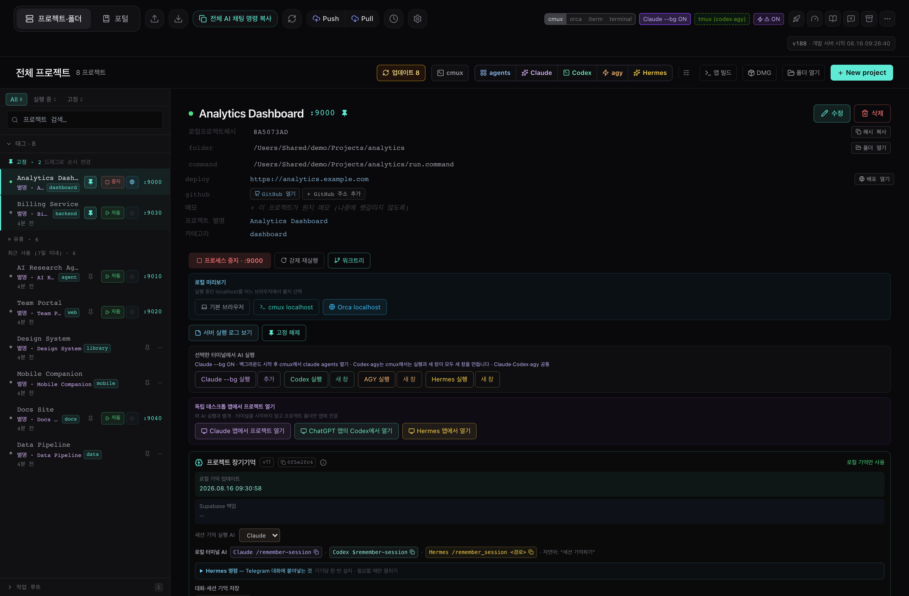
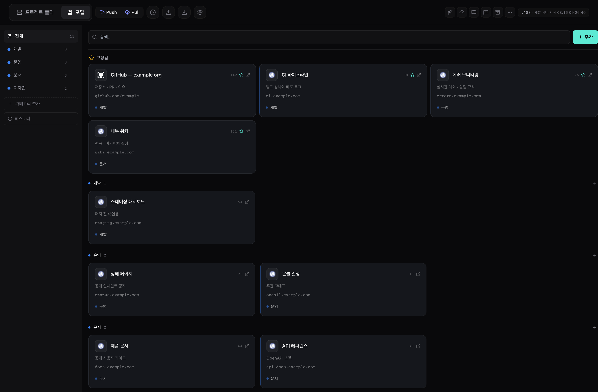
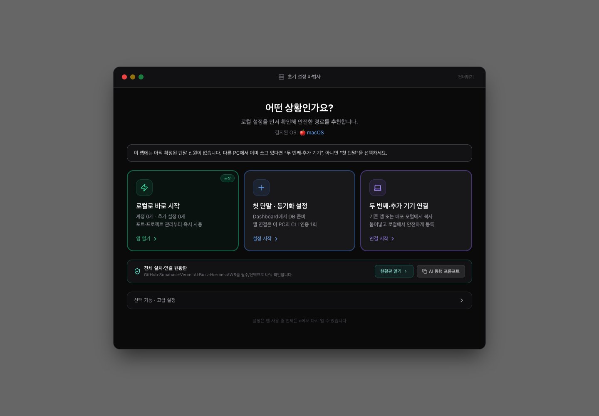
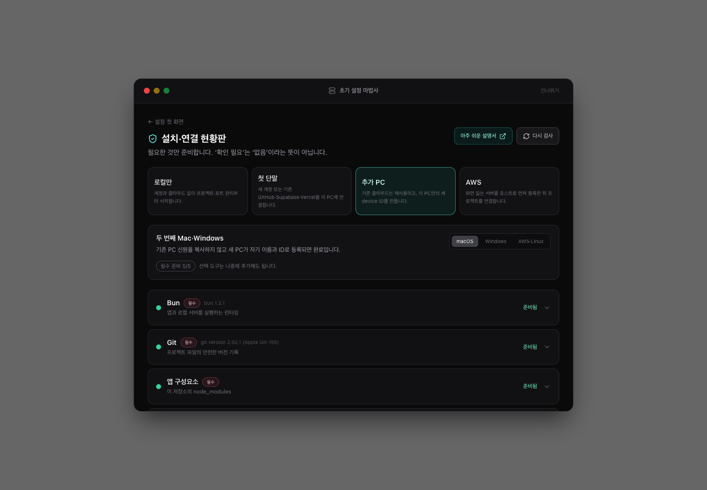
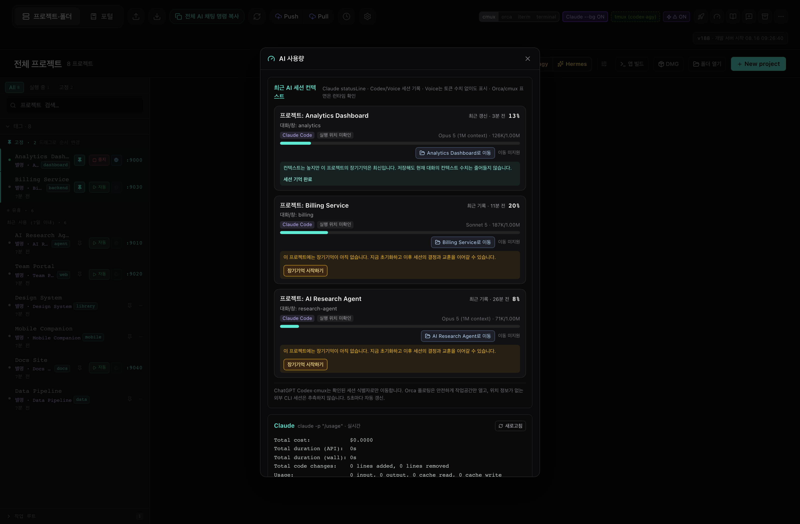

# AgentsToZ_byCS — 포트 관리기 (Port Manager)

> 로컬 개발 서버, AI 에이전트, 북마크를 한 화면에서. **macOS와 Windows를 지원하며, Windows 릴리스는 실기 검증을 기준으로 합니다.**

**처음 설치한다면:** [그림으로 따라가는 온라인 설치 설명서](https://agentstoz-guide.vercel.app) · [저장소 안의 사용자 가이드](docs/user-guide/GUIDE.md) · [내 계정으로 개인 포털 만들기](docs/SELF-HOSTING.md)

온라인 설치 설명서는 누구나 보는 **공개 설명서 전용 배포**입니다. 사용자의 개인 북마크 포털 주소나 Supabase 연결값을 포함하지 않습니다.

[](https://bun.sh)
[](https://tauri.app)
[](https://react.dev)
[](https://supabase.com)



---

## 내 상황에 맞는 시작 경로

초기 설정 마법사의 **설치 현황**은 필요한 도구와 선택 도구를 구분해 보여 주고, 현재 상황에 맞는 AI용 복붙 프롬프트를 만듭니다. 프롬프트를 Claude Code, Codex 등 원하는 AI에 전달하면 AI가 한 단계씩 확인하며 안내합니다. 계정 로그인, 2단계 인증, 비밀키 입력, 외부 프로그램 설치는 사용자가 확인한 뒤 진행합니다.

| 상황 | 시작 위치 | 기존 서비스 재사용 | 단말 신원 |
|---|---|---|---|
| 로컬에서 먼저 체험 | 새 앱 → **로컬로 바로 시작** | GitHub·Supabase·Vercel 불필요 | 로컬 설정만 사용 |
| 첫 Mac·Windows | 새 앱 → **첫 단말 · 동기화 설정** | 기존 프로젝트가 있으면 새로 만들지 않고 연결 | 이 앱이 만든 UUID 사용 |
| 두 번째·추가 Mac·Windows | 기존 앱 → **다른 PC 연결 정보 만들기**, 새 PC → **두 번째·추가 기기 연결** | 같은 GitHub 저장소를 clone하고, 기존 Supabase와 Vercel 주소를 그대로 사용 | 기존 ID를 복사하지 않고 새 UUID 생성 |
| Ubuntu·AWS·화면 없는 Linux | 포털 **단말 연결 → 클라우드·서버** 또는 앱 **장기기억 → 클라우드 단말** | 기존 Supabase에 호스트를 등록하고 필요할 때 기존 GitHub 저장소를 clone | 호스트를 먼저 등록한 뒤 프로젝트를 그 아래 연결 |

추가 Mac·Windows용 v3 연결 정보에는 공개 가능한 Supabase Project URL·anon/publishable key·추천 단말 이름만 들어갑니다. `service_role` 키, 로그인 토큰, 기존 단말 ID는 전달하지 않습니다. Vercel 포털은 같은 배포 URL을 계속 사용하므로 두 번째 PC마다 다시 배포할 필요가 없습니다.

Claude Code·Codex·Antigravity는 코딩 에이전트, Hermes는 원격/AWS 에이전트, Telegram은 Hermes의 대화 채널, Buzz는 에이전트와 채널을 운영하는 별도 협업 앱입니다. 모두 **선택 기능**이며 포트 관리와 로컬 실행에 필요하지 않습니다. 자세한 설치 순서와 연결 범위는 [온라인 설치 설명서](https://agentstoz-guide.vercel.app)에서 상황별로 확인하세요.

## 무엇을 하는 앱인가

- 로컬 개발 서버의 **포트를 목록으로 관리**하고, 실행 / 중지 / 강제 재실행을 버튼 하나로 처리합니다.
- `.bat` · `.cmd` (Windows) / `.command` · `.sh` (macOS) 실행 파일이 없어도, **폴더 경로만 있으면** `package.json` · `pyproject.toml` · `Cargo.toml`을 탐색해 실행 명령을 자동으로 찾아 기동합니다.
- 프로젝트별로 **Claude Code / Codex / Antigravity 에이전트**를 터미널에 바로 띄우고, git 워크트리를 패널에서 관리합니다.
- 프로젝트마다 **장기기억**을 쌓습니다 — 세션에서 정해진 것을 append-only 저널에 남기고, 그로부터 "색인 + 섹션별 노트"를 만들어 다음 세션이 **필요한 노트 하나만** 읽게 합니다. ([자세히](#프로젝트-장기기억))
- 자주 쓰는 링크를 모으는 **북마크 포털**을 제공하고, 원하면 Vercel로 배포해 휴대폰에서 엽니다.
- **Supabase 동기화(선택)** — 여러 기기의 포트 목록·북마크를 `device_id` 단위로 격리해 Push / Pull 합니다.

앱은 **웹 모드**(브라우저에서 `localhost:9000`)와 **데스크톱 앱 모드**(Tauri) 두 가지로 쓸 수 있습니다. Supabase 없이도 포트 관리 기능은 전부 동작합니다.

자주 쓰는 링크를 모으는 북마크 포털은 별도 탭입니다. 카테고리와 고정(pin)을 그대로 두고 기기 간 공유됩니다.



---

## 지원 플랫폼

| 기능 | macOS | Windows |
|---|---|---|
| 웹 모드 (`localhost:9000`) | 지원 | 지원 |
| 데스크톱 앱 빌드 | `.app` + `.dmg` (`tauri:build`, `tauri:build:dmg`) | NSIS `.exe` (`tauri:build:win`) |
| 포트 상태 감지 | `lsof` | `netstat -ano` |
| 프로세스 중지 / 강제 종료 | `SIGTERM` → `SIGKILL` | `taskkill /F` (`/T`로 트리 종료) |
| 서버 실행 파일 확장자 | `.command` / `.sh` / `.html` | `.bat` / `.cmd` / `.html` |
| 터미널 선택지 | cmux · Orca · iTerm · Terminal.app | PowerShell · WSL |
| tmux 세션 유지 | 지원 | WSL 터미널 선택 시 지원 |
| Claude Agent View (`--bg`) | 지원 | Windows 네이티브 실행 지원, WSL·tmux는 선택 |
| cmux 연동 버튼 (localhost 미리보기 등) | 지원 | 미지원 — **버튼이 UI에서 자동으로 숨겨짐** |
| DMG 빌드 / DMG 출시하기 | 지원 | 미지원 — 헤더에 `Win 빌드` 버튼으로 대체 |
| Supabase 동기화 | 지원 | 지원 |
| 북마크 포털 / Vercel 배포 | 지원 | 지원 |
| 데이터 저장 경로 | `~/Library/Application Support/com.portmanager.portmanager/` | `%APPDATA%\com.portmanager.portmanager\` |

> macOS 전용 기능(DMG, iTerm, cmux, osascript 기반 동작)은 Windows에서 **비활성화가 아니라 완전히 숨겨집니다.** Windows에 저장된 터미널 설정이 macOS 전용 값이면 앱이 부팅 시 `powershell`로 자동 교정합니다.

---

## 빠른 시작 (5분)

앱을 처음 열면 초기 설정 마법사가 현재 OS를 감지해 필요한 단계만 안내합니다.
Supabase 없이 로컬로 바로 시작할 수도 있습니다.





### 방법 A: AI 에이전트에게 맡기기 (권장)

이 공개 저장소에는 `AGENTS.md`와 Claude/Codex 온보딩 스킬이 포함돼 있어, 에이전트가 프로젝트 구조와 명령어를 스스로 읽습니다.

깨끗한 Windows라면 아래 블록을 **가장 먼저 PowerShell에 붙여넣으세요.** PowerShell 5.1에서도
동작하며, Git이 없으면 먼저 설치한 뒤 clone 전에 안전하게 멈춥니다. 안내가 나오면 PowerShell을
닫고 새로 연 뒤 같은 블록을 다시 붙여넣으면 됩니다. `winget`이 없는 PC에서는 공식 Git 설치
페이지가 열립니다.

```powershell
& {
  if (-not (Get-Command git -ErrorAction SilentlyContinue)) {
    if (-not (Get-Command winget -ErrorAction SilentlyContinue)) {
      Start-Process "https://git-scm.com/download/win"
      Write-Host "Git 설치 페이지를 열었습니다. 설치 후 PowerShell을 닫고 새로 연 뒤 이 블록을 다시 실행하세요." -ForegroundColor Yellow
      return
    }
    winget install --id Git.Git --exact --source winget
    if ($LASTEXITCODE -ne 0) { return }
    Write-Host "Git 설치가 끝났습니다. PowerShell을 닫고 새로 연 뒤 이 블록을 다시 실행하세요." -ForegroundColor Yellow
    return
  }

  git --version
  $devRoot = Join-Path $env:USERPROFILE "dev"
  $projectRoot = Join-Path $devRoot "AgentsToZ_byCS"
  New-Item -ItemType Directory -Path $devRoot -Force | Out-Null
  if (Test-Path (Join-Path $projectRoot ".git")) {
    Write-Host "기존 AgentsToZ_byCS 저장소를 사용합니다."
  } elseif (Test-Path $projectRoot) {
    Write-Host "$projectRoot 폴더가 이미 있지만 Git 저장소가 아닙니다. 폴더 이름을 확인한 뒤 다시 실행하세요." -ForegroundColor Yellow
    return
  } else {
    git clone https://github.com/intenet1001-commits/AgentsToZ-public.git $projectRoot
    if ($LASTEXITCODE -ne 0) { return }
  }
  Set-Location $projectRoot
}
```

저장소 폴더로 이동됐으면 설치되어 있는 AI 하나를 실행합니다.

```powershell
claude    # 또는: codex
```

에이전트에게 이렇게 말하면 됩니다:

```
온보딩 해줘. 먼저 현재 OS와 Bun/Git/node_modules 상태를 진단하고,
로컬 웹 모드로 앱을 실행하게 도와줘. 첫/추가 단말은 로컬 상태를 먼저 확인하고,
개인 포털 설정 화면이 어려우면 Playwright 브라우저 보조로 진행해줘.
```

> 이 저장소에는 온보딩 전용 스킬이 들어 있습니다. Claude Code는 `.claude/skills/onboarding/`, Codex는 `.agents/skills/onboarding/`을 읽고 환경 진단부터 첫 실행까지 단계별로 진행합니다. "온보딩 해줘"라고만 말해도 됩니다.

### 방법 B: 수동 설치

<details open>
<summary><b>Windows (PowerShell)</b></summary>

아래 블록 하나를 붙여넣으세요. Git 또는 Bun을 새로 설치한 경우 clone을 실행하지 않고 멈추므로,
PowerShell을 닫고 새로 연 뒤 **같은 블록을 한 번 더** 붙여넣으면 됩니다. `&&`, 삼항 연산자 등
PowerShell 7 전용 문법을 쓰지 않아 Windows 기본 PowerShell 5.1에서도 동작합니다.

```powershell
& {
  $restartRequired = $false

  if (-not (Get-Command git -ErrorAction SilentlyContinue)) {
    if (-not (Get-Command winget -ErrorAction SilentlyContinue)) {
      Start-Process "https://git-scm.com/download/win"
      Write-Host "Git 설치 페이지를 열었습니다. 설치 후 PowerShell을 닫고 새로 연 뒤 이 블록을 다시 실행하세요." -ForegroundColor Yellow
      return
    }
    winget install --id Git.Git --exact --source winget
    if ($LASTEXITCODE -ne 0) { return }
    $restartRequired = $true
  }

  if (-not (Get-Command bun -ErrorAction SilentlyContinue)) {
    powershell.exe -NoProfile -ExecutionPolicy Bypass -Command "irm https://bun.sh/install.ps1 | iex"
    if ($LASTEXITCODE -ne 0) { return }
    $restartRequired = $true
  }

  if ($restartRequired) {
    Write-Host "Git/Bun 설치가 끝났습니다. PowerShell을 닫고 새로 연 뒤 이 블록을 다시 실행하세요." -ForegroundColor Yellow
    return
  }

  git --version
  bun --version
  $devRoot = Join-Path $env:USERPROFILE "dev"
  $projectRoot = Join-Path $devRoot "AgentsToZ_byCS"
  New-Item -ItemType Directory -Path $devRoot -Force | Out-Null
  if (Test-Path (Join-Path $projectRoot ".git")) {
    Write-Host "기존 AgentsToZ_byCS 저장소를 사용합니다."
  } elseif (Test-Path $projectRoot) {
    Write-Host "$projectRoot 폴더가 이미 있지만 Git 저장소가 아닙니다. 폴더 이름을 확인한 뒤 다시 실행하세요." -ForegroundColor Yellow
    return
  } else {
    git clone https://github.com/intenet1001-commits/AgentsToZ-public.git $projectRoot
    if ($LASTEXITCODE -ne 0) { return }
  }

  Set-Location $projectRoot
  bun install
  if ($LASTEXITCODE -ne 0) { return }
  bun run start
}
```

브라우저에서 <http://localhost:9000> 을 엽니다. 배치 파일 `실행.bat`을 더블클릭해도 같은 결과입니다.

</details>

<details>
<summary><b>macOS (bash / zsh)</b></summary>

아래 블록은 실제 `git --version`부터 확인합니다. Git이 아직 준비되지 않았으면 Apple 명령줄
도구 설치 창만 열고 clone 전에 멈춥니다. 설치를 완료한 뒤 새 Terminal을 열어 같은 블록을
다시 붙여넣으세요. Bun을 새로 설치한 경우에도 새 Terminal에서 한 번 더 실행합니다.

```bash
(
  if ! git --version >/dev/null 2>&1; then
    xcode-select --install 2>/dev/null || true
    echo "Apple 명령줄 도구 설치 창에서 설치를 마친 뒤 새 Terminal에서 이 블록을 다시 실행하세요."
    exit 0
  fi

  if ! command -v bun >/dev/null 2>&1; then
    curl -fsSL https://bun.sh/install | bash
    echo "Bun 설치가 끝났습니다. 새 Terminal을 열고 이 블록을 다시 실행하세요."
    exit 0
  fi

  git --version
  bun --version
  dev_root="$HOME/dev"
  project_root="$dev_root/AgentsToZ_byCS"
  mkdir -p "$dev_root"
  if [ -d "$project_root/.git" ]; then
    echo "기존 AgentsToZ_byCS 저장소를 사용합니다."
  elif [ -e "$project_root" ]; then
    echo "$project_root 폴더가 이미 있지만 Git 저장소가 아닙니다. 폴더 이름을 확인한 뒤 다시 실행하세요."
    exit 0
  else
    git clone https://github.com/intenet1001-commits/AgentsToZ-public.git "$project_root" || exit 1
  fi

  cd "$project_root" || exit 1
  bun install || exit 1
  bun run start
)
```

브라우저에서 <http://localhost:9000> 을 엽니다. `./실행.command`로도 실행할 수 있습니다.

</details>

포트와 설정이 모두 없는 새 로컬 프로필에서는 초기 설정 마법사가 열립니다.
**"로컬로 바로 시작" 또는 "건너뛰기"를 누르면 바로 사용할 수 있습니다.** 이미 사용 중인
프로필에서는 헤더의 로켓(설정) 버튼으로 마법사를 엽니다.

---

## 사전 요구사항

### Windows

**필수**

| 도구 | 설치 (PowerShell) | 검증 |
|---|---|---|
| Bun | `powershell -c "irm bun.sh/install.ps1 \| iex"` | `bun --version` |
| Git | `winget install Git.Git` | `git --version` |

> Bun / Git 설치 후에는 **새 PowerShell 창**을 열어야 PATH가 반영됩니다.

**데스크톱 앱(.exe)을 직접 빌드할 때만 추가로 필요**

| 도구 | 설치 (PowerShell) |
|---|---|
| Rust (1.77.2 이상) | `winget install Rustlang.Rustup` → 새 창에서 `rustup default stable-msvc` |
| Visual Studio Build Tools 2022 (C++ 워크로드) | `winget install Microsoft.VisualStudio.2022.BuildTools --override "--wait --passive --add Microsoft.VisualStudio.Workload.VCTools --includeRecommended"` |
| WebView2 Runtime (Windows 10만) | `winget install Microsoft.EdgeWebView2Runtime` — Windows 11은 기본 내장 |

> NSIS는 별도 설치가 필요 없습니다. Tauri CLI가 빌드 시 `%LOCALAPPDATA%\tauri\NSIS`로 자동 내려받습니다.

**선택**

| 도구 | 설치 | 없으면 |
|---|---|---|
| Windows Terminal | `winget install Microsoft.WindowsTerminal` | 기본 콘솔 사용 |
| Python + Pillow | `winget install Python.Python.3.12` → `pip install Pillow` | 아이콘 우하단 버전 스탬프만 생략 (빌드는 정상 진행) |
| GitHub CLI | `winget install GitHub.cli` → `gh auth login` | GitHub Actions 클라우드 빌드 트리거 불가 |
| Node.js + Vercel CLI | `winget install OpenJS.NodeJS.LTS` → `npm install -g vercel` | 포털 Vercel 배포 불가 |
| Supabase CLI | `irm get.scoop.sh \| iex` → `scoop bucket add supabase https://github.com/supabase/scoop-bucket.git` → `scoop install supabase` | 테이블 자동 생성 불가 (아래 SQL 수동 실행으로 대체 가능) |
| WSL2 + Ubuntu | 관리자 PowerShell에서 `wsl --install` → 재시작 | Windows 네이티브 AI 실행은 가능, WSL 기반 tmux 세션 유지 기능만 사용 불가 |

> Supabase CLI는 앱이 Scoop 기본 경로인 `%USERPROFILE%\scoop\shims`를 함께 확인합니다. Scoop 이외의 방법으로 설치했다면 시스템 PATH에 직접 등록해야 합니다.

### macOS

**필수**

```bash
curl -fsSL https://bun.sh/install | bash   # Bun
xcode-select --install                     # Git 포함 (Tauri 빌드에도 필요)
```

**선택**

| 도구 | 없으면 |
|---|---|
| iTerm2 / cmux / Orca | 해당 터미널 연동 버튼만 동작 안 함 (Terminal.app으로 사용 가능) |
| tmux (`brew install tmux`) | 터미널 창을 닫으면 AI 세션이 함께 종료됨 |
| Python + Pillow (`pip install Pillow`) | 아이콘 버전 스탬프만 생략 |

### AI 에이전트 기능 (양 플랫폼 공통, 선택)

AI 이름·카테고리 생성과 에이전트 실행 버튼은 **API 키가 아니라 로컬 `claude` CLI**를 서브프로세스로 호출합니다. `claude`가 PATH에 없으면 해당 기능만 `503 claude_not_found`로 실패하고, 나머지 앱 기능은 정상 동작합니다.

---

## 설치 및 실행

`package.json`에 정의된 스크립트 전체입니다.

| 명령 | 하는 일 |
|---|---|
| `bun run dev` | 개발 서버 (`dev.ts` 러너 — api-server:3001 + vite:9000 동시 실행, 종료 시 함께 정리) |
| `bun run start` | `dev`와 동일 (`bun dev.ts`) |
| `bun run api` | API 서버(3001)만 실행 |
| `bun run build` | 프론트엔드 프로덕션 빌드 (`vite build`) |
| `bun run build:portal` | 북마크 포털 정적 빌드 (`vite.portal.config.ts`) |
| `bun run build:sidecar` | Tauri 사이드카(API 서버) 실행 파일 컴파일 |
| `bun run preview` | 빌드 결과 미리보기 (`vite preview`) |
| `bun run typecheck` | 타입 체크 (`tsc --noEmit`) — 커밋 전 0 에러 유지 |
| `bun run tauri` | Tauri CLI 패스스루 (`tauri`) |
| `bun run tauri:dev` | Tauri 개발 모드 |
| `bun run tauri:build:win` | **Windows** 설치 파일 빌드 (NSIS `.exe`) |
| `bun run tauri:build` | **macOS** `.app` 빌드 |
| `bun run tauri:build:dmg` | **macOS** DMG 빌드 |
| `bun run update-version` | 버전 갱신 (`build-number.json` 증가 + 아이콘 스탬프) |
| `bun run fix-dmg` | macOS DMG 후처리 복구 |
| `bun run test:smoke` | 로컬 스모크 테스트 (Playwright) |
| `bun run test:smoke:vercel` | 배포된 Vercel 포털 대상 스모크 테스트 |
| `bun run test:smoke:mobile` | 모바일 뷰포트 스모크 테스트 |

### Windows 앱 빌드

```powershell
bun run tauri:build:win
```

#### Windows 업데이트와 빌드 중 무엇을 써야 하나요?

| 사용자 | 권장 방법 |
|---|---|
| 소스 코드를 다루지 않는 일반 사용자 | 배포자가 실제 Windows에서 확인한 최신 NSIS `.exe`를 받아 기존 앱 위에 설치 |
| 코드를 수정한 유지보수자 | **실제 Windows PC에서** 헤더의 **Windows 빌드·출시 안내**를 열고 검증 → 빌드 → 설치본 실행 확인 |
| Windows 빌드 도구가 없는 유지보수자 | `GitHub Windows 빌드`로 아티팩트를 만든 뒤, 내려받은 `.exe`를 실제 Windows에서 최종 확인 |

앱의 **`Windows 빌드·출시 안내`** 버튼은 설치된 앱을 백그라운드에서 자동 교체하는 바이너리 자동 업데이트 기능이 아닙니다. 현재 저장소를 안전하게 갱신하고 테스트한 뒤 NSIS 설치본을 만들도록 **AI 유지보수 프롬프트를 복사하는 기능**입니다. 따라서 일반 사용자는 검증된 설치본을 쓰고, 출시 판단은 실제 Windows 빌드와 설치 앱의 IPC·WebView2·업데이트 경로 확인을 기준으로 합니다.

### macOS 앱 빌드

```bash
bun run tauri:build        # .app
bun run tauri:build:dmg    # .dmg
```

> 버전 문자열은 날짜가 아니라 **빌드 번호**입니다. `update-version.ts`가 `build-number.json`의 `buildNumber`를 1 올리고 `src-tauri/tauri.conf.json`의 `version`을 `<N>.0.0`으로, `productName`을 `AgentsToZ_byCS`로 고정합니다. 즉 빌드할 때마다 번호가 올라가며, 커밋 여부와 무관합니다.

### 로컬 빌드 없이 GitHub Actions로 빌드하기

Windows 가상머신 비용을 줄이기 위해 `.github/workflows/build-windows.yml`은 앱 업데이트·PR마다 자동 실행되지 않습니다. Windows 출시 또는 Windows 패키지 생성이 필요하다는 **명시적 지시가 있을 때만** GitHub Actions의 `workflow_dispatch`에서 실행 사유를 입력해 수동 실행합니다. `windows-latest` 러너가 NSIS `.exe`를 만들고 아티팩트로 올리므로 로컬 Rust · Build Tools 설치는 필요 없습니다. 다만 클라우드 빌드 성공은 실제 사용자의 Windows 데스크톱에서 설치·실행까지 확인했다는 뜻이 아니므로, 출시 전 실기 확인을 생략하지 않습니다.

---

## Windows 전용 안내

### 클론 위치: `C:\Windows\System32\` 하위는 피하세요

`makensis.exe`가 `C:\Windows\System32\` 아래 파일을 읽으려 하면 Windows가 OS 레벨에서 차단합니다(`os error 2` / `os error 5`). 그래서 `build-win.ts`는 다음 두 가지 우회를 수행합니다.

1. `CARGO_TARGET_DIR`을 `%USERPROFILE%\cargo-targets\portmanager`로 강제 고정
2. 사이드카 리소스를 `%USERPROFILE%\cargo-targets\portmanager-resources`로 복사한 뒤, `src-tauri/tauri.conf.json`의 `bundle.resources`를 빌드 동안만 임시 패치 (빌드 후 원본 복원)

권장 클론 위치: `C:\Users\<이름>\dev\AgentsToZ_byCS`

### 빌드 결과물 경로

```
%USERPROFILE%\cargo-targets\portmanager\release\bundle\nsis\*.exe
```

앱 헤더의 **"폴더 열기"** 버튼으로 이 경로를 바로 열 수 있습니다.

### 데이터 저장 위치

| 항목 | 경로 |
|---|---|
| 포트 목록 | `%APPDATA%\com.portmanager.portmanager\ports.json` |
| 포털 설정 (Supabase URL/키, deviceId) | `%APPDATA%\com.portmanager.portmanager\portal.json` |
| 서버 로그 | `%APPDATA%\com.portmanager.portmanager\logs\{portId}.log` |

기기 이전은 ① Supabase Push/Pull ② 앱 내 내보내기/불러오기 ③ `ports.json` 수동 복사 중 하나를 쓰면 됩니다.

### 헤더 버튼 차이

- Windows: `Win 빌드` 버튼 → `Windows 빌드·출시 안내` + `GitHub Windows 빌드` + `폴더 열기`
- macOS: `앱 빌드` + `DMG` + `폴더 열기`

### 터미널 / 에이전트

- 기본 터미널은 `powershell`입니다. 저장된 설정이 macOS 전용 값(cmux/iterm/terminal)이면 앱이 부팅 시 `powershell`로 자동 교정합니다.
- **tmux는 WSL을 선택했을 때만** 사용됩니다. tmux를 쓰는 이유는 하나 — 터미널 창을 닫아도 AI 세션이 죽지 않습니다.
- Agent View 버튼은 Windows 네이티브 `claude --bg`를 우선합니다. WSL을 선택한 경우에만 tmux 지속 세션을 사용합니다.

---

## Supabase 동기화 설정 (선택)

**하지 않아도 앱은 완전히 동작합니다.** 포트 목록은 로컬 `ports.json`에 저장되며, Supabase는 오직 **여러 기기 간 동기화**를 위한 것입니다. 기기가 한 대라면 건너뛰세요.

### 1. 프로젝트 생성

<https://supabase.com> 무료 계정 생성 → New Project. (무료 플랜은 7일간 활동이 없으면 프로젝트가 일시정지되니 주의)

### 2. 정본 DDL을 SQL Editor에서 실행

DDL 사본을 문서에 유지하지 않습니다. 현재 앱의 테이블·`github_urls` 호환 필드·RLS 정책은
[`src/schemaSql.ts`](src/schemaSql.ts)의 `MIGRATION_SQL` 하나가 정본입니다.
owner 이메일을 환경변수로 지정한 뒤 출력 전체를 Supabase Dashboard → **SQL Editor → New query**에 붙여넣고 실행하세요.

macOS/Linux:

```bash
ALLOWED_EMAIL=owner@example.com bun -e "import { migrationSqlForAllowedEmails } from './src/schemaSql.ts'; console.log(migrationSqlForAllowedEmails([process.env.ALLOWED_EMAIL ?? '']))"
```

Windows PowerShell:

```powershell
$env:ALLOWED_EMAIL = 'owner@example.com'
bun -e "import { migrationSqlForAllowedEmails } from './src/schemaSql.ts'; console.log(migrationSqlForAllowedEmails([process.env.ALLOWED_EMAIL ?? '']))"
```

초기 설정 마법사의 자동 설치와 AI 테이블 생성 안내도 같은 정본을 사용합니다.

> **RLS**: 정본 DDL은 anon 역할을 차단합니다. browser/배포 포털은 Google 로그인 JWT를,
> Tauri 데스크톱 앱은 localhost sidecar의 서버 전용 `service_role` 연결을 사용합니다.
> 앱의 service key는 WebView나 `portal.json`으로 전달되지 않습니다.

### 3. 앱에 URL / anon key 입력

Supabase 대시보드 → Project Settings → API 에서 **Project URL**과 **anon public key**를 복사해, 앱의 포털 설정 모달에 입력합니다. 값은 `portal.json`에 저장되어 프로젝트 탭과 북마크 탭이 함께 사용합니다.

### 4. 실행 환경별 인증

Tauri 데스크톱 앱에는 사용자 로그인 단계가 없습니다. 첫/추가 단말 마법사의
`Supabase CLI에서 자동 연결`(또는 설정의 `service_role Key`)을 한 번 완료하면
북마크·단말·장기기억 Push/Pull을 sidecar가 처리합니다.
배포 포털과 browser mode만 <http://127.0.0.1:9000/portal.html>에서 Google 로그인하고,
`portmgr_is_member()`의 이메일 허용 목록을 적용받습니다.

### 5. 두 번째 단말 연결

Mac·Windows는 이미 등록된 첫 단말 앱의 **초기 설정 → 다른 PC 연결 정보 만들기**에서 바로
초대를 복사할 수 있습니다. 개인 Vercel 포털은 필수가 아닙니다. 포털이 있다면
**단말 연결 → Mac·Windows 연결**을 사용해도 같습니다. 이 정보에는 공개 Project URL·
anon/publishable key·추천 이름만 들어가며,
기존 단말 ID, `service_role` 키, 로그인 토큰은 들어가지 않습니다. 새 PC에 설치한 앱에서
**초기 설정 → 두 번째·추가 기기 연결**을 열어 붙여넣고, 그 PC에서 `supabase login`을 한 번
확인하면 앱이 새 UUID로 등록합니다. 포털은 빈 단말 행을 미리 만들지 않습니다.

이미 등록된 앱에서는 추가 단말 마법사가 현재 신원을 덮어쓰지 못합니다. 같은 물리 단말의
재설치 복구는 장기기억 화면의 **이전 ID 연결**을 사용합니다.

### 개인 웹 포털 배포 (첫 단말에서 선택·권장)

처음부터 본인 Supabase와 본인 Vercel로 분리하는 전체 순서는 [내 계정으로 개인 포털 만들기](docs/SELF-HOSTING.md)를 먼저 보세요.

폰이나 원격 브라우저에서 북마크·기기 현황을 보려면 **초기 설정 → 포털 배포 · Google 로그인**을
엽니다. 현재 공개 clone을 Vercel CLI로 직접 배포하므로 GitHub Fork는 필수가 아니고, Git push
자동 재배포가 필요할 때만 선택합니다. 앱은 첫 단말에 저장된 공개 Supabase 연결 정보와 허용
이메일을 Vercel Production 환경 변수에 넣은 뒤 배포 URL을 돌려줍니다.
성공한 `*.vercel.app` 주소는 이 PC의 `portal.json`에 자동 저장되어 이후 **포털 열기**와
**새 단말 등록 링크**가 그 개인 주소를 사용합니다. 공개 소스에는 개인 주소의 기본값이 없으며,
수동 빌드에서만 필요하면 커밋하지 않은 배포 환경의 `VITE_PORTAL_URL`로 지정합니다. 저장된
Vercel origin의 localhost 연동은 장기기억용 제한 경로 네 개에만 적용됩니다. 사용자 지정 도메인은
서버 실행 환경의 `PORTMGR_PORTAL_INTEGRATION_ORIGINS`에 명시적으로 추가해야 합니다.

Google Cloud·Supabase·Vercel 화면을 따라가기 어렵다면 마법사의
**Playwright 브라우저 보조 요청 복사**를 눌러 Codex/Claude에 전달하세요. 에이전트는 현재 화면을
snapshot으로 확인해 메뉴 이동을 돕고, 로그인·2단계 인증·Google Client Secret 입력은 사용자가
브라우저에서 직접 하도록 멈춥니다.

Ubuntu/AWS/Linux는 이 흐름과 분리됩니다. 포털의 **단말 연결 → 클라우드·서버** 또는 앱의
**장기기억 → 클라우드 단말**에서 호스트용 일회용 명령을 만들고 서버에서 실행해 호스트를 먼저
등록한 뒤, 그 아래에서 새 프로젝트·GitHub 복제·장기기억 복원을 진행합니다.

### 6. 기기별 격리 규칙

| 대상 | 격리 단위 | `device_id` 값 |
|---|---|---|
| `portmgr_ports` | 기기별 | 해당 기기 UUID |
| `portmgr_portal_items` (`type = 'web'`) | 전 기기 공유 | `'__shared__'` |
| `portmgr_portal_categories` | 전 기기 공유 | `'__shared__'` |

Pull은 `내 UUID`와 `'__shared__'` 두 결과를 합산합니다. Push는 `sourceDeviceId`가 내 UUID인 항목만 upsert하므로, 다른 기기의 데이터를 덮어쓰지 않습니다.

### 공개 설치판 VOC 수집(선택)

VOC는 항상 사용자 PC의 `voc/` 폴더에 먼저 저장됩니다. 원격 수집은 기본적으로 꺼져 있습니다.
개발자가 공개 설치판의 VOC도 받으려면 앱 동기화·장기기억용 Supabase와 분리한 **별도 공개 VOC
수신 프로젝트**에 정본 DDL과 Edge Function을 배포하고 `.env`에 엔드포인트를 명시합니다.

```bash
supabase functions deploy submit-voc --no-verify-jwt
```

```dotenv
VITE_VOC_ENDPOINT=https://<project-ref>.supabase.co/functions/v1/submit-voc
```

API 서버 실행 환경에서만 덮어쓸 때는 같은 URL을 `AGENTSTOZ_VOC_ENDPOINT`로 지정할 수 있으며,
이 값이 `VITE_VOC_ENDPOINT`보다 우선합니다. URL은 공개값이며 service-role 키는 Edge Function
안에서만 사용됩니다. 두 변수가 비어 있거나 `off`이면 원격 요청을 보내지 않고 로컬에만 저장합니다.
설치본은 댓글·앱 버전·선택 위치만 명시적 동의 후 전송하고 파일·로그는 보내지 않습니다.
기본 제한은 설치 UUID당 하루 10회이며 앱의
**설정 → 공개 VOC 수집 관리**에서 1~100회, 접수 중지, VOC 전송 차단, 앱 사용 차단과 만료 시각을 관리합니다.
원격 확인 장애는 정상 사용자를 잠그지 않도록 fail-open으로 처리됩니다. 설치 UUID는 재설치로 바뀔 수 있으므로
차단은 반복 스팸 완화 수단이지 하드웨어 수준의 영구 차단은 아닙니다. 개인 동기화 Supabase 주소를
VOC 수신 주소로 재사용하지 마세요. 공개 수신함을 운영하지 않는 포크는 값을 비워 두면 됩니다.

---

## 프로젝트 장기기억

프로젝트마다 **몇 년치 노하우가 쌓여도 잃지 않고, 매번 다 읽지도 않는** 기억을 만드는 기능입니다.
Karpathy의 raw/wiki 패턴(원본은 안 건드리고, 원본에서 정리본을 컴파일)을 따릅니다.

AI 사용량 패널은 진행 중인 세션의 컨텍스트 사용률을 프로젝트별로 묶어 보여 주고,
저장이 필요한 세션에는 그 자리에서 기억을 갱신할 수 있는 버튼을 붙입니다.



### 두 개의 층

```
.agent-memory/
├── journal/            ← ① 원본. append-only, 다시 쓰지 않음
│   └── 2026-08.md         세션마다 한 항목 (요약 + 커밋 + 변경 파일)
├── CORE.md             ← ② 정리본의 색인. 에이전트가 항상 읽는 유일한 파일
├── notes/                 정리본의 본문. 필요한 것 하나만 열어봄
│   ├── manifest.json
│   ├── 02-key-decisions.md
│   └── 04-recurring-issues.md
├── feedback/           ← ③ 적용 결과. 기기별 append-only, Git 제외
│   └── events.jsonl       applied/confirmed/corrected/contradicted
├── config.json         ← 공유 identity(memoryId)·정책
└── state.json          ← 기기별 Pull/Push/remember cursor, Git 제외
```

**① journal — 잃지 않기 위한 층.** 통합이 항목을 지워도 원본은 남습니다. 한 번 쓰면 다시 쓰지 않습니다.

**② CORE.md + notes — 읽기 쉽기 위한 층.** 통합할 때마다 다시 만들어집니다.

**③ feedback — 경험을 검증하는 층.** 회상한 항목을 실제로 적용했는지, 성공했는지, 수정·반박됐는지를 이벤트로 남깁니다. 두 번 이상 적용·확인된 항목만 active 후보가 되고, correction/contradiction은 caution 또는 superseded 상태로 강등합니다. 점수는 로그형 상한을 사용해 오래된 항목이 영원히 검색 결과를 독점하지 못합니다.

| | 저장소 전체 | 에이전트가 실제로 읽는 것 |
|---|---|---|
| 이 저장소 실측 | 48KB (노트 7개) | **5KB 색인** |

색인에는 모든 항목의 **제목**이 섹션별로 들어 있습니다. 에이전트는 색인만 보고 "이 작업에 필요한 게 있나?"를 판단한 뒤, **해당 노트 하나만** 엽니다.

### 저장하는 세 가지 방법

| | 앱의 **세션 기억하기** 버튼 | 로컬 터미널 Claude/Codex `/remember-session` | AWS·Telegram Hermes `/remember_session` |
|---|---|---|---|
| 쓰는 주체 | 새 Claude 프로세스가 전체 재생성 | 대화 중인 프로젝트 에이전트가 노트에 직접 | 현재 Telegram 대화를 가진 Hermes agent |
| 아는 것 | git + **세션 기록을 읽어서** | 프로젝트 대화 그 자체 | 현재 Telegram 대화 + 등록 프로젝트의 Git 근거 |
| 언제 | 세션을 이미 닫았을 때 | 작업하던 프로젝트 세션이 살아 있을 때 | `/memory_link <memoryId>`로 연결한 프로젝트 topic에서 저장할 때 |

AWS·Telegram Hermes에서 **기존 프로젝트 기억을 연결**할 때는 `/memory_link <memoryId>`를 사용합니다. **현재 DM topic 전용 새 독립 기억을 만들고 즉시 Supabase에 초기 백업**하려면 `/memory_start [기억 이름]`을 사용합니다.

**새 프로젝트를 폴더째 시작**하려면 `/project_start <이름>`을 사용합니다 — 등록된 작업 루트 아래에 실제 프로젝트 폴더를 만들고, 기억을 깔고, 앱에 등록하고, topic에 바인딩합니다. `/memory_start`가 앱 데이터 폴더 안에 코드를 둘 수 없는 기억 전용 폴더를 만드는 것과 갈리는 지점입니다. git 저장소·초기 커밋·저장소 워크플로까지 함께 만들어, 앱의 **새 프로젝트**와 같은 결과가 나옵니다. 작업 루트가 여럿이면 어디에 만들지 되묻고, 하나뿐이면 묻지 않습니다. 작업 루트가 등록되지 않은 호스트(GUI가 없는 AWS 등)에서는 `~/projects/<이름>`에 만들고 **만든 경로를 함께 알려줍니다** — 위치를 직접 고른 것이 아니므로 어디에 생겼는지 알 수 있어야 하기 때문입니다.

연결·생성 후 평소에는 `/remember_session`으로 현재 대화를 저장합니다. `/memory_sync`는 대화를 저장하지 않고 기존 기억만 해시 기반으로 동기화하며, 앱의 자동 백업 설정이 꺼져 있어도 명시적인 수동 요청으로 실행됩니다. `/remember` 별칭은 제공하지 않으며, `/memory_stop`만 `/memory_unlink`의 호환 별칭입니다. 동명이면 자동 선택하지 않고, gateway cwd를 추측하지 않으며, 양쪽 기억이 바뀌었으면 자동 덮어쓰지 않습니다.

### 화면 없는 AWS/Linux 단말 등록

배포 포털의 **기기 관리 → 클라우드·서버 → 클라우드 등록** 또는 앱 최상위 **장기기억 → 클라우드 단말**에서 먼저 호스트 이름, 환경, 작업 루트와 초대 만료 시간(10분·1시간·24시간)을 고릅니다. 포털이 만드는 일회용 명령을 유효 시간 안에 AWS/Linux 터미널에 붙여넣으면 호스트 등록과 첫 상태 보고가 끝납니다. 그다음 호스트 카드의 **런타임 준비**에서 Bun과 AgentsToZ API 상태를 확인하고, API가 준비된 뒤에만 필요한 프로젝트를 연결합니다. Hermes·Telegram은 이 단계의 필수가 아닌 선택 기능입니다. 명령에는 공개 anon key만 들어가며 service-role key는 들어가지 않습니다.

등록 뒤 서버에는 `~/.local/bin/agentstoz-status`가 설치됩니다. 작업을 마친 뒤 실행하면 기억 content hash, 마지막 확인 시각, 프로젝트 경로와 Git fetch 성공 여부·HEAD·upstream·ahead/behind·dirty 상태가 다시 보고됩니다. 포털에서 **등록 해제**하면 서버 자격만 폐기하고 과거 기억/Git 상태 이력은 지우지 않습니다. 같은 물리 단말이 앱 재설치로 여러 ID를 얻은 경우에는 장기기억 단말 카드의 **이전 ID 연결**을 사용하며, 이것도 원본 리비전을 재작성하지 않습니다.

이 명령들은 **기기당 한 번 설치**해야 뜹니다 — Hermes는 `<HERMES_HOME>/skills/`와 `config.yaml`의
`skills.external_dirs`에 있는 스킬만 슬래시 명령으로 인식하므로, 프로젝트 안에 깔리는 Claude·Codex
어댑터로는 닿지 않습니다. 장기기억 패널의 `AWS·Telegram Hermes` 칸에 「Hermes에 명령 설치」 버튼이 설치가 필요할 때만
뜨고, 누르면 앱이 `templates/hermes/`의 현재 스킬 11개를 깔고 Hermes 설정에 폴더를 등록합니다.
설치 뒤에는 Telegram 대화에서 `/reload_skills`를 한 번 실행합니다. 자동완성 목록이 늦게 갱신돼도 명령을 직접 입력하면 실행됩니다.

### 크기가 커져도 느려지지 않는 이유

파일 하나였을 때는 저장할 때마다 전체를 다시 쓰느라 커질수록 느려졌고, "N바이트 이하로 유지하라"는 지시는 **모델이 자기 출력 바이트를 셀 수 없어서** 지켜지지 않았습니다(실측 3회 연속 초과).

지금은 예산이 **섹션 하나** 단위입니다. 저장 시 12KB를 넘는 섹션 **하나만** 이름과 실제 크기를 붙여 지목하고, 나머지는 건드리지 말라고 지시합니다. 확인 가능한 지시이고, 한 번의 통합 범위가 항상 한 노트로 제한됩니다.

세션 저널은 월별 append-only 파일로 나뉘며, 검색은 앱 데이터 폴더의 재생성 가능한 SQLite FTS 색인을 사용합니다. Supabase 동기화도 매번 원격의 모든 hash를 받지 않고 서버 ingestion cursor와 로컬 SQLite acknowledgement를 사용합니다. 이 SQLite 파일이 손상되거나 사라지면 정본인 로컬 파일·Supabase에서 멱등 재생하므로 기억 원본으로 취급하지 않습니다. 전체 curated 스냅샷 리비전은 기억별 최근 500개로 보존하고, 검증된 journal·feedback은 장기 근거라 삭제하지 않습니다.

확장성 회귀 테스트는 **25,000개 세션**(하루 1회면 약 68년)을 사용합니다. 2026-08-28 Mac 실측은 Push cold 188~259ms, 변경 없는 warm Push 20~21ms, FTS 회상 cold 207ms, warm 18ms였습니다. 알고리즘 일부는 이론적으로 전체 로컬 항목 수에 비례하므로, 수십만 건에서 실측 기준을 넘기면 월별 offset/manifest 계층을 추가합니다.

### 저장이 필요하다는 표시

헤더의 **세션 기억하기 필요** 배지는 두 조건이 **모두** 참일 때만 켜집니다.

| 신호 | 조건 |
|---|---|
| 세션 | 마지막 저장 뒤 Claude/Codex 활동 훅이 한 번 이상 기록됨 |
| 내용 | 프로젝트 지문이 달라졌고 변경량이 임계 이상이거나 HEAD가 이동함 |

둘 중 하나(OR)였을 때는 실측 26개 프로젝트 중 20개(77%)가 상시 점등이라 신호 구실을 못 했습니다.

### 백업과 복구

앱의 일반 화면은 `Push`·`Pull`을 따로 고르게 하지 않고 **Supabase 동기화** 하나로 안전한 방향을 판정합니다. 로컬만 바뀌면 Push, 원격만 바뀌면 Pull, 둘 다 바뀌면 아무것도 덮어쓰지 않고 충돌 검토를 엽니다. 내부 Push는 문서 전체를 리비전으로, 저널은 **항목 단위**로 올립니다. 되돌리려면 `.agent-memory/backups/`(최근 20개) 또는 Supabase 리비전(최근 500개)에서 복원합니다.

실제 **Private GitHub** 저장소가 연결된 프로젝트는 장기기억 패널에서 `Private 확인·보관 켜기`를 선택할 수 있습니다. 또는 프로젝트의 GitHub 새 저장소를 Private으로 만들 때 재해복구 보관 옵션을 함께 고를 수 있습니다. 이 기능은 매 Push 직전에 GitHub의 `PRIVATE` 상태, 현재 계정의 쓰기 권한, owner/name과 최초 연결 때 저장한 불변 repository node ID를 다시 확인하고, `agentstoz-memory-v1` 전용 branch에 CORE/notes와 암호학적으로 검증된 journal만 보관합니다. 토큰·비밀키·원본 대화로 보이는 값은 차단하며, Public 저장소에는 실행되지 않습니다.

GitHub 사본은 **선택형 cold archive**일 뿐 일상 동기화나 자동 복원의 정본이 아닙니다. Private 저장소도 협업자와 계정 접근자는 내용을 볼 수 있습니다. GitHub 보관 실패는 로컬 기억이나 Supabase 성공을 되돌리지 않고 다음 Push에서 다시 시도합니다. 자동 보관을 꺼도 기존 원격 branch는 삭제하지 않습니다.

Private archive는 백그라운드에서 기존 원격 tree와 전체 검증 journal을 대조하므로 현재 O(total)입니다. 25,000개 합성 세션 보관은 2026-08-28 Mac에서 약 19초였습니다. 일상 Push 응답을 막지는 않지만 journal이 수십만 건으로 커져 이 작업 시간이 운영 기준을 넘으면 archive 전용 증분 manifest/ack를 추가합니다.

> 관련 파일: `project-memory-server.ts`(전체 흐름) · `src/projectMemoryDocument.ts`(분할·색인) · `src/projectMemoryJournalRecall.ts`(저널 FTS) · `src/projectMemoryLedgerState.ts`(증분 cursor/ack) · `src/projectMemoryPrivateGitHubArchive.ts`(선택형 cold archive) · `src/sessionTranscript.ts`(세션 기록 읽기). 공개 구조와 운영 계약은 `AGENTS.md`를 참고하세요.

---

## 자주 겪는 문제

| 증상 | 원인 | 해결 |
|---|---|---|
| `bun : 용어를 인식할 수 없습니다` | Bun 설치 후 PATH 미반영 | PowerShell 창을 **새로** 열기 |
| `running scripts is disabled on this system` | PowerShell 실행 정책 | `Set-ExecutionPolicy -ExecutionPolicy RemoteSigned -Scope CurrentUser` |
| `bun run dev` 시작 직후 ENOENT (`./node_modules/.bin/vite`) | 의존성 미설치 | 저장소 루트에서 `bun install` |
| NSIS 빌드 실패 (`os error 2` / `os error 5`, makensis) | 프로젝트가 `C:\Windows\System32\` 하위 | 홈 디렉터리 하위로 클론. `build-win.ts`가 target dir을 자동 리다이렉트하지만 근본 해결은 위치 이동 |
| `link.exe not found` | MSVC 링커 없음 | Visual Studio Build Tools 2022 + "Desktop development with C++" 설치 |
| `cargo : 용어를 인식할 수 없습니다` | Rust 미설치 | `winget install Rustlang.Rustup` → `rustup default stable-msvc` |
| 설치한 앱 창이 백지 | WebView2 Runtime 없음 (Windows 10) | `winget install Microsoft.EdgeWebView2Runtime` |
| 포트 9000/3001이 이미 사용 중 | 이전 세션 잔여 프로세스 (`dev.ts`의 자동 정리는 macOS 전용) | `netstat -ano \| findstr :9000` → `taskkill /F /PID <pid>` |
| AI 이름 생성 / 에이전트 버튼만 실패 (`claude_not_found`) | 로컬 `claude` CLI가 PATH에 없음 | Claude Code 설치 후 PATH 확인. macOS는 `ln -sf $(which claude) /usr/local/bin/claude` |
| ENAMETOOLONG / 실행 파일을 찾을 수 없음 | GUI 셸의 PATH 누락 또는 명령줄 길이 초과 | 앱을 터미널에서 실행해 재현 확인. 서버 기동은 `bun run start` 경로 사용 |
| Supabase Pull이 0행 반환 | `device_id` 필터가 어긋났거나 원격 데이터가 없음 | 앱에서 401/403이면 설정의 `service_role Key`를 확인하고, 웹에서는 Google 세션을 확인 |
| 아이콘에 버전 숫자가 안 찍힘 | Pillow 미설치 | `pip install Pillow` (무해 — 빌드는 정상 완료) |
| DMG 빌드가 반복 실패 (macOS) | `bundle_dmg.sh` 이슈 | `bun run fix-dmg` |
| tmux 토글을 켜도 Claude가 tmux로 안 뜸 | 기본값 `Claude bg`가 켜져 있어 `--bg` 경로로 조기 반환 | 헤더에서 `Claude bg`를 끄면 tmux 경로 사용 |

---

## 프로젝트 구조

```
AgentsToZ_byCS/
├─ src/                      프론트엔드 (React 19 + Tailwind)
│  ├─ App.tsx                메인 컴포넌트 — 상태·모달·탭 전부 (플랫폼 분기 isWindows())
│  ├─ SetupWizard.tsx        초기 설정 마법사 (Supabase / CLI 설치 안내)
│  ├─ PortalManager.tsx      북마크 포털 + Supabase 설정 UI
│  ├─ terminalDefaults.ts    터미널별 기본값 · tmux 적용 범위 판정
│  ├─ orcaFloatingTerminal.ts / orcaWorktreeSupport.ts   Orca 연동 (macOS)
│  ├─ worktreeSource.ts      워크트리 소유권 판정 (배지 + 삭제 경로 공용)
│  ├─ projectMemoryDocument.ts   장기기억 분할·색인 생성 (분할 → 합성이 바이트 단위 일치)
│  ├─ sessionTranscript.ts   Claude·Codex 세션 기록 읽기 (버튼 저장에 대화 맥락 주입)
│  └─ schemaSql.ts           Supabase DDL 정본 — 설치 가이드가 보여주는 SQL도 여기서 나온다
├─ src-tauri/                Tauri 백엔드 (Rust)
│  ├─ src/lib.rs             포트 감지·실행·중지 (macOS lsof / Windows netstat)
│  ├─ tauri.conf.json        번들 설정 (app · dmg · nsis)
│  └─ capabilities/default.json   Tauri ACL 권한
├─ api-server.ts             Bun 기반 API 서버 (포트 3001)
├─ project-memory-server.ts  프로젝트 장기기억 — 저널·분해·색인·동기화·세션 주입
├─ dev.ts                    개발 러너 — api-server + vite 동시 실행/정리
├─ build-win.ts              Windows 빌드 래퍼 (CARGO_TARGET_DIR 고정 + 리소스 스테이징)
├─ build-macos.ts            macOS 빌드 래퍼 (.app / --dmg)
├─ build-sidecar.ts          API 서버를 단일 실행 파일로 컴파일
├─ update-version.ts         버전 갱신 (+ stamp-icon.py 호출)
├─ fix-dmg.ts                macOS DMG 후처리
├─ vite.config.ts            앱 프론트엔드 (포트 9000)
├─ vite.portal.config.ts     북마크 포털 정적 빌드
├─ supabase/migrations/      Supabase 마이그레이션 SQL
├─ tests/                    Playwright 스모크 테스트
├─ 실행.bat / start.bat      Windows 실행 배치
├─ 실행.command              macOS 실행 스크립트
└─ AGENTS.md                 개발자·AI 에이전트용 상세 기술 문서
```

---

## 기여

1. 포크 후 브랜치를 만듭니다.
2. 변경 전후로 `bun run typecheck`를 실행해 **0 에러**를 유지합니다.
3. 커밋 후 PR을 엽니다.

**포크 시 함께 바꿔야 하는 파일** (자세한 내용은 [AGENTS.md](AGENTS.md)의 "Fork 후 체크리스트"):

- `src-tauri/tauri.conf.json` — `identifier`를 본인 도메인으로 (그대로 두면 macOS 서명 충돌)
- `.env.example` → `.env` 복사 후 `VITE_SUPABASE_URL`, `VITE_SUPABASE_ANON_KEY`, `VITE_VOC_ENDPOINT`, `VITE_REPO_URL`, `PORTMGR_GITHUB_OWNER`, `PORTMGR_GITHUB_REPO` 채우기
- `package.json` — `homepage`, `repository.url`
- `.github/workflows/build-windows.yml` — Secrets 재설정

API 엔드포인트, 데이터 구조, Tauri 커맨드, 빌드 시스템 상세는 **[AGENTS.md](AGENTS.md)** 를 참고하세요.

---

## 라이선스

© 2025 CS & Company. All rights reserved.

이 저장소는 검토와 기여를 위해 소스가 공개되어 있지만 오픈소스 라이선스가 부여된 것은 아닙니다.
다만 [개인 포털 만들기](docs/SELF-HOSTING.md)에 따라 공개판을 **본인 계정의 Supabase·Vercel에
비상업적으로 배포해 본인이 사용하는 것**은 허용합니다. 제3자 제공·판매·브랜드 변경·수정본
재배포·그 밖의 상업적 사용은 권리자의 별도 서면 허가가 필요합니다. GitHub fork/PR 기여는
계속 환영합니다.
