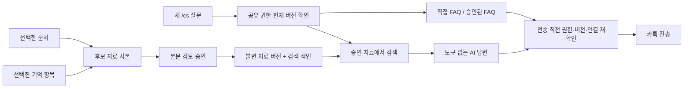

# CS 대직 개선 설계안 — 선택 공유와 재사용 가능한 검색 자료

작성일: 2026-09-10. 상태: **설계 제안, 구현·출시 승인이나 완료 기록이 아님**.

## 1. 권고

대직을 **공유할 범위 선택 → 검색 자료 만들기 → 시험 질문 → 자동 응답 켜기 → 변경분 갱신** 흐름으로 개선한다. 장기기억과 프로젝트 문서는 동일한 선택·검토·철회 체계를 사용한다. 질문마다 원본 전체를 읽지 않고, 운영자가 승인한 시점의 자료 사본에서 관련 부분을 검색한다.

Claude가 구현한 설정 유지, 전송 동의 유지, 상태 배너, 문서 선택기는 기반으로 보존한다. 문서 본문을 하나의 `knowledge` 칸에 복사하는 방식은 소량 직접 자료에 계속 제공하되, 그것만으로 공유 선택과 갱신 요구를 완료했다고 보지 않는다. 실제 검색을 제공하므로 사용자 버튼은 **「검색 자료 만들기(RAG) / 검색 자료 업데이트」**로 표현할 수 있다.

기술적 기본안은 **로컬 SQLite 어휘 검색 + 승인된 자료 사본**이다. 첫 버전은 색인 생성에 AI나 외부 임베딩 API를 호출하지 않는다. 한국어 검색 품질을 평가한 뒤 필요하면 임베딩을 추가한다. 모델 추가보다 자료 선택·검색·검증 가능한 답변을 먼저 완성한다.

## 2. 확인한 현황과 증거 수준

| 구분 | 확인 내용 | 해석 |
|---|---|---|
| 현재 Git | `main`, HEAD `1391571`(v427 버전 커밋) | 설치 앱이 이 내용이라는 증거는 아님 |
| 커밋된 기능 | `b3272c1` 실험 대직·자동 FAQ, `9065b1c` 실패 진단, `4050491` 설정창 생명주기 수정 | 기존 기반 |
| Claude의 최신 미커밋 변경 | 9개 추적 파일 수정 + `tests/csDutyDocuments.test.ts` 신규 | 현재 작업 폴더에 존재, 배포 완료 아님 |
| 최신 UI 변경 | 상태 배너, 설정/실행 2단계, ON 불가 이유, 무관한 진단·폴링에서 동의 유지 | 다음 설계에서 보존 |
| 문서 불러오기 | `.md`·`.markdown`·`.txt` 선택 후 안내 자료에 삽입, 빈 자료 경고 | 검색·자료 버전·갱신 기능은 아직 없음 |
| Claude가 발견하고 고친 결함 | 신원 토큰 `resolve()`와 경로 `resolvePath()` 분리, `/var` 실경로 정규화 | 코드와 새 실파일 회귀에서 확인 |
| 이번 직접 검증 | CS 대직 관련 Bun 테스트 3개 파일, **27 pass / 0 fail** | 해당 범위의 검증이며 전체 verify·설치 검증 아님 |
| Claude 작업 기록의 검증 주장 | typecheck·UI·생명주기 회귀 통과, 전체 Bun 1건 실패 보고 | 이번 작업에서는 해당 전체 실행을 재확인하지 않음 |
| 실제 운영 검증 | 문서에는 과거 동의한 방에서 개별 어댑터 실측 기록이 있음 | ON 감시 루프가 타인의 새 질문을 받고 답하는 왕복·장시간 운영은 미검증 |
| 장기기억 | 로컬 curated 기억과 recall 조회를 사용 | 원격 Pull은 `WORKSPACE_LEASE_RECOVERY_REQUIRED`로 실패. 잠금은 변경하지 않았으며 원격 최신 여부는 미확인 |

Claude의 최신 대화에서 사용자가 원한 것은 장기기억 공유 선택, 문서 선택, 현재 기준 RAG 생성, 다음 ON을 위한 RAG 갱신이었다. 그 뒤의 Claude 권고는 「본문을 기존 칸에 삽입하고 DutyConfig를 유지」였으며, RAG와 선택형 장기기억 공유는 구현되지 않았다.

### 기존 판단에서 보완할 부분

- **“장기기억은 검색할 수 없다”는 과도한 단순화다.** 정본은 로컬 문서이고 Supabase 리비전은 문서 백업이지만, 이미 `recallProjectMemory`의 항목 검색과 일지 SQLite FTS 검색이 있다. 부족한 것은 검색 기능 전체가 아니라 **카톡에 공유하기로 선택한 자료만 검색하는 권한 경계와 버전 관리**다. 기존 전체 recall 응답을 그대로 대직 AI에 넘기면 안 된다.
- **RAG의 검색 여부와 공유 권한은 별개다.** 전체 본문을 매번 모델에 주는 방식도 그 본문 전체의 노출 가능성을 갖는다. 검색을 없애는 것만으로 자료 추출을 막을 수 없다. 공유 집합을 정확히 제한하고 실제로 공유해도 되는 내용을 승인하는 것이 먼저다.
- **파일명이나 Markdown 구조는 공유 허가가 아니다.** 현재 선택기는 `AGENTS.md`·`CLAUDE.md`도 열거할 수 있다. 반대로 `###`가 없다는 이유로 어떤 노트가 영원히 안전하게 배제된다고 보장할 수 없다. 이름·제목 개수 대신 정본 파서, 항목 ID, 본문 버전, 명시적 선택으로 결정한다.
- **설정 스키마 유지 자체를 목표로 삼지 않는다.** 기존 40KB 설정에 모든 자료를 끼워 넣으면 갱신·철회·출처·큰 문서 처리가 모호해진다. 설정에는 자료 버전 참조를 두고 승인된 본문과 색인은 별도로 저장한다.

## 3. 사용자 화면과 동작

설정창 상단에 프로젝트·방·실행 상태·현재 자료 버전·마지막 수신 확인·호출 잔여량을 고정 표시한다. **OFF 버튼은 어느 화면에서도 접근 가능**하게 둔다. 본문은 다음 세 영역으로 나눈다.

| 영역 | 화면 내용 | 주 동작 |
|---|---|---|
| 응대 연결 | 프로필, 채팅방, AI/모델, 단계별 연결 진단 | 연결 확인 |
| 답변 자료 | 직접 안내·FAQ, 문서 목록, 장기기억 항목, 공유 범위, 자료 상태 | 만들기 / 업데이트 / 공유 해제 |
| 시험·운영 | 시험 질문, 검색 근거, 예상 답변, 자동 응답 전송 동의, 처리 상태 | 시험 질문 / 자동 응답 켜기 / OFF |

### 최초 설정

1. 방과 응답 모델을 정한다. 미지원 provider는 선택 당시 이유를 표시하고 실행 가능 모델과 구분한다.
2. **문서 공유**와 **장기기억 공유**는 처음에 모두 미선택이다. 선택 기능을 켜면 대상 목록을 보여 준다. 토글만으로 전체가 공개되지 않는다.
3. 문서는 파일·제목 구간, 기억은 정본 파서의 항목 단위로 선택한다. 기억에는 제목·본문·출처·최근 변경 여부를 표시한다. 세션 일지와 원문 대화는 기본 대상에서 제외한다.
4. 「현재 항목 전체 선택」은 현재 목록의 ID·본문 버전 집합으로 확정한다. 이후 생기는 항목이나 파일이 자동으로 추가되지 않는다. 선택되지 않은 부분을 숨긴 채 “전체”라고 표시하지 않는다.
5. 「검색 자료 만들기」가 선택한 본문만 로컬 후보 사본으로 만든다. 포함·제외·읽기 실패·크기 초과를 보여 주고 원문 또는 공유용 편집본을 검토할 수 있게 한다. 편집본은 원본을 수정하지 않는다.
6. 「이 자료를 답변에 사용」으로 정확한 후보 버전을 적용한다. 그 뒤에 전송 없는 시험 질문을 실행한다. 검색만 시험하면 AI 호출 0회, 답변까지 시험하면 화면에서 AI 사용을 표시하고 기존 AI 예산에 합산한다.
7. 프로필·방·자료 버전·AI 사용을 요약한 한 번의 실행 동의를 거쳐 ON한다. `/cs 질문`과 ON 이후 새 메시지만 대상이라는 규칙을 같은 위치에 표시한다.

문서 제목만으로 공개 가능 여부를 단정하지 않는다. `.env`·자격증명·원문 로그는 일반 문서 선택 경로에서 제외하고, `AGENTS.md`·`CLAUDE.md`는 개발 지침이라는 설명과 함께 기본 미선택으로 둔다. 장기기억은 전용 선택 경로로만 접근한다. 비밀 패턴 검사는 검토 보조이며 산문 속 내부 정보를 모두 판정한다고 설명하지 않는다.

### 다음에 켤 때와 갱신

- 재시작해도 선택·승인된 자료·사용량은 유지하며 자동 전송은 OFF다.
- 설정창을 열거나 ON 직전에 선택된 원본의 변경 여부를 확인한다. 평상시 UI 상태 조회는 메모리의 상태만 반환한다.
- 변경이 없으면 기존 색인을 그대로 쓴다. 변경이 있으면 「문서 2개 수정, 기억 1항목 변경」처럼 표시하고 「업데이트」 또는 「기존 승인 자료로 시작」을 고른다. 읽기 실패는 “변경 없음”으로 처리하지 않는다.
- 업데이트는 바뀐 자료만 읽고 분할한다. 새 파일은 자동 선택하지 않으며 삭제·제외 항목도 변경 목록에 나타낸다. 공유용 편집본이 있는 원본이 바뀌면 원문으로 자동 덮어쓰지 않고 다시 검토한다.
- 후보 생성 실패나 취소는 현재 운영 자료를 손상시키지 않는다. 후보가 완성되어도 자동 적용하지 않는다.
- 새 버전 적용은 해당 대직의 진행 작업을 중단하고 OFF로 전환한다. 오래된 답변·자동 FAQ가 새 자료에 섞이지 않도록 무효화한 뒤 재시작한다.
- “원본 파일 삭제”와 “공유 철회”를 구분한다. 사본은 과거 승인 자료임을 표시하며, **「공유 해제」는 실행 상태와 관계없이 즉시 사용 금지**한다. 이미 전송된 카톡 메시지를 회수한다는 의미는 아니다.
- 최초 버전은 무기한 공유를 임의 도입하지 않고 기존 feed의 만료 UX를 참고해 기본 90일을 제안한다. 실제 만료값은 적용 화면에 표시한다. 만료 시 중단하고 사용자 갱신 전에는 자동 연장하지 않는다.

## 4. 데이터와 실행 구조

### 별도로 관리할 세 가지

| 객체 | 주요 필드 | 의미 |
|---|---|---|
| `DutyShareGrant` | `grantId`, `targetId`, 프로젝트 identity, `chatId`, `revision`, 선택 source ID·본문 hash, `expiresAt`, `revokedAt` | 어떤 대상에게 무엇을 허용했는가 |
| `DutyKnowledgeSnapshot` | `snapshotId`, `grantRevision`, `manifestHash`, `createdAt`, 선택 본문·공유용 편집본·출처, `formatVersion` | 운영자가 승인한 정확한 내용 |
| `DutySearchIndex` | `snapshotId`, `indexVersion`, 분할·정규화 버전, chunk ID, 어휘 색인 | 사본에서 재생성 가능한 검색 캐시 |

**승인된 사본은 사용자가 선택한 운영 버전이고, 색인은 버릴 수 있는 파생 캐시다.** 둘을 같은 것으로 취급하지 않는다. 색인이 손상되면 같은 승인 사본에서만 복구한다. 최신 원본을 임의로 읽어 승인되지 않은 버전을 대체하지 않는다.

`DutyConfig`는 versioned 저장 형식으로 전환하고 활성 `grantId`·`snapshotId` 참조를 추가한다. 기존 `knowledge`·수동 FAQ·사용량은 그대로 이관한다. 신규 공유 선택은 비어 있고 재시작 OFF다. 알 수 없는 미래 schema는 초기화하지 않고 업그레이드 필요 상태로 보존한다. 마이그레이션 전 사본·트랜잭션·중단 복구 검증을 포함한다.

문서 ID는 서버가 발급하고 해당 프로젝트 안에서 다시 해석한다. 기억은 `memoryId + entryKey + contentVersionHash`로 묶는다. 기존 항목 ID가 없거나 안정적으로 파싱되지 않는 내용은 파일/구간의 hash에 묶인 개별 후보로만 제시하고 새 버전에서 자동 추적·승계하지 않는다. 기억 ID 합병·프로젝트 교체는 기존 공유 권한을 새 identity로 자동 확장하지 않는다.

### 검색과 답변

- 승인된 집합만 색인화한다. 전체 프로젝트/전체 기억을 검색한 뒤 결과만 필터링하는 구조를 피한다.
- Markdown 제목·문단 단위로 나누고 안정적인 chunk ID와 본문 hash를 저장한다. 한국어는 기존 recall의 정규화·검색 단위 처리에서 재사용할 수 있는 부분을 확인하고, 띄어쓰기 변형·부분 단어 회귀를 포함한다. FTS5 단독 기본 토크나이저가 한국어에 충분하다고 가정하지 않는다.
- 초기값은 상위 6개 chunk, 근거 합계 UTF-8 16KiB 이내를 제안한다. 중복 구간을 합치고 문서 다양성을 반영한다. 검색 실패는 승인된 직접 FAQ 외에는 근거 부족 응답으로 끝내며 전체 원문 투입으로 우회하지 않는다.
- AI는 검색 결과를 자료로만 받는다. 질문이나 문서 안의 역할 변경·도구 실행 지시는 권한을 만들지 않는다. 현행 도구 없는 전용 작업 디렉터리를 유지한다.
- 답변 결과는 `answer / needs-human / insufficient-evidence`, 근거 chunk ID 목록을 구조화한다. 서버는 근거 ID가 해당 snapshot에 속하는지 확인한다. 이 검사는 의미적 정답 보증이 아니므로 검증 지표를 별도로 둔다.
- 내부 화면에는 실제 근거 구간과 버전을 표시하고 카톡에는 공유용 문서 제목 정도만 붙인다. 절대 로컬 경로나 내부 ID를 답변에 자동 노출하지 않는다.
- 자동 생성 FAQ는 기본 **검토 대기 후보**로 바꾼다. 전송 성공을 정답 확인으로 승격하지 않는다. 후보는 원본 snapshot·근거 chunk·모델 정보를 보존하고 승인 전에는 재사용하지 않는다. 기존 자동 FAQ도 삭제 없이 후보로 이관한다.
- 자료 버전 교체·공유 철회는 파생 FAQ의 사용 가능성도 무효화한다. 사용자가 답변 문구만 고쳤다고 출처 결속을 제거하지 않는다. 별도로 직접 작성한 FAQ는 독립적으로 검토한 자료임을 명시한다.

### 철회·갱신 경합

질문 접수 시 `runEpoch + grantRevision + snapshotId + binding`을 고정한다. 검색 후, AI 완료 후, 실제 전송을 시작하기 직전에 현재 값과 비교한다. 공유 해제·만료·새 버전 적용은 epoch를 올리고 진행 중 AI와 전송 대기를 취소한다. 전송 시작과 철회 판정은 같은 직렬화 경계 안에서 처리하여 검사 직후 과거 권한으로 새 전송을 시작하는 틈을 막는다.

이미 전송 subprocess가 시작된 시점에는 취소가 전달 성공을 되돌린다고 보장하지 않는다. 그 결과는 **전송 결과 미확정**으로 남기고 자동 재전송하지 않는다. 새 권한으로 복귀해도 미확정 질문을 새 요청으로 자동 처리하지 않는다.

## 5. API·저장·자원 예산

기존 `CS_DUTY_PATH`의 설치 Mac/Tauri capability 경계를 그대로 사용한다. 임의 경로를 받는 공개 검색 API나 새 feed token은 만들지 않는다. 아래는 추가 operation 제안이며 실제 이름은 구현 시 하나의 schema에서 관리한다.

| operation | 역할 |
|---|---|
| `sources` / `sourcePreview` | 등록 프로젝트의 문서·기억 항목 목록과 선택 미리보기, 페이지·본문 상한 적용 |
| `prepareKnowledge` | 선택 ID·예상 hash·설정 revision으로 후보 생성, 즉시 job ID 반환 |
| `knowledgeJob` / `cancelKnowledgeJob` | 후보 진행·실패·취소 확인 |
| `applyKnowledge` | 검토한 candidate ID·manifest hash·기대 revision으로 원자적 적용 |
| `checkKnowledgeUpdates` | 선택 원본 변경 확인, 승인 사본은 변경하지 않음 |
| `revokeKnowledge` | 일부/전체 권한 즉시 차단, epoch 증가·진행 작업 취소 |
| `previewAnswer` | 같은 검색·AI 경로로 시험하되 전송 권한 자체를 주지 않음 |

자료 파일은 앱 데이터의 `cs-duty` 아래 권한 0700/0600으로 둔다. 기존 설정 파일과 별개로 grant·활성 snapshot 포인터를 작은 트랜잭션 저장소에서 관리하고, 불변 사본·색인은 임시 영역 완성 후 포인터를 교체한다. 권한을 영속화하지 못하면 새 버전이 활성 상태로 보고되어서는 안 된다.

초기 예산 제안: 프로젝트당 선택 문서 200개, 개별 200KB, 선택 본문 총 20MiB, chunk 최대 20,000개, 사본과 색인 합계 128MiB. 호스트 전체 자료 저장은 512MiB, 자료 생성은 실행 1개·대기 4개로 제한한다. 한 프로젝트의 활성 버전과 후보 하나를 기본으로 유지하고 동시 작업·중단 후보도 예산에 포함한다. 초과 시 후보 생성을 멈추고 선택을 줄이도록 안내하며 원본 기억·문서·활성 사본을 자동 삭제하지 않는다. 수치는 대표 자료로 실측 후 조정한다.

파일 개수 제한뿐 아니라 디렉터리 방문 수·열거 엔트리 수·시간·총 읽기량을 제한한다. 현재 `collectDocuments`의 성공 파일 수 상한만으로는 문서가 거의 없는 큰 폴더의 순회 비용을 제한할 수 없다. 원본 읽기는 열기 전후 파일 identity·크기·실경로와 읽은 내용 hash를 확인해 선택 이후 파일 교체를 탐지한다. 무거운 분할·색인은 worker로 실행하여 sidecar health와 OFF 처리를 막지 않는다.

변경 감지는 수동 갱신·ON 준비 시 수행하고 이미 관측된 기억 revision을 활용한다. 파일 변경 알림은 “다시 확인 필요” 힌트로만 사용한다. UI 5초 조회나 질문마다 전체 문서를 읽거나 색인을 재생성하지 않는다. 수정 시각만으로 최종 무변경을 확정하지 않고 적용 시 본문 hash를 확인한다.

설정창을 닫아도 시작된 자료 생성의 진행 상태는 서버가 소유한다. 취소·앱 종료 시 worker와 파일 핸들을 회수한다. 재시작 시 미완료 후보는 미완료로 표시하며 활성 자료로 승격하지 않는다. 원문 채팅의 영속 저장을 추가하지 않고 제한된 처리 메타데이터만 보존한다.

## 6. 운영 체감 개선

자료 기능과 함께 상태가 “왜 답하지 않았는가”를 설명하도록 바꾼다. `대기 / 검색 중 / AI 생성 중 / 전송 중 / 일시 중지`를 표시하고, 무시 사유는 `/cs 아님`, `본인 메시지`, `첨부`, `켜기 전 메시지`, `한도`, `창 읽기 불가` 등의 집계로 제공한다. 원문을 자동 저장하지 않는다.

현재 `tick()`은 한 방의 AI 처리까지 전역 I/O 구간을 점유하므로 8개 ON 시 약 40초 기본 순환에 AI 시간이 추가된다. 첫 자료 버전에서는 동시성을 그대로 두고 관측한다. 후속 단계에서만 **카톡 읽기/전송 직렬 큐와 AI 실행 큐를 분리**한다. AI 동시 실행은 처음 1개, 방별 순서·전송 직전 binding 재검증·OFF 우선·전체 대기 예산을 유지한다. 동일 방의 메시지 순서를 바꾸거나 불명확한 전송을 자동 재시도해 지연을 줄이지 않는다.

## 7. 구현 순서와 완료 조건

| 단계 | 구현 범위 / 주요 파일 | 완료 조건 |
|---|---|---|
| 0. 현재 변경 확정 | `CsDutyPanel.tsx`, `csDuty.ts`, `csDutyHost.ts`, 기존 문서·회귀 | Claude 변경분 기준선 고정. UTF-8 byte/글자 상한 불일치, 조용한 입력 잘림, 큰 첫 문서 때문에 뒤 문서를 못 넣는 동작 정리. 목록 없음/읽기 실패 구분. 필요한 전체 검증 통과 |
| 1. 선택·권한·사본 | 새 `csDutyKnowledge.ts`, `csDutyKnowledgeStore.ts`, `csDutySources.ts`, 패널·API schema | 문서와 curated 기억의 항목 선택, 미리보기, 버전 적용, 즉시 철회. 마이그레이션·경합·재시작·원본 불변 회귀 통과 |
| 2. 검색·시험·FAQ | 새 `csDutyRetrieval.ts`, `CsDuty.tick`, `DutyHost.answer`, 시험 UI | 선택 사본만 검색. 출처·근거 부족 처리. 시험 전송 0건. FAQ 후보 승인과 철회 전파. 한국어 평가 통과 |
| 3. 업데이트 | 후보 생성 job, 원본 변경 확인, 변경 미리보기, 저장소 포인터 교체 | 무변경은 본문 재분할 0개, 변경 문서만 재분할. 새 파일 미승인 유지. 실패·취소 후 기존 버전 정상 |
| 4. 설치 운영 검증 | 실제 sidecar 경로·기능 화면·두 계정 테스트방 | 새 `/cs` 수신→검색→AI→도착, OFF·철회·오류·재시작·다중 방 반복 검증. 설치 버전·runtime identity 기록 |
| 5. 확장 | 지연 측정 후 큐 분리, Codex 어댑터, 이후 Antigravity 검증 | provider별 도구 격리·선택 모델 일치·보관·예산·취소·종료를 실제 환경에서 검증 |

1~3단계를 하나의 사용자 기능으로 완성하되 내부 구현 순서는 문서 adapter부터 정리한 뒤 기억 adapter를 같은 계약에 연결한다. 장기기억 공유를 출시 범위에서 조용히 빼지 않는다. PDF·DOCX·OCR과 임베딩은 첫 범위에서 제외하고 이후 별도 자료 유형으로 확장한다.

### 핵심 수용 시나리오

1. 문서 A와 기억 항목 M만 공유하면 B·다른 기억·일지의 고유 테스트 문자열은 검색 결과와 AI 입력에 0건이다.
2. “현재 전체 선택” 후 추가한 파일·항목은 명시적으로 추가 적용하기 전까지 나오지 않는다.
3. 문서 A를 수정하고 갱신 후보를 만드는 동안 기존 승인판이 유지되며, 새 판 적용 후 과거 판 답변은 전송되지 않는다.
4. AI 생성 중 공유 해제·만료·OFF·방 변경을 하면 그 결과가 새 전송으로 이어지지 않는다. 전송 시작 뒤 미확정 결과는 구분한다.
5. 자동 FAQ에 남은 A의 답변도 A 공유 철회 후 재사용되지 않는다. 문구 수정으로 출처 결속이 사라지지 않는다.
6. 재시작하면 설정·승인 자료·호출 예산은 남고 자동 전송은 OFF다. 손상된 색인은 승인 사본에서만 복구된다.
7. 탐색 중 삭제·symlink 교체·identity token 오주입·permission denied를 실제 파일시스템과 실제 등록 target resolver 연결로 검증한다.
8. 같은 프로젝트 자료를 반복 시험해도 원본 전체 읽기나 AI 없는 검색의 토큰 사용이 생기지 않는다. OFF와 health 응답은 자료 생성 중에도 정상이다.
9. 한국어 질문 40개(직접 표현·바꿔 말하기·근거 없음·철회/비선택 자료·모순)를 고정 평가한다. top-6 근거 적중률 목표 90% 이상은 **목표치**이며, 답변 근거 일치와 미승인 자료 차단을 별도로 측정한다. 미승인 자료 차단은 전 건 통과해야 한다.
10. 실기 검증은 대직 계정과 다른 질문자 계정의 왕복으로 수행한다. 과거 동의나 모의 UI 통과를 이번 실제 전송 검증의 승인·증거로 재사용하지 않는다.

커밋 전 저장소 계약대로 `bun run verify`를 통과시키고, 관련 Chromium/WebKit UI 회귀와 별도 `bun run test:smoke`를 실행한다. 릴리즈는 clean 원격 기본 브랜치 출하 가드와 설치 후 확인 절차를 따른다. 고정 시간 추정 대신 각 단계의 완료 증거로 진척을 판단한다.

## 8. 근거 연결

- 현행 동작·한계: [cs-duty.md](cs-duty.md)
- 상태·한도·FAQ·취소: [csDuty.ts](../src/csDuty.ts)의 `CsDuty.configure`, `enable`, `tick`, `disable`, `dutyKnowledgeDigest`
- 문서·실행·연결 어댑터: [csDutyHost.ts](../src/csDutyHost.ts)의 `collectDocuments`, `readDocuments`, `createCsDutyHost`
- 설정창: [CsDutyPanel.tsx](../src/CsDutyPanel.tsx)의 `consentFacts`, `acceptStatus`, `act`
- 기존 검색: [project-memory-server.ts](../project-memory-server.ts)의 `recallProjectMemory`, `readMemoryDocument`; [projectMemoryRecall.ts](../src/projectMemoryRecall.ts)의 `parseProjectMemoryEntries`; [projectMemoryJournalRecall.ts](../src/projectMemoryJournalRecall.ts)
- 외부 feed 권한 참고: [project_memory_feed migration](../supabase/migrations/20260906010000_project_memory_feed.sql). 이 SQL 존재만으로 실제 배포 상태를 단정하지 않음.
- 자원 계약: [resource-management.md](resource-management.md)
- 로컬 장기기억에서 적용한 원칙: local authoritative, stable entry ID와 content version 분리, 결과 기반 성공 표시, 상태 조회의 재계산 금지, 실제 production resolver로 검증. 특히 2026-09-10 문서 불러오기 결함 교훈은 `.agent-memory/notes/11-recurring-issues-continued-3.md`의 항목 `5c81f0a4d7b23e9186cf2a05`에서 확인.
- Claude 최신 세션의 대직 관련 사용자 요청·최종 응답은 로컬 기록에서 필요한 구간만 확인했다. 원문 대화·테스트방 식별자·자격증명은 이 설계 문서에 복사하지 않았다.
