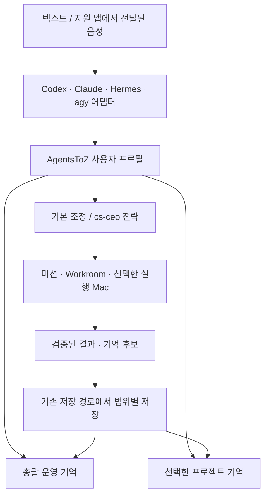

# AgentsToZ 사용자 운영 프로필과 공통 장기기억

상태: 2026-09-14 구현 진행. 아래는 설계 기준이며 실제 완료 범위·검증은 [실행 기록](CONTROL-PROFILE-EXECUTION.md)을 따른다.

이 문서는 Control의 제품 정체성과 기억 접근 계약을 정의한다. [자동 준비 계획](CONTROL-BOOTSTRAP-PLAN.md)은 이 계약을 설치·복원하는 실행 계획이다. 설계 설명과 실행 증거는 구분한다.

## 1. 결정

사용자에게 보이는 이름은 **AgentsToZ · 아젠투지**다. 사용자의 여러 프로젝트를 아는 운영 프로필 하나가 기본이며, 어떤 프로젝트 폴더에서 어떤 지원 AI를 사용하든 같은 프로필을 호출한다. 초기 버전은 사용자당 기본 프로필 하나로 단순화한다.

Hermes의 profile처럼 역할·운영 규칙·기억을 가지고 있지만, 특정 AI의 네이티브 profile에 소유권을 주지 않는다. Hermes profile, Codex skill, Claude command, Antigravity integration은 공통 프로필에 접속하는 어댑터다. AI/모델 교체는 프로필이나 기억 ID를 교체하지 않는다.

`AgentsToZ-Control`은 이 프로필의 기존 저장·동기화 위치로 계속 사용할 수 있다. 사용자가 그 폴더로 이동하거나 프로젝트 목록에서 검색해야만 호출되는 구조를 없앤다. byCS는 계속 앱 개발 프로젝트다. 기존 Control 폴더를 삭제·이동하거나 기억을 새 ID로 복사할 필요는 없다.

## 2. 기억과 실행의 역할

| 범위 | 보관할 내용 | 정본 |
|---|---|---|
| 사용자 운영 기억 | 사용자가 정한 작업 방식, 프로젝트 별칭·관계, 반복되는 공통 결정, 검증된 여러 프로젝트의 결과 요약 | AgentsToZ 프로필에 연결된 하나의 운영 기억 |
| 프로젝트 기억 | 해당 프로젝트의 설계, 코드 변경, 검증 결과, 제약 | 각 프로젝트의 기존 canonical memory |
| 진행 중 작업 | 목표, 담당 AI, 실행 순서, 세션, 결과 영수증, 중단·재개 상태 | 기존 mission/Workroom 저장소 |
| 기기 연결 | 이 OS 사용자의 로컬 경로, CLI 설치·로그인 상태, 실행 가능한 Mac | 해당 설치의 로컬 설정 및 검증된 연결 기록 |

운영 기억은 전체 프로젝트 원문을 모은 복사본이 아니다. 프로젝트 관계와 필요한 기억의 참조를 가진다. 코드 작업에서는 운영 기억으로 목표·대상을 정한 뒤 대상 프로젝트 기억을 읽는다. 단순 프로젝트 열기에는 짧은 프로필과 프로젝트 목록만 사용한다.

우선 적용할 정보는 현재 사용자의 명시적 지시, 작업 대상에 적용되는 지침, 확인된 프로젝트 사실이다. 오래된 운영 선호와 현재 프로젝트 제약이 다르면 오래된 선호로 덮어쓰지 않고 차이를 표시한다. 기억에서 읽은 인용문·외부 자료는 실행 권한을 부여하지 않는다.

## 3. 착수 시 확인한 구현과 부족한 부분

- `agentstozInvocationInstaller.ts` v1은 `AgentsToZ`, `에이전츠투지`, `아젠투지`, `/agentstoz`, `$agentstoz`를 설명하는 관리 블록/skill을 생성한다. 이것은 지침 설치 증거이며 모든 AI의 실제 호출 성공 증거는 아니다.
- `agentstozUseControl.ts`와 MCP 서버는 `controllerPortId`를 요구한다. 호스트 `verifyAgentsToZUseController`도 등록 프로젝트를 확인한다. 사용자 프로필에 대한 독립적인 접속 계약이 필요하다.
- 현재 MCP에 사용자 운영 프로필 조회·제한된 운영 기억 회상 도구가 없다. 프로젝트 상태 조회만으로 총괄 기억이 자동 주입된다고 말할 수 없다.
- Control 탐색은 표시 이름/폴더명에 의존한다. 이름 변경·다른 폴더·여러 Mac을 견디는 고정 프로필 바인딩으로 대체해야 한다.
- 호출 규칙의 Hermes 설치는 기본 `~/.hermes`를 전달한다. 활성/custom `HERMES_HOME` 및 선택한 개별 profile에 설치·등록·도구 노출이 되는지 확인해야 한다.
- 기존 `serviceMemory.ts`는 프로젝트 기억 + serviceKey로 파생된 서비스 기억이고 내용은 현재 기기 로컬이다. 이 저장소를 그대로 사용자 전체의 동기화된 운영 기억이라고 재명명하지 않는다.
- 앞선 음성 설계는 앱 데이터의 orchestration memory, mission과 선택적 Control 프로젝트를 함께 설명한다. 이 설계에서는 **장기 운영 기억 하나**와 **기존 live mission 저장소**의 역할을 명확히 하며 같은 결정을 두 운영 기억에 따로 저장하지 않는다.

## 4. 프로필 정체성과 저장

공유 프로필은 `profileId`, schemaVersion, displayName, invocationAliases, canonicalMemoryId, memoryBackend, revision, 선택한 coordinationPolicy를 가진다. 검증된 사용자 바인딩과 동기화 연결 메타데이터는 프로필의 소유권을 결정한다. 초기의 `controlId` 설계 명칭은 `profileId`로 통일한다.

프로필 ID는 최초에 한 번 생성하여 저장한다. 폴더명, 이메일 표시값, GitHub URL, OS 사용자명으로 매번 재계산하지 않는다. 오프라인 최초 사용자는 로컬 사용자 주체로 시작하고, 계정 연결 시 기존 프로필을 유지하거나 검증된 기존 프로필에 합류한다. 동명이인/동일 이름 프로필을 자동 합병하지 않는다.

Mac별 바인딩은 profileId → canonical memory 저장 위치, local project ID(있는 경우), 설치 ID, CLI 연결 상태다. 호출한 AI의 현재 작업 디렉터리는 프로필 선택 키가 아니다. 새 Mac은 같은 프로필 ID/기억 ID를 복원하고 해당 Mac의 경로를 새로 결속한다.

기존 사용자: `AgentsToZ-Control/.agent-memory/config.json`의 memoryId와 기록을 그대로 연결한다. Control의 운영 용도는 사용자 범위로 설명하되 기존 저장 형식의 DEV 표식을 억지로 바꾸지 않는다. 별도의 USE service-memory로 자동 이관하지 않는다.

신규 공개 사용자: 기본 저장은 OS 사용자 전용 앱 데이터의 프로필 관리 영역을 사용한다. 프로젝트 등록과 작업 루트 선택 없이도 프로필을 준비할 수 있다. 기존 기억 엔진은 프로젝트 API를 편법으로 호출하지 않고 검증된 프로필 저장소 어댑터를 통해 재사용한다. 코드 프로젝트 생성·실행에는 별도의 작업 루트가 필요하다.

GitHub 문서 버전 관리가 필요하면 Control 폴더 연결/내보내기를 제공한다. 활성 기억 정본은 항상 하나이며 저장 위치 전환은 스냅샷과 해시·ID 검증 후 바인딩을 원자적으로 바꾼다. 초기 구현에서는 기존 Control을 유지해 이관을 최소화한다.

Supabase 기억 동기화는 기존 revision/충돌 감지/백업 경계를 재사용한다. Git과 Supabase가 같은 기억을 임의로 각각 덮어쓰지 않도록 Git 복원 → 기억 ID 확인 → 원격 revision 대조 → Pull/충돌 처리 → 후속 Push 순서를 유지한다. 오프라인은 마지막 검증된 로컬 기억으로 동작하며 기준 시각을 표시한다. 서버 응답 없음은 새 기억 생성 근거가 아니다.

## 5. 공통 호출 계약

표시 이름 `AgentsToZ`, 정규 호출 토큰 `agentstoz`, 한국어 별칭 `아젠투지`, `에이전츠투지`를 하나의 버전 관리된 목록으로 관리한다. 소문자/대문자·유니코드·공백 정규화 규칙을 공유한다. 모델별 프롬프트와 앱 라우터가 별도 별칭 목록을 가지지 않게 한다.

예시 입력(설계 예시이며 지금 실행할 명령은 아님):

- “아젠투지, 새 프로젝트 만들고 Codex로 열어줘.”
- “agentstoz, 방금 프로젝트의 검증을 Hermes에게 맡겨줘.”
- “에이전츠투지, 공통 운영 방식은 유지하고 이 프로젝트만 Claude로 이어가.”

직접 부르는 요청과 이름만 언급하는 설명/인용을 구분한다. 발음 유사도를 근거로 불명확한 대상을 임의 실행하지 않는다. 이름만 부르면 현재 프로필과 준비 상태를 짧게 응답하고 미션을 만들지 않는다. 세션에 프로필이 연결된 뒤 후속 요청마다 이름을 다시 말할 필요는 없다. 프로필 전환과 로그아웃은 기존 세션 바인딩·캐시를 종료한다.

AI 호출 지침은 최소한의 부트스트랩만 전달한다. 실제 기억은 매 요청에 필요한 부분을 공통 도구로 읽는다. AI가 지침을 읽지 않았거나 도구가 없는 상태를 연결 완료로 표시하지 않는다.

## 6. AI/표면별 어댑터와 지원 범위

| 표면 | 구현·검증할 연결 | 완료 판정 |
|---|---|---|
| Codex 앱/CLI | 전역 skill + 관리 지침 + MCP. `$agentstoz` 및 자연어 호출. `/agentstoz` 메뉴 노출은 해당 버전의 실제 지원을 별도 확인 | 올바른 프로필 조회, 회상, 요청 작업 결과 확인 |
| Claude Code | 전역 command/skill + MCP. `/agentstoz` 및 자연어 호출 | 실제 command 인식과 같은 프로필·기억 조회 |
| Hermes | 선택한 프로필/custom home의 지원 skill 등록 + MCP. 기존 SOUL/config는 관리 블록만 갱신 | 기본·별도 프로필 양쪽에서 설치가 아닌 실행 결과 확인 |
| Antigravity/agy | 해당 실행 표면의 지원 지침·skill/MCP 연결 | IDE/CLI 각각 도구 검색·회상·실행 확인 |
| 다른 AI | 지원하는 MCP 또는 앱의 도구 어댑터 연결 | 동일 계약을 통과한 표면만 지원으로 표시 |
| 도구 연결이 없는 일반 채팅 | 앱에서 실행할 명확한 핸드오프와 필요한 요약 제공 | 직접 제어 가능으로 표시하지 않음 |

목표는 AI에 종속되지 않는 동일 기능이다. 도구 연동을 허용하지 않는 모든 AI에서 자동 인식·직접 실행을 보장하지 않는다. 모델명·추론 설정은 각 실행기가 지원하는 값으로 유지한다. 프로필 공유가 Claude/Codex의 네이티브 채팅 기록과 로그인을 합친다는 뜻은 아니다.

Hermes에 `agentstoz`라는 선택적 전용 profile을 만들 수는 있지만 공통 프로필의 원본으로 사용하지 않는다. 사용자가 선택한 기존 profile에도 접속할 수 있게 하고 이름 충돌 시 덮어쓰지 않는다. 다른 Hermes profile의 모델·개성·인증을 바꾸지 않는다.

## 7. 기억 회상과 저장 도구

아래 공통 도구를 구현했다. 설치된 MCP 버전과 준비 상태를 먼저 확인한다.

1. `agentstoz_use_get_control_profile`: 인증된 연결에 결속된 프로필, 기억 기준 revision, 사용 가능한 기능·저장 상태 조회. 경로나 임의 사용자 ID를 받아 프로필을 선택하지 않는다.
2. `agentstoz_use_recall_control_context`: 현재 요청에 관련된 운영 기억과 허용된 프로젝트 참조를 제한된 결과로 반환. 결과에는 entry ID, scope, revision, 갱신 시각과 출처를 포함한다.
3. 기존 프로젝트 조회·상태·Workroom·미션 도구로 실행한다. 현재 폴더를 바꾸지 않아도 되고 대상 프로젝트·실행 Mac은 검증된 ID로 선택한다.
4. `agentstoz_use_propose_control_memory`: 사용자 요청이나 검증 결과에 기반한 운영 기억 후보를 기존 저장 검토 흐름에 제출한다. 성공 응답에는 후보 접수와 실제 저장 완료를 구분한다.

프로필 바인딩이 프로젝트 controller 검증을 대체하더라도 기존 로컬/원격 권한을 넓혀 버리지 않는다. 프로필 바인딩 조회만으로 기억 원문 읽기나 원격 실행 권한이 생기지 않으며 각 표면에서 실제 허용된 기능을 반환한다. 기존 MCP 설정은 호환 어댑터로 유지하고, 확인되지 않은 controller를 기본 프로필에 자동 결속하지 않는다.

운영 기억은 공통 저장 dispatcher 하나로 기록한다. 여러 AI/Mac이 동시에 저장하면 expected revision과 멱등 요청 ID로 충돌·중복을 감지한다. 충돌 시 양쪽 후보와 근거를 보존하고 재조회하며 last-write-wins로 지우지 않는다. AI별 별도 운영 CORE 사본을 정본으로 만들지 않는다.

회상은 짧은 기본 프로필 + 검색 결과로 제한한다. 초기 검증 예산은 핵심 설명 2 KiB, 관련 항목 최대 8개/총 16 KiB이며 실제 지연·정확도 측정으로 조정한다. 캐시는 사용자·프로필·revision·질의에 결속하고 프로필 전환/저장/로그아웃에서 무효화한다. 포괄 질의에도 전체 기억을 무제한 주입하지 않는다.

수동 기억 저장·최근 저장 시각은 프로필 화면에 제공한다. 자동 저장은 관찰 가능한 작업 완료 이벤트와 기존 사용자 설정을 사용한다. 컨텍스트 사용률이나 종료 이벤트를 제공하지 않는 AI 표면에서는 값을 추정하거나 모든 대화 자동 저장을 약속하지 않는다. Hermes/agy의 저장 연동은 완료 이벤트 계약부터 시험한다.

## 8. 음성·원격·오케스트레이션

음성은 지원 앱에서 이미 켜진 음성 대화가 텍스트 요청을 전달하는 시점부터 공통 호출 계약에 들어온다. 텍스트/음성에서 같은 프로필 회상·실행 영수증을 사용한다. 상시 마이크 감시, OS 전역 깨우기 단어, Codex 음성 UI 자동 열기는 별도 기능이며 이 프로필 작업의 완료 조건에 포함하지 않는다.

모바일은 인증된 연결의 사용자 프로필과 선택 Mac을 조회한다. 같은 프로필을 여러 Mac에서 쓸 수 있어도 실제 실행 위치가 같다는 뜻은 아니다. 마지막 검증된 대상이 있으면 재사용하고, 여러 Mac 중 대상을 결정할 근거가 없으면 선택받는다. 호스트가 끊겼을 때 다른 Mac으로 자동 재실행하지 않는다.

협업은 두 전략을 선택할 수 있다: AgentsToZ 기본 조정 / cs-ceo의 계획·분해·검토 사용. 양쪽 모두 같은 프로필·프로젝트 기억·미션·Workroom을 사용한다. cs-ceo에 별도 사용자 기억을 복제하거나 작업 상태 정본을 넘기지 않는다. 선택된 전략이 설치되지 않았으면 연결 필요 상태와 명시적 대안을 제시한다.

한 checkout의 쓰기 작업은 하나로 배정하고 병렬 변경은 격리 worktree를 사용한다. AI를 바꿀 때는 미션 ID, 마지막 검증 결과, 관련 기억 참조를 전달한다. AI의 전체 비공개 채팅 기록을 복제하지 않는다. 중단·재시작 후 실제 작업 재개는 사용자 요청에 따른다.

## 9. 설치 경로에 적용

private byCS: 현재 사용자의 기존 Control을 프로필에 연결하고, 다른 Mac의 Pull + 최신 런타임 실행에서 동일 프로필/기억 자동 복원을 우선 구현한다. 복원 프로필의 개인 값은 공개 소스·패키지에서 제외한다.

공개 clone/앱: 관제 화면과 공통 프로필 엔진을 포함한다. 신규 사용자에게 개발자의 Control을 내려주지 않는다. 프로젝트가 0개여도 로컬 프로필을 준비하고 호출할 수 있으며 첫 프로젝트 생성 시 작업 루트를 정한다. 기존 사용자는 자신의 프로필을 복원한다.

설치 앱: 소스 checkout과 무관한 번들 어댑터와 계정별 앱 데이터를 사용한다. Mac 배포 권한과 실제 CLI host 작동은 별도 출하 검증을 수행한다. iOS는 연결된 host 프로필을 사용하고 독립된 운영 기억을 몰래 생성하지 않는다.

## 10. 구현 순서와 수용 기준

P0 — 프로필 계약과 기존 기억 채택: profile ID/바인딩/소유권/스토어 어댑터를 정의한다. 기존 Control을 ID 변화 없이 연결하고 이름/경로 변경 후에도 조회한다. 신규 상태는 별도 임시 fixture로 검증한다.

P1 — 개인 다른 Mac 자동 준비: private bootstrap, 업데이트 후 실행, clone·등록·기억 복원·중단 후 재개. 같은 프로필·기억 ID 및 원래 항목 해시 확인, 반복/동시 실행에 중복 없음. 기존 기억이 미확인일 때 빈 기억을 push하지 않음.

P2 — 공통 회상·호출: 프로필/회상/저장후보 도구, 버전 관리된 별칭 지침, 구 MCP 호환. 일반 폴더·프로젝트 A·프로젝트 B에서 같은 운영 선호를 읽고 대상별 기억은 다르게 읽는지 확인한다.

P3 — AI별 실제 검증: Codex → Claude → Hermes → agy 교체 후 같은 profileId/memoryId/revision과 검증된 상태를 읽는지 확인한다. custom Hermes profile과 새 대화에서의 도구 검색을 포함한다. 이름 언급·인용은 무작업, 직접 호출은 요청에 맞는 도구 호출인지 검사한다.

P4 — 공개·설치·모바일: 신규 OS 사용자, 기존 계정, 다른 계정, 네트워크 중단, 앱 업데이트, Mac/iOS 실제 배포본을 시험한다. 개인 설정 유출 없음, 교차 사용자 기억 접근 없음, 다른 Mac에서 기억 최신화, 실행 Mac 유지 여부를 확인한다.

P5 — 저장·성능·장기 운영: 여러 AI 동시 저장 충돌, 같은 요청 재전송, 폴더 이동, 프로필 연결 해제, 미지원 schema, 캐시 무효화, 회상 크기 상한을 검증한다. 회상과 실행의 지연을 나누어 기록하고 p50/p95를 측정한다. 결과 전에 속도 향상을 단정하지 않는다.

배포 승인 증거는 이름 규칙 설치가 아니라 **사용자 호출 → 정확한 공통 기억 회상 → 대상 프로젝트 작업 → 결과 확인 → 올바른 범위로 저장 → 다른 AI/Mac에서 회상**의 전체 연결이다. 현재 문서 작성 단계에서는 이 연결이 구현·검증되었다고 보고하지 않는다.
