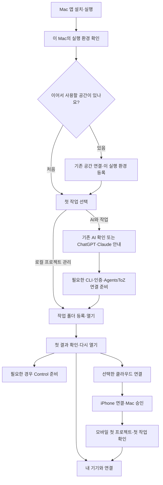

# 설치 앱에서 시작하는 계정·실행 환경·모바일 온보딩

작성 2026-09-13 · 검토 기준 `7955986` (Mac v463). 상태: **구현 진행 중**. 검증된 범위와 남은 항목은 [EXECUTION.md](EXECUTION.md)를 따른다.

사용자 요청: 소스 Clone 없이 설치한 Mac 앱에서 단말 등록·조회, 도구·계정 상태 확인, AI 핸드오프,
첫 작업과 iPhone 연결까지 이어지게 한다. Mac TestFlight 업로드보다 이 경험의 완성을 우선한다.

기존 [9월 11일 계획](../beginner-onboarding-2026-09-11/PLAN.md)과
[실행 계약](../beginner-onboarding-2026-09-11/ENGINE.md)을 대체 구현하지 않고 확장한다.
이 문서가 추가하는 범위는 **앱의 상시 연결 센터, OS 사용자별 실행 환경, 검증된 AI 인계,
기존 계정 재사용과 모바일 연결의 끝까지 확인**이다. 구 계획의 구현 상태는 각 EXECUTION 문서와 소스로 판단한다.

검증 행렬·출시 판정은 [ACCEPTANCE.md](ACCEPTANCE.md), 구현 단위는 [IMPLEMENTATION.md](IMPLEMENTATION.md)를 따른다.
계획 수립 이후 소스 구현을 시작했다. 계정 생성·DB 변경·새 앱 설치·배포 여부는 실행 기록에 별도로 남긴다.

## 최신 요청으로 고정한 우선순위

사용자의 최신 요청은 **추가 기능의 테스트 계획 → 새 앱 빌드 → 실제 기능 검증**을 먼저 진행하는 것이다.
구체적인 실행 순서는 [TEST-PLAN.md](TEST-PLAN.md)를 따른다. 서명창 재시도와 재시동 요청은 일단 중단한다.
최종 배포는 기존에 결정한 **Mac TestFlight 업로드 → 실제 다운로드·설치 → 기능 실기**를 유지한다.
Developer ID 직접 배포로 임의 전환하지 않는다. 기능 시험과 배포 서명·패키징·sandbox 관문을 나누고 각 실패 근거를 남긴다.

사용자가 이미 사용하는 **사용자 소유 Google Cloud 프로젝트 → Supabase Auth의 Google OAuth → 개인 Vercel 포털 → Mac/iPhone** 구성을
다른 사용자도 재현하는 것이 1차 목표다. 대화에 제공된 실제 프로젝트 이름·ID·번호는 사용자 제공 참고 정보이며
접속·권한·설정의 실시간 검증 결과가 아니다. 공개 계획·기본값·샘플 인계문에는 이를 복제하지 않는다.

이번에는 개인 포털 경로를 단순한 고급 부록으로 밀어 두지 않는다. 아래 기존 1.8과 7절의 공통 모바일/gateway 방향은
후속 간소화 트랙으로 유지하되, **사용자 소유 기존 구성 재현의 선행 조건으로 두지 않는다.**
서비스 전체를 공유 DB로 전환하거나 개발자 포털에 신규 사용자를 추가하는 계획도 아니다.

목표 체험은 `Mac TestFlight 설치 → AI 도우미 준비 → 인계문 복사·붙여넣기 → 필요한 로그인·선택 클릭
→ 앱의 사후 검사 → 모바일에서 이어 작업`이다. TestFlight 채널은 P0 적합성 실증 통과를 조건으로 한다.
전체 호스트 기능이 채널 제약을 충족하지 못하면 그 사실을 먼저 보고하고, 같은 온보딩을 제공하는 서명·공증 Mac 앱으로
테스트를 계속한다. 배포 경로를 바꾼 것을 “Mac TestFlight 목표 달성”으로 계산하지 않는다.

`클릭과 인계문 복붙만`은 다음처럼 채점한다.

- 사용자가 terminal 명령·SQL·환경변수 파일을 작성/수정하는 횟수: 0.
- AI 없이도 첫 설치 안내·설정 상태 조회·다음 단계 안내·보류/재개 가능.
- 일반 설치 단계의 인계문: 한 작업 시작에 하나, 대화 이동/복구 때만 필요한 내용을 다시 생성.
- 사람은 로그인·2FA·소유 계정/팀·프로젝트·비용/공개 여부 등 자신의 결정을 처리한다.
- OAuth Client Secret 전달은 공식 API/검증된 비밀 처리 경로가 가능한지 P0에서 실증한다.
  AI 채팅에 붙여넣는 방식은 채택하지 않는다. 공식 대시보드 간 사용자의 별도 보안 입력이 필요하면
  `보안 입력 1단계 필요`라고 표시하고 **엄격한 클릭/인계문만 목표는 미충족**으로 남긴다.

상세 복제 순서와 실제 버튼·인계문 계약은 [HANDOFF.md](HANDOFF.md)에 있다.

## 1. 제품 결정

1. 처음 실행하면 `시작 도우미`, 이후에는 같은 상태의 `내 기기와 연결`을 연다. 장기기억 하위에만 있던
   기기 관리를 앱 전체의 공통 기능으로 노출한다. 새 단말 테이블이나 별도 등록 wizard를 중복 생성하지 않는다.
2. AgentsToZ 설치본 자체는 Git Clone·Bun·Rust·Xcode 없이 열린다. Git과 AI 도구는 해당 기능을 고를 때 준비한다.
3. AI가 없으면 `ChatGPT로 도움받기`를 첫 추천으로 제시하고 `Claude로 도움받기`와 `직접 준비하기`를 제공한다.
   이미 사용할 수 있는 AI가 있으면 그것을 우선한다. 설치 강제·유료 가입 자동 선택은 없다.
4. AI 도움은 선택이다. 앱의 고정 설치·인증·재개 엔진이 기본 진행을 맡아 AI를 설치해야 AI 설치를 도울 수 있는 순환을 없앤다.
5. 선택한 첫 AI 하나에서 실제 첫 응답까지 확인한다. 네 CLI를 모두 설치해야 시작할 수 있는 구조를 만들지 않는다.
6. 계정 존재를 전역 검색하지 않는다. 앱이 확인할 수 있는 것은 **이 환경에 연결된 인증과 선택된 서비스 자원의 상태**다.
   브라우저가 로그인돼 있는지만 보고 CLI 인증 또는 다른 서비스 권한을 완료 처리하지 않는다.
7. 로컬 사용, 기존 공간의 추가 기기, 완전히 새로운 동기화 공간을 구분한다. 신규 고객을 개발자의 개인 DB/포털에 연결하지 않는다.
8. 공통 모바일+사용자 소유 Supabase라는 기존 방향을 유지한다. 기존 개인 Vercel 포털은 지원되는 기존 경로다.
   모든 신규 사용자에게 개인 Vercel·Google OAuth 앱 생성을 기본 관문으로 요구하지 않는 목표는 아직 gateway 구현이 필요하다.
9. Control은 운영·관제 기억, 개별 프로젝트는 해당 작업의 기억을 가진다. 앱 설치/등록 성공의 조건으로 개발용 byCS 저장소를 Clone하지 않는다.
10. Mac TestFlight 적합성은 별도 선행 실증이다. 이 계획을 끝냈다는 이유만으로 전체 CLI 호스트의 TestFlight 배포가 가능하다고 판정하지 않는다.

## 2. 현재 있는 기반과 확인된 빈틈

| 영역 | 현재 근거 | 필요한 보완 |
|---|---|---|
| 설치본과 소스 실행 구분 | `onboardingInfrastructure.ts`의 packaged 정책은 Bun/dependencies를 제외 | 설치본 기본 진입·전체 설명·AI 지침까지 일관되게 적용 |
| 준비 현황과 재개 | `OnboardingPreparation.tsx`, `onboardingProgressStore.ts`: SQLite, revision, 보류/재개 | 설정/초기 화면/AI가 동일 run과 증거를 읽도록 통합 |
| Codex | 고정 설치 recipe, 로그인 guard/receipt, 첫 프로젝트/응답 경로 | 새 OS 계정·서명 설치본에서 실제 전체 여정 검증 |
| GitHub | 별도 설치·인증 host/guard/UI | 계정·선택 저장소·권한·실제 작업 결과 연결 |
| 나머지 도구 | 네 CLI와 Supabase/Vercel 진단·설치 안내 | 제공자별 설치/로그인/권한/첫 실행 상태 및 자동 복귀 |
| Supabase 기존 진단 | `api-server.ts`의 `/api/supabase-cli/status` | 종료 실패를 일괄 미로그인으로 판정하고 제한 없는 프로세스 대기가 있음. 공통 bounded 진단으로 이관 |
| Vercel | 읽기 진단은 bounded, 로그인은 legacy Terminal 경로 | 설치본에서 repo 없이 배포할 아티팩트·로그인 receipt·대상 확인 필요 |
| AI 인계 | `buildOnboardingAgentPrompt`는 packaged를 구분 | 로컬 제어 capability 확인, 앱으로 결과 복귀, 앱 동봉 지침 필요 |
| 문서 | README·최근 계획은 설치 앱 우선 | `.agents/skills/onboarding` 도입부는 Clone/Bun/Git 필수 관점. 설치본과 소스 절차를 분기해야 함 |
| 추가 기기 | `onboardingHandoff.ts` v3는 URL/public key/추천 이름만 전달 | OS 사용자 계정을 포함한 표시·다시 시도·기존 설정 보존을 앱에서 이해하기 쉽게 제공 |
| 단말 정본 | 사용자 홈의 `portal.json`, `device_id` 중심, alias 이력 | 물리 Mac·OS 계정·실행 환경의 역할 명시, 다른 계정의 동시 실행 시험 |
| 로컬 서버 | `src-tauri/src/lib.rs`: `127.0.0.1:3001`, capability 증명·타 서비스 보호 | 같은 Mac 다중 로그인 시 포트 충돌. 사용자 폴더 분리만으로 동시 실행을 보장할 수 없음 |
| DB | 일부 테이블/RPC는 `portmgr_is_member()`로 공간 회원 공통 접근 | 개인 공간과 타인 데이터의 격리를 구분. macOS 계정 추가를 tenant 보안으로 설명하지 않기 |
| 모바일 | iOS의 `RemoteHomeView`, 영속 WKWebView, OAuth bridge, 기존 QR/relay | 현재 개인 포털 의존 경로와 계획 중 공통 앱 경로 구분, 로그인 직후 자동 목록 반영 실증 |
| 기기 이름 | v463 `RemoteConnectionLabel`: Mac localStorage의 연결별 별명 | 단말/실행 환경/모바일 연결 이름의 일관성, 정확한 단말정보 없는 경우 수동 별명 유지 |

사용자가 보고한 “로그인 뒤 새로고침하면 목록이 보임”은 재현 대상이며 원인을 확정하지 않았다.
앱 ID 변경 또는 재승인 필요로 단정하지 않는다. 첫 준비 화면의 빈 목록과 조회 실패도 구분한다.

## 3. 사용자가 보게 될 순서



등록된 공간을 아직 모르면 기존 사용 여부만 묻는다. 설정이 읽히지 않을 때 신규 등록으로 밀어 넣지 않는다.
동기화·모바일을 선택하지 않은 로컬 사용자는 UUID의 원격 등록이나 Google 로그인을 기다리지 않는다.

### 화면 A: 시작 도우미

`처음 사용해요` / `다른 기기에서 사용 중이에요`, 이미 로컬 기록이 있으면 `이어서 준비하기`.
시작 목표는 `프로젝트 열기`, `AI와 작업`, `휴대폰 연결`로 제시하고 필요한 단계만 만든다.
macOS·CPU·앱 빌드·설치 채널·사용자 저장 공간과 로컬 서버 연결을 먼저 확인한다.

### 화면 B: 내 기기와 연결 — 상시 접근

```text
내 기기와 연결
이 Mac · cs-test                   온라인 · 방금 확인
연결 공간: 내 작업 공간            [다른 공간 연결]

AI 도우미   ChatGPT   설치됨 · AgentsToZ 연결 확인 필요  [연결하기]
워크룸      Codex     로그인됨 · 첫 작업 미확인        [첫 작업]
코드 보관   GitHub    연결됨 · 선택 저장소 확인 필요   [저장소 선택]
자료 동기화 Supabase  기존 공간 연결됨                [상태 확인]
웹 배포     Vercel    선택하지 않음                   [나중에 연결]
모바일      iPhone   아직 연결하지 않음               [휴대폰 연결]

[등록된 실행 환경 보기] [다른 Mac·사용자 계정 추가] [이어서 준비하기]
```

화면의 계정/상태는 실제 증거가 있을 때만 표시한다. 미설치는 새 사용자에게 오류가 아니라 다음 준비 단계다.
세부정보에는 앱/CLI 버전·발견 경로(로컬만)·인증 계정/팀(동의된 최소 표시)·검사 시간·실제 기능 결과를 둔다.
단말 목록은 캐시의 마지막 보고와 현재 연결을 구분하고 이름을 바꿔도 ID·권한을 바꾸지 않는다.

### 화면 C: AI 도움받기

1. 이미 설치된 앱/CLI와 사용 가능한 연결을 확인한다.
2. 없으면 공식 ChatGPT 설치 안내를 기본 추천, Claude Desktop을 대안으로 제공한다.
3. 설치 후 앱으로 돌아오면 제한된 재검사를 수행하고 다음 단계로 이동한다.
4. 선택한 AI에서 로컬 도구 연결이 확인되면 `AI에 이어서 맡기기`, 확인되지 않으면 `안내문 복사`를 표시한다.
5. 브라우저 자동화 도움은 선택한 제공자가 지원할 때만 제공한다. 특정 브라우저 설치를 모든 사용자에게 강제하지 않는다.

ChatGPT 앱의 현재 공식 안내에는 Chat/Work/Codex 작업 표면이 있다. 이름이 아니라 실제 로컬 작업·도구 연결을 확인한다.
Claude Desktop의 로컬 MCP는 공식 desktop extension 경로를 검토한다. 둘 다 **앱 존재 → 모든 CLI 인증 완료**로 계산하지 않는다.
공식 지원이 확인되지 않은 딥링크·명령 자동 입력·비공개 로그인 상태 읽기를 설계의 필수 요소로 두지 않는다.

### 화면 D: 휴대폰 연결

Mac에서 `휴대폰 연결` → 네트워크에 맞는 QR → iPhone에서 스캔/필요한 로그인 → Mac의 코드 확인·권한 선택
→ 양쪽에 같은 실행 환경과 기기 이름 → 프로젝트 목록 자동 표시 → 작은 원격 작업 실행.

- `인터넷 어디서나`와 `같은 네트워크`를 선택 전에 구분한다. LAN 연결만으로 외부 사용 완료 처리하지 않는다.
- iPhone에서 시작했다면 Mac 설치 안내와 `Mac 준비 후 QR 스캔`으로 돌아올 수 있어야 한다.
- OAuth 후 앱 복귀·토큰 갱신·Mac 승인 도착 시 auth/tenant/controller 세대에 맞는 목록을 갱신한다.
  늦은 응답으로 다른 공간의 목록을 덮어쓰지 않고, mutation은 자동 재전송하지 않는다.
- 새 앱 ID·재설치·다른 휴대폰은 연결을 새로 해야 할 수 있음을 안내하되 실제 저장 연결을 먼저 조회한다.
- 유지 기간은 기존 승인 상한 30일과 명시 해제/만료 조건을 따른다. 앱 업데이트가 자동으로 기간을 연장하지 않는다.

## 4. 식별 구조: 단말 대신 실행 환경을 분명히 한다

| 개념 | 권장 정본/처리 | 표시 예 |
|---|---|---|
| 연결 공간 | 검증된 Supabase/gateway 배포 신원. 로컬만 쓰면 원격 공간 없음 | 내 작업 공간 |
| 서비스 사용자 | 해당 issuer/공간의 검증된 subject. 로컬 사용 시 선택 | 연결된 계정 |
| 실행 환경 | 현재 `device_id` 보존. OS 계정의 앱 데이터와 실행 주체 | MacBook · cs-test |
| 물리 기기 묶음 | 선택적 표시 관계. 승인된 연관만 묶고 권한에 사용하지 않음 | 개인 Mac |
| 접속 기기 | 기존 controller ID·키·승인 세션·만료 | 아이폰17 · TestFlight |
| 프로젝트/기억 | 프로젝트 정본·memoryId 유지, 실행 환경별 경로 연결 | Control / 실제 작업 프로젝트 |

같은 hostname·이름·이메일을 키로 합치지 않는다. OS username/UID는 로컬 실행 확인에 쓰되 서비스 userId로 쓰지 않는다.
계정 이름 자동 제안은 로컬에서 만들고, 동기화할 표시 이름은 사용자가 수정할 수 있다. 하드웨어 일련번호 수집은 필요 없다.
기존 DB 행은 일괄 재작성하지 않는다. 선택 메타데이터를 점진적으로 추가하고 구버전의 누락 값을 `미확인`으로 해석한다.
추가 기기는 v3 공개 연결 정보와 새 UUID를 사용하고, 중단 후에는 pending UUID를 재사용한다.
재설치 이력 복구와 다른 OS 계정 신규 등록은 서로 다른 동작이다.

**중요:** 현재 공간의 허용된 회원이 공통 데이터를 볼 수 있는 정책을 유지하는 동안 `cs-test`는 같은 개인 공간의
추가 실행 환경이다. 이를 타인과 안전하게 공유하는 별도 사용자 영역이라고 광고하지 않는다.
여러 독립 고객은 고객별 DB/검증된 gateway로 분리한다. 하나의 공유 DB를 여러 고객에게 제공하려면 별도 tenant/RLS 설계가 필요하다.

### 같은 Mac의 두 사용자 동시 실행

현재 Tauri는 3001을 고정 사용한다. 두 번째 사용자가 실행하면 기존 서버를 외부 서버로 판정해 시작이 막힐 가능성이 있다.
계획의 P0에서 실제 두 OS 계정으로 재현하고, P1에서 사용자별 endpoint 발견 계약을 구현한다.
Tauri가 시작한 sidecar의 동적 loopback 포트와 capability를 사용자 소유 파일/IPC로 전달하며 앱·MCP 클라이언트가 같은 resolver를 쓴다.
포트 번호나 이름만으로 다른 사용자의 API를 채택하지 않는다. 레거시 3001 클라이언트에는 정확한 소유 확인과 안내를 유지한다.
이 변경은 모든 `localhost:3001` 경로를 검색해 마이그레이션해야 하며 온보딩 화면만 바꾸면 완료가 아니다.

## 5. 상태는 설치·인증·권한·기능을 분리

표준 증거는 기존 ENGINE Readiness를 확장한다: tool/provider ID, environment ID, 선택 account/team/resource,
각 축의 yes/no/unknown/not-required, checkedAt, 증거 종류, 다음 동작, 오류 분류.
인증값·CLI 원문·사용자 홈 경로는 원격 DTO나 AI 인계문에 넣지 않는다.

| 표시할 상태 | 의미 | 다음 동작 |
|---|---|---|
| 설치 필요 | 지원되는 탐색 경로에서 실행 파일을 찾지 못함 | 공식 설치/앱의 검증된 설치 |
| 설치됨 | 버전과 실행 가능 확인, 로그인은 미확인 | 로그인 확인 |
| 로그인 필요 | 공식 인증 검사에서 명시적으로 미인증 판정 | 로그인 열기 |
| 권한 확인 필요 | 계정은 확인했으나 선택 리소스 접근 미확인 | 조직·프로젝트 선택/권한 확인 |
| 첫 작업 미확인 | 설치·인증·권한과 실제 실행을 구분 | 짧은 실제 작업 |
| 사용 가능 | 선택 기능의 실제 검증 결과가 있음 | 사용하기 |
| 확인하지 못함 | 네트워크/Keychain/포트/서비스 장애 | 원인별 재검사, 인증 유지 |
| 나중에 연결/지원 안 함 | 사용자 보류 또는 미지원 환경 | 필요한 기능만 계속 |

Supabase 관리 OAuth, DB 연결/스키마, 포털 Google 로그인, 회원 권한, relay 도달 가능성은 각각 다른 검사다.
Vercel 로그인 성공도 배포 권한이나 해당 배포의 Google callback 정상 동작을 보장하지 않는다.
ChatGPT 구독·API 계정과 워크룸 CLI의 인증 방식도 해당 어댑터의 검증된 정보만 표시한다.

## 6. AI 핸드오프와 앱이 직접 하는 일

앱은 고정 recipe의 설치·인증 시작·상태 재검사·복구를 담당하고 AI는 같은 단계의 설명과 예외 해결을 돕는다.
`setupRunId`와 revision이 정본이며, AI의 “완료”라는 문장은 완료 증거가 아니다.

제안 인계문 예시(지금 실행할 명령이 아님):

```text
AgentsToZ의 “AI와 첫 작업” 설정을 이어서 도와줘.
설치 앱 환경이며 소스 Clone이나 Bun 설치는 필요하지 않아.
이 Mac의 AgentsToZ 연결 도구로 준비 상태를 다시 확인해 줘.
선택한 준비 작업은 Codex 연결과 첫 프로젝트 실행이야.
현재 알려진 상태: 설치 확인, 로그인 확인 필요.
기존 계정·프로젝트를 재사용하고 로그인은 공식 화면에서 내가 진행하게 해줘.
도구 연결이 없으면 앱의 다음 버튼을 안내하고 완료로 표시하지 마.
```

실제 인계에는 비밀 없는 run 참조·recipe 버전·허용 tool ID만 더한다. run ID만으로 실행 권한을 주지 않는다.
수신 AI는 MCP handshake로 같은 실행 환경을 확인하고, 앱에서 검토된 단계/승인 범위를 재사용한다.
임의 shell을 온보딩 MCP의 인자로 받지 않는다. 로그인 code·token·cookie·관리자 key를 프롬프트에 복사하지 않는다.
사용자가 승인한 설치 목록을 매 단계 다시 승인받지 않고, 새 범위·유료 생성·팀 선택·공개 배포의 결정만 따로 받는다.
공식 로그인/2FA는 별도 인증 화면에서 처리하고 워크룸 기록·What I Said·자동 기억 수집에서 제외한다.
AI 앱으로 이동했다 돌아오거나 앱이 재시작돼도 같은 단계부터 이어간다. 미확정 외부 생성은 결과 조회 후 판단한다.

## 7. 클라우드: 기존 환경과 새 사용자 경험을 분리

| 경로 | 계획 |
|---|---|
| 기존 개인 Supabase·Vercel 보유 | 새 앱에서 연결 정보 import → 로컬 인증 → 새 실행 환경 등록 → 읽기·쓰기 검증 → 기존 포털/Google/QR 검사 |
| 새 사용자·로컬만 사용 | 클라우드 없이 첫 프로젝트·AI 작업. 이후 필요할 때 연결 |
| 새 사용자·모바일까지 사용 | Supabase 계정/프로젝트 선택 또는 생성 지원 → 고객 gateway 설치·검증 → 공통 iOS 연결 공간 등록. 별도 기술 실증 후 활성화 |
| 개인 웹 포털을 직접 소유하고 싶음 | Vercel 선택 연결. 서명된 공개 portal artifact와 대상 Supabase 바인딩으로 배포. 설치 디렉터리나 임의 cwd를 소스로 사용하지 않음 |

새 사용자 기본 흐름의 Supabase OAuth 통합은 개발자 측 OAuth client/redirect 등록·최소 scope·취소/회수 처리가 필요하다.
서비스 계정만 로그인하면 gateway가 자동 완성된다고 설명하지 않는다. 프로젝트 선택, 비용/리전, DB 변경 영향은 구체적으로 보여준다.
Google 로그인 간소화는 선택한 공통 인증/등록 중계와 고객 gateway의 subject 결속을 증명해야 한다.
이 실증이 실패하면 개인 포털 고급 경로를 유지하고 “설정 없는 공통 모바일” 출하 완료를 보류한다.
Vercel 로그인과 Vercel 배포 권한, Supabase 로그인과 Management API 범위는 별개다.

## 8. Control과 기억

첫 프로젝트 후 `여러 프로젝트를 함께 지휘하기`를 고르면 Control을 만든다/연결한다.
프로젝트 등록·기억 초기화 API를 재사용하고 저장 루트와 GitHub 사용/공개 여부가 미정인 경우 해당 선택을 받는다.
단일 프로젝트만 쓰는 사람에게 Control을 강제하지 않는다.
운영 기억에는 공간·프로젝트 관계·공통 결정, 개발 기억에는 구현·테스트·배포 사실을 남긴다.
인증 비밀, 원문 진단, 현재 설치 상태를 영구 기억의 정본으로 사용하지 않는다. 실시간 상태는 연결 센터가 담당한다.

## 9. 배포와 이행

첫 목표는 공개 소스의 clean snapshot으로 만든 설치본에서 전체 온보딩을 확인하는 것이다.
Mac Developer ID 서명·공증 경로와 Mac TestFlight 호스트 적합성은 별도 판정하며 둘을 동일 빌드로 가정하지 않는다.
앱 샌드박스, 외부 CLI 실행·설치, 사용자 선택 폴더, 보조 프로세스, 권한·업데이트 동작을 작은 배포 실증으로 먼저 확인한다.
TestFlight 제한을 외부 helper 다운로드로 우회하는 방향은 계획하지 않는다. 전체 기능이 불가능하면 정식 Mac 직접 배포를 유지한다.
필요 시 companion 제품은 별도 결정이며 사용자 몰래 호스트 기능을 축소해 같은 앱이라고 안내하지 않는다.

원격 승인·진행 영수증·기억·프로젝트는 업데이트에서 보존한다. 앱 ID/서명/저장소가 바뀌는 전환은 명시적 이행 화면이 필요하다.
온보딩 미완료로 기존 사용자에게 처음부터 설치하라는 화면을 강제하지 않는다.
문서·공개 가이드·AI 스킬·앱 내 링크는 검증된 새 진입점으로 옮기되 Windows/Linux·레거시 복구 링크는 유지한다.

## 10. 공식 근거와 해석의 한계

2026-09-13 확인. 아래는 가능한 통합 경로의 근거이며 AgentsToZ 어댑터 구현/실기기 통과 증거가 아니다.

- [OpenAI ChatGPT desktop app](https://learn.chatgpt.com/docs/app): 공식 설치·로그인·작업 위치와 Chat/Work/Codex 안내. 실제 설치 버전/정책의 로컬 연결은 별도 확인한다.
- [Claude Desktop local MCP](https://support.claude.com/en/articles/10949351-getting-started-with-local-mcp-servers-on-claude-desktop): 로컬 MCP extension 경로. AgentsToZ용 검증된 묶음은 구현 대상이다.
- [Supabase OAuth integration](https://supabase.com/docs/guides/integrations/build-a-supabase-oauth-integration): 사용자 조직/프로젝트를 관리하기 위한 별도 OAuth 통합 근거.
- [Vercel API integrations](https://vercel.com/docs/integrations/create-integration/vercel-api-integrations): 서비스 로그인만으로 배포 권한을 대체하지 않는 별도 통합 경로.
- [Apple App Review Guidelines](https://developer.apple.com/app-store/review/guidelines/): 2.2 TestFlight 및 2.4.5 Mac 조건. 승인 여부를 이 문서가 보장하지 않는다.
- [App Sandbox](https://developer.apple.com/documentation/xcode/configuring-the-macos-app-sandbox), [distribution methods](https://help.apple.com/xcode/mac/current/en.lproj/dev31de635e5.html): Mac 직접 배포와 Store/TestFlight 실증을 나누는 근거.
