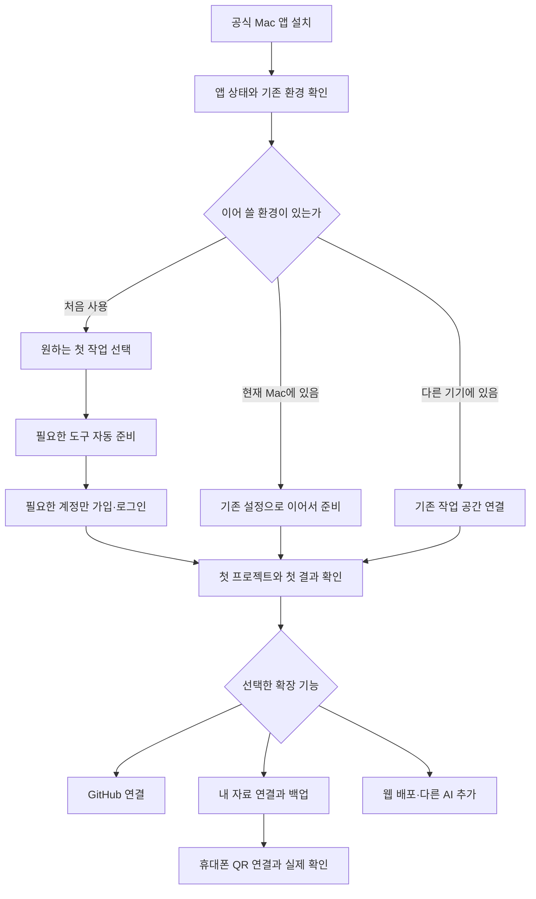

# 처음 쓰는 사람을 위한 AgentsToZ 시작 도우미

작성: 2026-09-11. 소스 검토 기준: `ae91f945068f0ad6ad253fd01f6828ee731ec89b`.
상태: **검토용 설계·실행 계획. 구현·설치·계정 생성·배포를 수행했다는 뜻이 아니다.**
후속 사용자 합의: [Codex·ego-lite 시작 동선](BROWSER-ASSISTED-ENTRY.md). 브라우저 보조 여정의 선행 준비와 개인 포털 검증 순서는 이 문서를 함께 따른다.


이 계획은 [Mac 우선 제품 설계](../../design/README.md)의 사용자 소유 Supabase·공통 모바일 방향과
[모바일 작업 공간](../mobile-workspace-2026-09-11/DESIGN.md)의 프로젝트·원격 작업·기록 흐름을
초보자의 첫 사용까지 확장한다. 기존 인증 프로토콜을 임의로 바꾸는 새 정본은 아니다.

문서 구성:

- 이 문서: 제품 결정, 사용자 화면, 설치 대상, 기존 기능 정리.
- [ENGINE.md](ENGINE.md): 실행·인증·중단 복구·AI 보조 계약.
- [CHECKLIST.md](CHECKLIST.md): 구현 순서, 검증 행렬, 출시 조건, 미해결 검증.

## 1. 해결할 문제와 완료의 정의

사용자가 CLI와 AI를 한 번도 쓰지 않았어도 앱을 설치하고, 자신의 프로젝트에서 첫 결과를 만들고,
원하는 경우 휴대폰에서 그 작업을 이어가게 한다. 사용자는 도구 설치 순서, 셸, PATH, SQL,
환경변수, OAuth callback, 단말 ID를 이해하지 않아도 된다.

기본 경로의 목표는 **수동 명령 0개·비밀값 복사 0개**다. 클릭으로 처리할 수 없는 공식 설치 절차에는
한 단계씩 복사·붙여넣기를 제공한다. 복붙 여부를 사용자에게 묻는 대신 앱이 실제 결과를 확인한다.

외부 서비스 장애, 지원하지 않는 OS, 기업 설치 금지, 계정 이용 제한까지 없애는 것은 불가능하다.
제품이 보장할 것은 **진행을 잃지 않음, 잘못 완료됐다고 하지 않음, 다음 행동 하나를 제시함,
이미 가능한 기능을 계속 쓸 수 있음**이다. 실패를 감추거나 인증을 우회해서 체크를 채우지 않는다.

완료는 설치 개수로 판정하지 않는다.

| 사용자가 선택한 목표 | 완료 증거 |
|---|---|
| 이 Mac에서 프로젝트 관리 | 프로젝트 하나를 추가하고 앱 재실행 후 다시 열 수 있음 |
| AI와 작업 | 선택한 AI가 앱에서 실제 작은 작업에 응답하고 결과를 다시 볼 수 있음 |
| GitHub 사용 | 선택한 계정·저장소의 권한 확인 및 사용자 선택 작업의 결과 확인 |
| 여러 기기에서 자료 사용 | 같은 작업 공간의 테스트 항목을 다른 클라이언트에서 읽고 신원 확인 |
| 휴대폰에서 이어 작업 | 실제 iPhone의 외부 네트워크에서 승인한 Mac의 프로젝트 조회·작업 결과 확인 |
| 웹 배포 | 선택한 계정·팀의 배포 결과 URL에서 기대한 화면 확인 |

## 2. 먼저 고정할 제품 결정

1. 신규 Mac 사용자는 **완성된 앱 설치**로 시작한다. Git clone, Bun, Rust, Xcode 전체 설치를
   AgentsToZ 실행의 전제조건으로 두지 않는다. 실제 선택한 개발 기능이 요구하는 도구만 준비한다.
2. 시작 위치는 하나다. 첫 실행과 설정 메뉴의 **시작 도우미**가 같은 진행 상태를 연다.
   기존 설정이 있으면 자동으로 `이어서 준비하기`를 보여준다.
3. AI가 없어도 도우미가 작동한다. 설치·검사·재개는 앱의 고정 실행 엔진이 맡고,
   AI는 준비된 뒤 쉬운 설명과 예외 진단을 돕는다.
4. 대화 앱·CLI·계정 로그인·이 앱에서의 사용 가능 여부를 분리한다. 하나가 있다고 나머지를
   완료 처리하지 않는다. 이미 사용 가능한 내장 CLI가 있다면 호환성 확인 후 재사용한다.
5. Claude Code·Codex CLI·agy·Hermes를 모두 지원하며 첫 사용에는 하나를 권장한다.
   추가 선택에서 전체 준비도 가능하고 같은 엔진이 누락된 도구를 차례로 준비한다.
6. **ego lite는 브라우저 보조를 선택할 때 추천한다.** 브라우저 보조에 들어가기 전 설치·첫 실행을
   안내하지만, 모든 사용자의 첫 관문으로 만들지 않는다. 기본 브라우저 로그인과 앱 자체 설치는
   ego 없이도 가능해야 한다.
7. 사용자 자료는 기존 결정대로 사용자 Supabase에 둔다. 다른 신규 사용자를 운영자의 개인 DB나
   개인 포털에 가입시키는 방식으로 단순화를 구현하지 않는다.
8. 공통 iPhone 앱·웹을 쓰는 사람에게 개인 Vercel 가입·배포·Google OAuth 앱 생성을 요구하지 않는다.
   이 경험에는 아직 구현·검증이 남은 고객 gateway와 등록 흐름이 필요하다.
9. GitHub·Supabase·Vercel CLI를 쉽게 준비하는 기능은 모두 제공한다. 다만 서비스 이용 목적과
   CLI 설치를 분리하여, 계정 연결 API로 가능한 작업 때문에 CLI를 추가 설치하지 않는다.
10. 기존 매뉴얼의 기본 노출과 중복 화면은 교체한다. 유효한 복구 지식·보안 규칙·Windows/AWS
    절차·이력은 새 흐름의 동등성 검증 후 유지보수 문서로 옮긴다.

## 3. TestFlight와 Mac 설치 경로

| 대상 | 기본 배포 경로 | 사용자에게 요구하지 않을 것 |
|---|---|---|
| iPhone 베타 | TestFlight 초대 → TestFlight에서 설치 | Xcode, 개발 Team, USB 신뢰, Developer Mode |
| 실제 개발 호스트 Mac | Developer ID 서명·공증한 공식 앱 다운로드 | 소스 빌드, 터미널에서 보안 차단 해제 |
| 모바일 웹 | 배포자가 운영하는 공통 HTTPS 웹앱 | 개인 Vercel 배포 |
| Mac App Store/TestFlight companion | 필요 시 별도 범위·심사 가능성 검토 | 전체 호스트 기능과 동일하다는 약속 |

TestFlight는 Mac 앱도 지원하지만, 외부 CLI 설치·공유 경로 수정·개발 프로세스 실행을 하는 현재
Mac 호스트를 그대로 넣을 수 있다고 가정하지 않는다. Apple 지침의 TestFlight 준수 요구와
Mac 배포 제약을 고려한 **설계 판단**으로, iPhone TestFlight와 Mac 직접 배포를 나눈다.
[Apple App Review Guidelines](https://developer.apple.com/app-store/review/guidelines/),
[Developer ID](https://developer.apple.com/help/account/certificates/create-developer-id-certificates/).

Mac 다운로드 페이지에는 `Mac용 다운로드` 하나를 먼저 보여주고 OS·CPU에 맞는 검증된 빌드를 제공한다.
지원하지 않는 조합은 다운로드 전에 알린다. 현재 arm64 빌드가 있다는 사실로 Intel 검증을 대신하지 않는다.
현재 DMG를 우선 사용하고, 드래그 설치가 사용자 시험의 주요 이탈 원인일 때 서명 PKG를 별도 비교한다.
앱 데이터·현재 신원·프로젝트는 앱 업데이트와 분리해 보존한다.

iPhone에서 먼저 시작한 사람에게는 `작업할 Mac 준비하기`를 보여주고 공식 설치 링크를 복사하게 한다.
iPhone에서 Mac 소프트웨어를 설치한 것으로 표시하지 않는다. Mac가 아직 준비되지 않았어도
명확히 표시한 체험 화면은 볼 수 있으나 실제 연결 완료와 구분한다.

## 4. 기본 사용자 여정



### 화면 1 — 시작

`AgentsToZ와 첫 작업을 시작해요` 아래 `시작하기`를 둔다.
보조 링크는 `다른 기기에서 사용 중이에요` 하나다. 로컬 기록으로 판단 가능한 상황은 묻지 않는다.
기존 공간을 알 수 없는 완전 신규 환경에서만 기존 사용 여부를 한 번 확인한다.

앱은 OS·CPU·설치본/소스·기존 설정·저장 가능 여부·필요한 연결 상태를 검사한다.
이때 개발 도구의 미설치를 빨간 오류 목록으로 나열하지 않는다. 새 Mac에서 예상되는 정상 상태다.
읽기 실패는 `현재 상태를 확인하지 못했어요`로 남기며 빈 설정을 만들지 않는다.

### 화면 2 — 첫 작업

`AI와 첫 프로젝트 만들기` / `가지고 있는 프로젝트 열기`를 보여준다.
추가로 `휴대폰에서도 이어서 할래요`를 선택할 수 있다. GitHub·배포는 해당 작업에서 자연스럽게 제안한다.
로컬만 사용하고 싶은 사람은 계정 없이 바로 프로젝트를 등록할 수 있다.

AI 선택은 현재 쓸 수 있는 계정을 우선 보여준다. 없으면 `ChatGPT로 시작` / `Claude로 시작` 등
검증된 선택을 같은 위계로 제공하고, `다른 AI`에서 agy·Hermes를 선택한다.
구독·접근권한이 없으면 필요한 가입/요금제 확인 단계로 안내하며 자동 결제하거나 무료라고 추측하지 않는다.
사용자가 잘 모르겠다고 해도 AI 비교표나 모델 ID 입력을 첫 관문으로 만들지 않는다.

`도구 더 준비하기`에는 ChatGPT 앱, Claude 앱, Codex CLI, Claude Code, agy, Hermes,
GitHub CLI, Supabase CLI, Vercel CLI, ego lite의 선택 목록과 `지원되는 도구 모두 선택`을 둔다.
이미 준비된 도구는 재설치하지 않고 해당 OS 미지원 항목은 이유와 함께 제외한다.
전체 선택은 설치 목록 승인이고, 유료 가입·약관·조직 권한·배포를 일괄 승인하는 동작은 아니다.

### 화면 3 — 자동 체크리스트

화면에 보이는 것은 전체 현재 진행, 지금 할 한 가지, 주 동작 버튼이다.

```text
첫 작업 준비                          2 / 4

✓ 이 Mac 확인
● AI 연결하기
○ 첫 프로젝트 열기
○ 첫 결과 확인

Claude 로그인만 하면 계속할 수 있어요.
열리는 공식 화면에서 계정을 선택해 주세요.

[Claude 로그인 열기]
나중에 하기                         자세히 보기
```

선택 확장에 따라 단계 수를 계산하고, 다운로드 중 가짜 퍼센트를 만들지 않는다.
실제 전송량을 아는 작업만 퍼센트로 표시하고 다른 작업은 단계·경과·마지막 변화로 보여준다.
내부 선행 단계가 늘어나면 진행률을 임의로 되감지 않고 `추가 구성요소 준비`를 설명한다.

설치 목록을 확정한 `준비하기` 클릭은 그 목록의 일반 설치와 검사를 승인한다.
설치할 때마다 같은 질문을 반복하지 않는다. 새 서비스 생성·요금·조직·공개 배포처럼 결과를
사용자가 정해야 하는 곳만 실제 대상과 영향을 보여주고 확인받는다.

### 화면 4 — 첫 성공

로컬 관리/기존 프로젝트 경로는 사용자가 고른 폴더를 등록하고 재실행 후 다시 열면 첫 성공이다.
이 경로에서 AI나 샘플 프로젝트를 생성하지 않는다. AI 첫 작업 경로에서만 앱이 만든 분리된
시작용 프로젝트에서 사용자가 작은 요청을 시작한다. 사용자 파일을 임의로 수정하거나
연결 시험을 위해 임의 저장소를 공개하지 않는다. 확인용 AI 호출은 이 실제 첫 작업으로 겸한다.
작업 성공 후 `결과 열기`, `이어서 요청하기`, `기록 보기`를 보여준다.
앱 재실행 뒤 같은 프로젝트와 결과를 여는 것까지 확인한다.

추가 AI를 쓰는 장기기억 정리는 `기록 남기기`와 구분한다. 프로젝트·조건·호출 제한을 보여주고
사용자가 켤 때만 자동 정리를 활성화한다. 설정 초기화나 새 AI 설치가 자동 저장 동의를 확대하지 않는다.

### 화면 5 — 휴대폰에서도 이어 하기

`내 자료 연결`에서 Supabase 가입/로그인과 대상 프로젝트 선택을 마치면 앱이 필요한 구성을 준비한다.
내부 표현인 URL·anon key·SQL·gateway는 자세히 보기에만 둔다.
새 Supabase 프로젝트를 만들 때 이름·지역·요금 영향을 제안하고 사용자가 확정한다.
이미 설정한 공간은 다시 만들지 않는다.

Mac의 `휴대폰 연결`은 외부 인터넷 연결을 기본 안내로 삼고, 같은 Wi-Fi 전용 연결은 상세 선택에 둔다.
TestFlight 설치 → QR 스캔 → 양쪽 연결 대상/확인번호 승인 → 프로젝트 표시 → 작은 실제 작업 확인이다.
QR 용도·주소와 실제 연결 방식을 기준으로 안내하며, 휴대폰의 5G 표시만 보고 잘못된 QR을 추측하지 않는다.
등록과 원격 작업 권한은 분리한다. 이미 완료한 가입을 매 연결 때 다시 요구하지 않는다.

연결 뒤 기존 다섯 탭을 유지한다: 홈, 프로젝트, 원격 작업, 북마크, 기록.
북마크는 기기 필터가 없고, 프로젝트 현황은 마지막 동기화 자료, 원격 작업은 선택한 온라인 호스트다.
기록에는 장기기억·내가 한 말·공유 프롬프트 접근을 현재 권한에 맞게 연결한다.
설정 시트나 메뉴를 닫아도 작업 세션을 바꾸지 않는다.

## 5. 설치·연결 대상별 정책

| 대상 | 앱이 맡는 일 | 사람이 할 일 | 완료 판정 / 제외 조건 |
|---|---|---|---|
| AgentsToZ | 서명 배포, 자체 구성요소, sidecar health | 다운로드·설치·OS가 요청한 승인 | Finder 실행·재실행·저장 성공 |
| ChatGPT 앱 | 호환 설치본 안내/설치, 기존 앱 재사용 | 공식 가입·로그인 | 앱 설치와 선택 기능 준비 별도; 웹 대안 가능 |
| Claude 앱 | 공식 앱 설치와 실행 안내 | 공식 가입·로그인 | 대화 앱만 쓰는 경우 CLI 불필요 |
| Codex CLI | 독립 설치 또는 호환 내장 CLI 확인 | 공식 인증, 필요한 최초 신뢰 | 바이너리·인증·앱 실행·첫 작업을 따로 확인 |
| Claude Code | 공식 native 설치 우선, 실행 위치 확인 | 공식 인증·프로젝트 신뢰 | Node 전역 설치를 필수로 두지 않음 |
| agy CLI | 공식 CLI 설치, IDE 런처와 구분 | 공식 최초 설정·인증·신뢰 | `--version`만으로 로그인 완료 처리 금지 |
| Hermes | 공식 설치 선택, 기존 home/profile 보존 | provider 연결, 채널을 쓸 때만 채널 인증 | CLI·provider·profile·gateway·채널 각각 확인 |
| Git | 선택 Git 작업의 필요 여부 검사, 공식 설치 안내 | CLT 설치가 필요하면 OS 승인 | 빈 기기에서 무동의 `git` 호출로 설치 팝업을 띄우지 않음 |
| GitHub CLI | 설치, 공식 로그인 열기, 정확한 계정/저장소 검사 | 가입·기기 코드/MFA·권한 승인 | Git 인증과 API 인증 구분, 기존 SSH 설정 유지 |
| Supabase | 관리 인증, 프로젝트 확인/생성, 버전 고정 구성 설치 | 가입·대상/지역/요금 확인·관리 권한 승인 | CLI는 로컬 대안/고급 도구; 모바일 등록 후 관리키 전달 안 함 |
| Vercel CLI | 필요 시 Node/npm와 함께 준비, 팀 선택, 배포 확인 | 가입·로그인·팀/공개 결과 확인 | 공통 모바일 이용에는 불필요; 자체 웹 배포 선택 시 준비 |
| ego lite | 브라우저 보조 선택 시 공식 앱 설치·첫 실행·어댑터 확인 | 필요한 로그인·권한·제어 인계 | 브라우저 보조가 없어도 핵심 도우미가 작동 |
| Homebrew/Node 등 | 실제 레시피의 선행 의존성으로 표시·중복 방지 | 필요한 OS 설치 승인 | 모든 도구를 위해 무조건 설치하지 않음 |

2026-09-11 공식 자료 확인상 Codex·Claude Code·agy에 직접 설치 경로가 있고,
Hermes는 GUI 설치와 CLI 설치를 모두 안내한다. 각 어댑터의 지원 버전·로그인 명령·OS 요구사항은
구현 시 고정한 레시피로 재검증한다. 이 문서의 검토일이 미래 설치 가능성을 보증하지 않는다.
[Codex CLI](https://developers.openai.com/codex/cli/),
[Claude Code 설치](https://code.claude.com/docs/en/setup),
[agy 시작](https://antigravity.google/docs/cli/getting-started),
[Hermes 설치](https://hermes-agent.nousresearch.com/docs/getting-started/installation/).

## 6. 계정 연결의 가장 큰 변경

현재 개인 포털과 달리 신규 기본 흐름은 **자신의 Supabase 한 개 + 공통 모바일**를 사용한다.
이를 화면 문구만 바꿔서 달성할 수 없다. 다음 기능을 먼저 실증해야 한다.

1. Supabase 관리 인증으로 실제 대상 프로젝트와 설정 권한 확인.
2. 버전 고정 schema·Edge gateway 설치 및 결과 확인.
3. 첫 소유자와 기기별 키 등록, 일반 사용에서 관리자 권한 제거.
4. 공통 웹/네이티브의 실행 시점 작업 공간 선택과 저장소 격리.
5. 기존 개인 포털의 QR 제어와 별개인 신규 등록·승인·회수.

기본 관리 인증은 공식 Supabase OAuth 통합을 목표로 한다. 단, 공식 token 교환에 필요한
`client_secret`을 Mac 앱 안에 넣을 수 없다. 운영자의 confidential broker와 최소 권한·단기
토큰 수명·취소/회수·키에 묶인 결과 전달을 검증해야 한다.
이는 운영 책임이 추가되는 **새 기능**이며, 기존에 완성됐다고 표시하지 않는다.
[Supabase OAuth 통합](https://supabase.com/docs/guides/integrations/build-a-supabase-oauth-integration).

OAuth 통합이 준비되기 전에는 이미 지원하는 공식 CLI 로그인/로컬 관리 인증을 단계 엔진 안에서
사용할 수 있다. 이때 추가 인증 또는 로컬 보호 입력이 남는다는 한계를 그대로 표시한다.
완전 초보자용 무비밀값 복사 경로가 검증되기 전에는 완성된 클라우드 온보딩으로 광고하지 않는다.

운영자가 모든 사용자 DB를 보관하는 managed 서비스는 이번 기본 설계에 넣지 않는다.
가입은 더 줄일 수 있으나 데이터 소유·과금·테넌트 격리·복구 책임을 바꾸는 별도 제품 결정이다.
공통 UI와 등록 중계를 운영하는 것과 사용자 데이터를 중앙 DB로 이전하는 것은 다르다.

## 7. ego 브라우저와 복붙의 정확한 위치

브라우저 보조를 선택한 사용자는 해당 작업 전에 `브라우저 준비 → 첫 실행 → AI 어댑터 확인`을 진행한다.
기본 브라우저로 가능한 공식 OAuth는 기본 브라우저에서 처리한다. 계정 로그인을 공유하기 위해
사용자 쿠키를 꺼내 다른 앱에 복사하지 않는다.

ego는 공식적으로 AI의 브라우저 자동화를 돕는 도구다. 브라우저 자동화의 유용성과 온보딩의
필수 의존성 여부는 별개이므로 선택 보조로 둔다.
[ego lite](https://lite.ego.app/).

현재 로컬 ego 설치 보조에는 quarantine 제거 동작이 기술돼 있다. 새 공개 시작 도우미는 그것을
그대로 복사하지 않는다. 서명·공식 배포·OS 승인으로 설치하며 보안 차단 해제를 자동 해결책으로 삼지 않는다.
웹 화면 변경이나 자동화 차단 때는 같은 단계에서 현재 필요한 클릭 하나를 안내한다.

직접 실행이 불가능한 단계의 화면은 다음 형태다.

```text
이 단계는 Mac의 터미널에서 진행해 주세요.
[명령 복사]  [터미널 열기]

복사한 내용을 붙여넣고 Return을 누르면 됩니다.
완료되면 AgentsToZ가 자동으로 확인합니다.
```

명령에 비밀번호·관리 토큰을 넣지 않고, 사용자가 출력 로그 전체를 붙여넣게 하지 않는다.
현재 단계의 명령과 확인 명령을 나란히 보여 혼동시키지 않는다. 확인은 앱의 책임이다.
클립보드 차단 시 선택 가능한 텍스트를 제공한다. 일반 안내 복사와 실제 실행 완료를 구분한다.
클립보드가 바뀌었다고 자동으로 실행하지 않는다.

터미널을 처음 여는 경우에만 `⌘V로 붙여넣기 → Return`의 짧은 그림 안내를 제공한다.
실제 GUI installer 단계는 버튼을 `설치 프로그램 열기`로 바꾸고 터미널용 문구를 보여주지 않는다.
인증을 요청할 때 `Mac 로그인 비밀번호`, `Supabase 계정`, `GitHub 기기 코드`처럼 지금 필요한
인증의 주체를 명확히 쓴다. OS/공식 도구가 비밀번호 입력을 화면에 표시하지 않는 경우도 그 자리에서
짧게 설명한다. 비밀번호를 도우미나 AI 대화에 입력하라고 하지 않는다.

## 8. 기존 기능 감사와 정리 대상

| 대상과 현재 근거 | 유지/교체 판단 |
|---|---|
| `src/onboardingInfrastructure.ts` | OS·도구·목적 분류 재사용. 명령 목록을 검증된 recipe와 dependency graph로 발전 |
| `src/onboardingDiagnosis.ts`, `onboardingEntryPolicy.ts` | 기존 상태·신원 보호 재사용. 로컬 설정 존재와 실제 원격 준비를 분리 |
| `api-server.ts`의 새 `/api/onboarding/tools` | bounded probe·캐시·재탐색 재사용. 네트워크/로그인/권한 실패 분류 보완 |
| `src/OnboardingInfrastructureCenter.tsx` | 기본 화면을 한 단계 UI로 교체, 현황판은 `자세히`로 이동 |
| `src/SetupWizard.tsx`의 여러 wizard | 단일 session으로 편입 후 중복 component 제거. 현재 진행 대부분은 React 메모리에만 있음 |
| `src/setup-main.tsx` | 완료/건너뛰기 빈 callback을 없애고 정본 도우미로 연결 |
| 옛 `/api/*-cli/status` | 공통 probe에 위임. GET에서 `npx` 다운로드가 가능한 경로 제거 |
| Supabase link/create-tables | 실행별 격리 공간·대상 재검증·잠금·영수증 추가. 현재 고정 임시파일/암묵적 linked 대상 대체 |
| `src/onboardingHandoff.ts` | 초대 형식 호환 유지. JWT `eyJ` prefix만 인정하는 검사를 anon role 검증으로 강화 |
| `src/onboardingClipboard.ts` | 복사 실패의 선택 가능 텍스트 대안 유지 |
| `src-tauri/src/lib.rs` executable 탐색 | GUI PATH·내장 CLI 재사용. 설치·로그인·실행이 같은 검증된 경로 사용 |
| `.agents/skills/onboarding`, `.claude/skills/onboarding` | clone 중심 긴 실행 문서를 공통 엔진의 얇은 어댑터로 교체 |
| `src/onboarding-guide-main.tsx` | Mac 공식 설치를 기본으로. 소스 빌드·수동 SQL·개인 Vercel은 고급 링크 |
| 관련 `AGENTS.md`, README, 옛 설명서 | 잘못된 현재 기능 서술 수정, 유지해야 할 기술 계약은 엔진 문서로 연결 |

현재 `--version` 성공과 로그인 준비가 섞이고, 일부 CLI 상태 조회의 실패가 모두 로그아웃으로
분류된다. 도구를 더 많이 설치시키기 전에 이 완료 판정을 바로잡는다.

정리 순서는 **기능 매핑 → 새 엔진으로 연결 → 실제 동일 동작/복구 검증 → 옛 메뉴 제거 → 중복 문서 제거**다.
기존 링크에는 새 도우미로 가는 짧은 호환 안내를 남긴다. 사용자의 전역 에이전트 설정이나
개인 작성 매뉴얼을 검색해서 일괄 삭제하지 않는다. 우리가 생성한 marker·명확한 소유 파일만 다룬다.

## 9. 화면 품질 기준

- 기존 웜 스톤·코퍼·다크 토큰 사용. 별도 온보딩 디자인 체계를 만들지 않는다.
- 주 동작 하나, 선택 기능은 `나중에`, 기술 설명은 접는다.
- 전문 용어 대신 `내 자료 연결`, `AI 연결`, `휴대폰에서 이어 하기`를 쓴다.
- 한글 기본, 키보드·VoiceOver, 확대, 44px 터치, 입력 16px 기준을 검증한다.
- 팝오버는 외부 클릭·Escape·다시 클릭으로 닫히고 외부 원래 동작을 삼키지 않는다.
- 시작 도우미 창을 닫으면 앱 작업 공간으로 돌아간다. 설치 작업의 취소는 별도 동작이다.
- 완료 화면은 `준비된 기능`과 `남겨둔 기능`을 구분하고 모든 AI가 설치돼야 100%가 되게 만들지 않는다.

## 10. 다음 단계

[실행 체크리스트](CHECKLIST.md)의 O0-local에서 배포·완전 신규 Mac 대표 경로를 확인하고
O1/O2의 실행 엔진과 첫 결과를 먼저 완성한다. O0-cloud의 Supabase 관리 인증·등록 실증은 병렬로
진행하며 O3의 클라우드/모바일 출하만 차단한다. 외부 OAuth 승인 때문에 로컬 첫 사용 개선을 기다리지 않는다.
단순 화면 수정만으로 이번 제품 목표가 달성됐다고 판정하지 않는다. 원래 개인 환경의 안정화와
신규 사용자 온보딩 출시 증거도 따로 기록한다.
