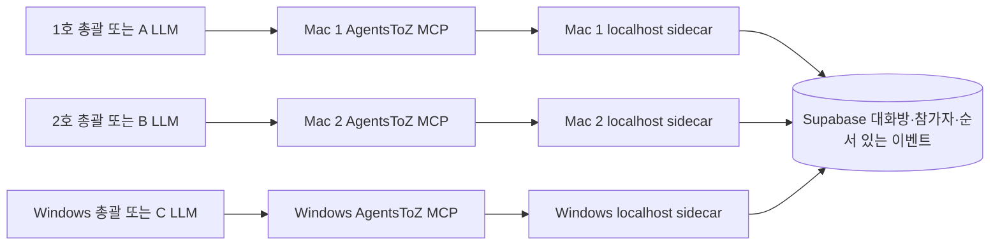

# 기기·총괄·프로젝트 간 에이전트 그룹 대화 구현 설계

상태: Mac/공통 코드의 첫 구현 및 로컬 DB 계약 테스트 완료 · 2026-10-03. 이 Mac의 Supabase CLI 링크를 새 `agentstoz` 프로젝트로 바꾸고, 저장된 DB 암호를 일회성 환경 변수로 사용해 격리 작업 폴더에서 `20261003010000_agent_dialogue.sql` 한 건만 배포했다. 대상 DB에서 마이그레이션 이력, 6개 테이블의 RLS, RPC의 service-role 전용 권한을 확인했다. 실제 DB의 두 기기 등록·초대·참여·메시지 조회를 한 문장 안에서 수행한 뒤 의도적 예외로 전체 롤백했고 잔여 행 0건을 확인했다. PostgREST 경로도 service-role은 RPC 내부의 기기 인증까지 도달하고 anon은 함수 실행 권한에서 차단됨을 확인했다. 대상 DB의 이력과 저장소의 기존 마이그레이션 목록은 서로 다르므로 저장소 전체를 그대로 `db push`하지 않는다. 계정 또는 로컬 기기 ID가 바뀌면 이전 endpoint를 재시작 후에도 유지되는 폐기 대기열로 옮기고, 이전 프로필·기기 자격으로 원격 폐기를 재시도한다. 이전 폐기가 일시 실패해도 현재 프로필의 heartbeat는 계속된다. 설치 앱 확인과 두 Mac·Windows 실기 대화 검증은 아직 하지 않았다. 아래 설계 중 원격 기기 퇴역 검증, UI 전용 capability, 온라인 상태 판정, 7일 이상 방 연장, Realtime 알림은 후속 단계다. 사용자가 앱에서 참여 요청을 거절하면 해당 초대는 DB에서도 `declined`로 기록한다.

## Sol 6 단계별 에포트 권장

| 단계 | 권장 에포트 | 판단 기준 |
|---|---|---|
| 계약·DB 권한·동시성 | xhigh | profile/device/endpoint 권한, 방 잠금·cursor·멱등성 검증 |
| Mac MCP·sidecar·Keychain | high | 로컬 승인과 DB 호출 경계, 재시작·오프라인 처리 |
| 앱 승인 화면·문구 | medium | 대표적인 접근성·상태 표시 확인 뒤 반복 UI 수정 가능 |
| Mac 두 대 실기·DB 배포 검토 | xhigh | 실제 계정/기기 결속, 불확실한 전송 결과, 마이그레이션 검증 |
| Windows 및 3자 실기 검증 | xhigh | 별도 PC 빌드·보호 저장소·동시 전송 확인; 정형 회귀 반복은 high로 낮출 수 있음 |

현재 코드는 공통 입력 계약, 버전 SQL, Mac sidecar·MCP, 앱의 endpoint 동의·요청 승인 화면, Keychain/DPAPI 키 재사용, 30초 이내 bounded `wait`, 10분 유지보수 tick을 포함한다. 설치 앱의 승인 화면은 현재 원격제어 관리와 공유하는 인증된 Tauri 로컬 프록시를 사용한다. RPC 정본은 `portmgr_agent_dialogue_call` 하나이며 operation으로 분기한다. 본문은 최대 4,000 UTF-8 bytes, 조회는 한 번에 7개 이벤트를 스캔하고 `hasMore`로 페이지를 이어간다. 방은 생성 후 24시간 또는 유휴 2시간에 만료된다. 종료·만료 7일 뒤 본문 제거는 등록 이력이 있는 앱의 유지보수 tick에서 한 번에 최대 500건씩 수행하므로 앱이 꺼져 있으면 다음 연결까지 지연된다. 수신 AI가 자동으로 재개되거나 대화 결과가 기억에 저장되지는 않는다.

### 2026-10-04 두 Mac 실기 1차 (1호 ↔ 3호) — 확인된 것과 고친 것

- **같은 Supabase 프로젝트가 전제다.** 대화 RPC는 앱의 Supabase 설정(`portal.json` + service_role) 하나를 그대로 쓴다. 3호가 옛 프로젝트에 남아 있는 동안 1호의 상대 목록에 3호가 없었고, 3호의 옛 DB에는 대화 테이블 자체가 없었다. 3호를 `agentstoz` 프로젝트로 옮기고 총괄 프로필이 `ready`가 된 뒤 총괄 1·프로젝트 38개가 등록됐다(같은 profileId). 실측: 3호 총괄 참여(seq 3), 3호 → 1호 메시지 저장(seq 4, 수신 1). 1호가 그 뒤 읽지 않아 **왕복은 아직 미완**이다.
- **승인 요청이 보이지 않았다.** 「승인 대기」가 긴 공개 대상 목록 아래에 있어 사용자가 「등록」을 승인으로 눌렀고, 요청은 5분마다 조용히 만료됐다. 이제 승인 대기는 창 맨 위(건수 포함)에 있고, 창이 닫혀 있어도 `AgentDialogueApprovalNotice`가 「기기 간 대화 승인 요청 N건」을 띄운다(대상이 켜진 기기만 4초, 아니면 60초 간격으로 UI 전용 status를 읽는다 — 승인은 하지 않는다).
- **같은 방 요청 여러 개가 똑같이 보였다.** 각 요청에 MCP `initialize`의 `clientInfo.name`(정리된 표시 전용 헤더 `X-AgentsToZ-Dialogue-Client`)·연결 표시(인스턴스 난수의 해시 앞 6자, 난수 자체는 노출하지 않음)·요청 시각을 싣는다. 권한 판단에는 쓰지 않는다.
- **방 grant는 30분 유휴로 만료되지만 쓸 때마다 연장되고, 처음 받은 때로부터 24시간을 넘지 않는다.** 만료 뒤 그 방의 보내기·읽기를 사용자가 다시 허용하면 grant가 다시 열린다(예전에는 메시지마다 재승인). 다른 MCP 연결은 여전히 따로 승인해야 한다.
- `agent_dialogue_management_request` Tauri 명령은 async(`spawn_blocking`)다 — 알림이 주기적으로 부르므로 바쁜 사이드카가 창을 멈추게 하면 안 된다.
- 받는 AI는 메시지가 와도 스스로 깨어나지 않는다(V1 범위 밖, 위 설계대로). 상대가 `wait`를 부르도록 사람이 전해야 한다.
- **삭제한 프로젝트의 endpoint가 계속 활성이었다.** 3호에서 옛 `AgentsToZ-Control` 프로젝트를 지운 뒤에도 그 endpoint가 1호의 상대 목록에 남았다. 이제 유지보수 tick이 **등록 파일(`ports.json`)에서 ID가 사라진** 프로젝트 endpoint를 「연결 끄기」처럼 폐기하고 원격에서 해지한다. 해석 가능한 프로젝트 목록은 폴더가 없거나 0.5초 안에 안 읽히는 프로젝트도 빼므로 기준으로 쓰지 않는다. 등록 파일을 읽지 못하면 아무것도 폐기하지 않는다. 폐기된 endpoint의 grant·대기 요청만 지우고 다른 방은 유지한다. 이름 동기화도 한 endpoint의 실패에서 멈추지 않는다.
- OPS endpoint 표시 이름은 `<기기> / 아젠투지(OPS)`다(화면 용어집 — 「총괄」은 음성 도크의 대화 상대 구분에만 쓴다). 기존 `<기기> / 총괄`은 다음 유지보수에서 같은 endpointId로 이름만 바뀐다.

코드와 로컬 PGlite 테스트는 실제 Supabase 권한·배포 상태를 증명하지 않는다. 설치된 Mac 앱과 다른 PC에 현재 MCP 계약이 들어간 후 실제 양방향 질문·응답을 별도로 확인해야 한다. 현재 원격 endpoint가 등록 뒤 오랫동안 접속하지 않아도 목록에 남을 수 있어 `lastSeenAt`은 최근 접속 참고 정보일 뿐 온라인 보증이 아니다. 기기 퇴역·프로필 전환 시 남은 endpoint를 서버에서 일괄 폐기하는 경로도 출시 전에 완성한다.

## 목표와 범위

- `아젠투지 1호 / A`와 `아젠투지 2호 / B`처럼 서로 다른 프로젝트·장기기억의 에이전트도 대화한다. `아젠투지 1호 / qq`와 `아젠투지 2호 / qq`처럼 같은 장기기억의 프로젝트 단말도 대화한다.
- `1호 총괄 ↔ 2호 총괄`, `1호 총괄 ↔ 2호 B`, `1호 A ↔ 2호 총괄`도 같은 대화 기능을 쓴다. 한 기기의 총괄과 프로젝트도 서로 다른 참가자가 될 수 있다.
- Mac↔Mac, Mac↔Windows, Mac·Mac·Windows 3자 대화를 한 계약으로 처리한다. V1 대화방 정원은 2~8개 **에이전트 endpoint**다. 한 물리 기기의 총괄·서로 다른 등록 프로젝트도 각각 참가할 수 있다.
- 각 PC에서 이미 실행 중인 Codex·Claude·Hermes·agy가 **그 PC의 AgentsToZ MCP**를 통해 짧은 질문, 관찰, 빌드 영수증을 주고받는다. 진행 중인 에이전트가 `wait`를 호출하면 새 메시지를 받는다. 종료된 AI 턴을 자동 재개하는 기능은 V1 범위 밖이다.
- 대화방은 임시 협업 기록이다. `.agent-memory`와 Supabase 기억 리비전은 검증된 결론의 정본으로 유지하고 대화 전문을 자동으로 장기기억에 저장하지 않는다.
- 각 기기의 기존 `deviceName`을 `아젠투지 1호`처럼 표시할 수 있다. 표시 이름과 선택적 canonical `memoryId`는 관계 정보이며 라우팅·권한 키가 아니다. 대상은 **물리 기기 + 그 기기의 총괄 또는 등록 프로젝트 인스턴스**를 나타내는 불투명 `endpointId`다.
- 대화방의 `participantId`는 방 안의 `endpointId` 하나에 대응한다. 같은 PC에서 총괄과 프로젝트 둘이 참가하면 두 참가자다. `agentKind`는 진단용 표시이며 MCP 프로세스 계보를 인증으로 쓰지 않는다.

### 총괄·프로젝트 endpoint 신원

`endpointId`는 `(공유 Control profileId, canonical deviceId, kind, 로컬 대상, 등록 incarnation UUID)`에 결속한다. `kind='ops'`의 로컬 대상은 해당 기기의 **연결된 총괄 프로필**이며 `portId`가 없다. `kind='project'`의 대상은 그 기기의 등록 `portId`다. 기존 `target=ops`는 이 기기의 총괄을 가리키고, 다른 기기의 총괄은 목록에서 받은 별도 `endpointId`로 고른다. OPS 폴더가 `role=ops` 프로젝트 행으로도 등록되어 있어도 하나의 총괄 endpoint로 정규화해 중복 표시하지 않는다. 총괄 프로필은 사용자 단위로 공유되지만 **총괄 에이전트 실행·참여·수락은 기기별로 독립**이다. 로컬 전용 app-data 프로필은 공유 Control에 연결되기 전까지 원격 endpoint로 게시하지 않는다.

프로젝트 `portId`는 해당 기기의 로컬 ID이며 다른 기기의 동명 프로젝트 ID와 같다고 가정하지 않는다. incarnation은 앱 데이터에 별도로 보관하고 프로젝트의 실제 삭제·재등록, 총괄 연결 해제·다른 프로필 재연결, 또는 기기 credential 재발급 때 바꾼다. 이름 변경·폴더 이동·일반 동기화로는 바꾸지 않는다. 프로젝트의 `syncGeneration`은 삭제 fence 검증에 사용하되 incarnation을 대신하지 않는다. 매 작업 직전에 총괄 endpoint는 공유 프로필 결속을, 프로젝트 endpoint는 로컬 등록 행·폴더/worktree 실재·삭제 fence를 재검증한다. 둘 다 기기 퇴역을 확인한다. 결속이 사라지면 endpoint와 참가 권한을 폐기한다.

`memoryId`는 기억이 초기화된 **프로젝트 endpoint**에만 붙는 선택적 메타데이터다. 총괄 기억은 Control `profileId`에 결속하고 프로젝트 기억과 섞지 않는다. 기억 없는 등록 프로젝트도 대화할 수 있다. 두 프로젝트의 같은 ID는 `공유 장기기억` 배지를 보여 줄 수 있지만 자동 연결·초대·동의·기억 동기화의 근거가 아니다. 방은 공유 Control `profileId`에 속하며 단일 `memoryId`에 속하지 않는다. 총괄·프로젝트 이름과 기기 별명은 표시와 검색에만 사용한다. 동명 프로젝트가 여럿이면 기기·대상을 각각 선택한다. 로컬 MCP도 매 송수신에 **`target=ops` 또는 등록 `portId` 중 하나**와 `participantId`를 명시해 발신자를 현재 작업 폴더로 추측하지 않는다.

| 사례 | 선택·승인 |
|---|---|
| 1호 총괄 ↔ 2호 총괄 | 서로 다른 기기의 `ops` endpoint를 선택하고 양쪽 총괄에서 수락 |
| 1호 총괄 ↔ 2호 B, 또는 1호 A ↔ 2호 총괄 | 해당 `ops`·`project` endpoint를 선택하고 수신 대상에서 수락 |
| 1호 A(`memA`) → 2호 B(`memB`) | B의 `endpointId`를 선택하고 B 프로젝트에서 명시적으로 참여 수락 |
| 1호 qq(`memQ`) ↔ 2호 qq(`memQ`) | 서로 다른 두 `endpointId`를 결속하고 각각 등록·수락 검사 |
| 1호 A + 2호 B + Windows C | 세 `endpointId`가 각자 수락·퇴장·철회 |

## 현재 코드에서 재사용할 경계

| 대상 | 현재 정본 | V1 활용 |
|---|---|---|
| 로컬 프로젝트 신원 | `PortInfo.id`, `syncGeneration`, 등록 프로젝트/worktree 조회 | 매 동작에 로컬 `portId`·삭제 fence 재검증. `sourcePortId`는 복제 출처이지 현재 단말의 endpoint가 아님 |
| 선택적 기억 관계 | `.agent-memory/config.json`, `portmgr_resolve_project_memory_id`, `portmgr_project_memory_devices` | 공유 기억 표시와 각 프로젝트 자체 기억 접근 확인. 대화 라우팅 권한으로 사용하지 않음 |
| 물리 기기 | `portal.json`의 device ID, `portmgr_devices`, `portmgr_device_identity_aliases`, 기기 retirements | 별명은 기존 `deviceName`; alias·retire 상태를 서버에서 해석. 이름으로 자동 합병하지 않음 |
| OPS | `controlProfileStore`, `X-AgentsToZ-Control-Profile`, 기존 `target=ops` | 공유 Control 결속을 확인하고 각 기기에 별도 총괄 endpoint 게시. 총괄 폴더의 `role=ops` 행은 별도 프로젝트 endpoint로 중복 생성하지 않음 |
| MCP 진입 | `agentstoz-use-mcp-server.ts` → `/api/agentstoz-use/action` → `agentstozUseControl.ts` | 별도 도구군·요청 파서와 호스트 분기 추가. 기존 Workroom 권한으로 대화 권한을 추론하지 않음 |
| 특권 DB 접근 | 설치 sidecar의 Supabase service role | 대화 관련 RPC는 sidecar에서만 호출. 브라우저·MCP DTO에 service role/기기 비밀/로컬 경로를 싣지 않음 |

현재 `agentstoz_use_*`는 이 기기의 Workroom을 제어한다. 다른 PC의 실행 중인 LLM에 전달하는 inbox가 없으므로 Workroom 지시를 다른 기기로 우회하지 않는다. `src/schemaSql.ts`와 버전별 `supabase/migrations`는 SQL 내용과 배포 안내가 맞아야 하며, 앱 시작 시 새 테이블을 자동 생성하지 않는다.

## 데이터 모델 및 순서 보장

새 버전 마이그레이션에 아래 테이블과 **원자적 RPC**를 둔다. 테이블은 RLS를 켜고 `anon`·`authenticated`의 직접 DML을 모두 회수한다. V1 앱은 `service_role`이 있는 로컬 sidecar에서만 고정 RPC를 호출한다. DB가 업그레이드되지 않았으면 기능 상태를 `schema-upgrade-required`로 표시하고 조용히 기억 동기화로 대체하지 않는다.

| 테이블 | 핵심 필드·제약 |
|---|---|
| `portmgr_agent_dialogue_endpoints` | `endpoint_id uuid` PK, `profile_id`, canonical `device_id`, `kind` (`ops/project`), `project`일 때만 로컬 `port_id`·선택적 canonical `memory_id`, 등록 `incarnation_id`, 표시명, 계약 버전, 상태·최근 접속. partial unique: 활성 `ops`는 `(profile_id, device_id)`당 하나, 활성 `project`는 `(profile_id, device_id, port_id)`당 하나. 로컬 경로·명령은 저장하지 않음 |
| `portmgr_agent_dialogue_rooms` | `id uuid` PK, `profile_id`, `owner_participant_id`, `state` (`active/closed/expired`), `next_seq bigint`, `created_at`, `expires_at`, `closed_at`, `schema_version`. 방 단위 `memory_id` 없음 |
| `portmgr_agent_dialogue_members` | `participant_id uuid` PK, 유일 `(room_id, endpoint_id)`, `state` (`invited/joined/declined/left/revoked`), `join_after_seq`, `leave_seq`, `ack_seq`, `invited_at`, `joined_at`, `last_seen_at`. invited+joined 합계 최대 8 |
| `portmgr_agent_dialogue_events` | PK `(room_id, seq)`, `kind` (`joined/left/message/closed`), `sender_participant_id`, `request_id`, `body`, `recipient_participant_ids`, `created_at`. 메시지 중복 키 `unique(room_id, sender_participant_id, request_id)`; 같은 ID·다른 본문은 409 |
| `portmgr_agent_dialogue_requests` | PK `(profile_id, endpoint_id, request_id)`, `action`, 정규화된 입력의 hash, 결과 room/seq와 영수증. 방 생성·초대·가입·보내기·퇴장·종료를 같은 트랜잭션에서 중복 방지; 같은 ID·다른 입력은 409 |
| `portmgr_agent_dialogue_device_keys` | `(profile_id, canonical device_id)`별 무작위 credential의 해시·등록/폐기 시각. 원문은 Mac Keychain/Windows 보호 저장소에만 보관. DB RPC는 hash를 확인하고 retire/revoke도 확인 |

`body`는 UTF-8 4,000 bytes 이하의 구조화된 짧은 텍스트(`question/answer/observation/build-receipt`)로 한정한다. 한 방의 메시지는 최대 2,000개, read 한 페이지는 최대 50개·32 KiB다. 빌드 로그 전문과 클립보드 원문 대신 결과 요약·산출물 해시를 보낸다. 초대·가입·퇴장도 순서 있는 이벤트로 기록한다. 새 참가자는 기본적으로 **가입 이벤트 이후** 메시지만 읽는다. 떠나거나 철회된 기기는 더 읽거나 보낼 수 없다.

SQL 쓰기는 `portmgr_agent_dialogue_register_device`, `register_endpoint`, `create`, `invite`, `join`, `decline`, `send`, `leave`, `close`의 고정 RPC로만 수행한다. `peers`, `invitations`, `read`, `status`도 권한을 검사하는 RPC로 제한한다. 모든 RPC는 계약 버전, `auth.role() = 'service_role'`, 기기 credential, Control `profileId`, endpoint 종류·등록·상태·incarnation과 참가 상태를 재검증한다. DB는 로컬 폴더·총괄 연결의 실재를 알 수 없으므로 sidecar도 **같은 요청에서** 선택 대상이 현재 총괄인지 등록 프로젝트인지 다시 확인한다. 프로젝트의 삭제 fence와 총괄의 profile binding 변경도 확인한다. `create`와 각 변경 RPC는 요청 영수증을 같은 트랜잭션에 저장한다. RPC 소유자는 고정 `search_path`를 쓰며 공개 테이블 직접 접근권을 회수한다.

`next_seq`는 방 행을 `SELECT ... FOR UPDATE`로 잠근 **같은 트랜잭션**에서 증가시키고 이벤트와 요청 영수증을 삽입한다. 따라서 두 기기가 동시에 보낼 때 두 번째 트랜잭션이 첫 번째 commit을 기다린다. 독립 `identity`/`bigserial` 할당값만 cursor로 쓰면 늦게 commit한 낮은 번호를 건너뛸 수 있으므로 금지한다. 조회는 `afterSeq` 뒤의 committed 이벤트를 번호순으로 제한해 훑고, 참가자에게 보이지 않는 이벤트도 지나간 뒤 **실제로 훑은 마지막 번호**를 `nextSeq`로 돌려준다. 미처 훑지 않은 번호로 cursor를 전진시키지 않는다. 중복 읽기는 `(roomId, seq)`로 제거한다. 가입·탈퇴와 전송이 경합하면 같은 방 잠금의 순서로 접근 가능 범위를 결정한다.

방은 기본 24시간, idle 2시간에 만료된다. 사용자가 활성 방에서 갱신할 수 있지만 생성 후 7일이 상한이다. 종료·만료 7일 후 메시지 본문을 삭제하고 감사용 최소 메타데이터의 보존 기간은 별도로 제한한다. 정리 작업은 독립 유지보수 RPC/스케줄에서 실행하며 기존 기억·journal을 지우지 않는다. 오프라인 기기는 만료 전까지 저장된 이벤트를 복원한다.

## 권한과 신뢰

1. **로컬 호출:** MCP 요청은 기존 Control profile token을 요구한다. 설치 앱 UI는 원격제어 관리와 공유하는 인증된 Tauri/sidecar 프록시를 사용하고 대화 관리 경로를 고정 allowlist로 제한한다. 사용자 단위로 공유된 Control profile에 연결하지 않은 로컬 전용 프로필은 기기 간 대화를 시작하지 않는다. 사용자가 대화 기능을 해당 기기의 총괄 또는 등록 프로젝트에 켜고 **정확한 수신 endpoint**의 세션 초대를 수락해야 `join`이 성공한다. 같은 `memoryId`나 기존 Workroom 권한만으로 자동 참여하지 않는다. `target=ops`와 `portId`는 선택값이지 발신 권한 증명이 아니다. sidecar는 MCP 인스턴스별 비공개 난수로 연결을 식별하고 앱 UI가 그 연결에 발급한 `(endpointId, 선택적 roomId, send/read 범위, 만료)` 로컬 grant를 보관한다. 새 방을 열 때는 지정된 대상 endpoint 목록에 묶인 단기 생성 grant를 먼저 발급하고 생성 후 roomId에 결속한다. 전송·조회에도 발신 endpoint grant가 필요하다. Workroom 프로세스 계보는 승인 화면의 힌트일 뿐 grant를 대체하지 않는다. 외부 CLI 연결은 endpoint별 UI 승인 없이는 발신할 수 없다.
2. **기기·endpoint 등록:** 각 기기는 기존 실제 device ID를 로컬 저장소에서 읽고 대화용 256-bit credential을 OS 보호 저장소에 한 번 생성한다. endpoint 등록 때 현재 Supabase·공유 Control 연결, 물리 기기, `ops`라면 총괄 프로필 결속, `project`라면 실제 등록 프로젝트·삭제 fence를 확인한다. 재설치·기기 alias 변경은 명시적 재등록이며 퇴역 ID의 credential을 폐기한다. 요청 body의 `senderDeviceId`나 `senderEndpointId`는 신뢰하지 않는다. 로컬 credential과 선택된 `target=ops` 또는 `portId`에서 발신자를 유도한다.
3. **대상 간 대화:** 시작·초대·가입·전송·조회 RPC는 같은 `profileId`의 정확한 endpoint와 참가 상태를 확인한다. **동일 canonical `memoryId`는 필수 조건이 아니다.** OPS↔OPS, OPS↔프로젝트, 프로젝트↔프로젝트를 같은 규칙으로 처리한다. 화면에 `1호 총괄 → 2호 B`처럼 기기와 정확한 발신·수신 대상을 보여 주고 수신 endpoint의 별도 동의를 받는다. 동명 프로젝트, 연결 해제된 총괄, 삭제·퇴역된 endpoint, 다른 profile은 거절한다. 방 소유 **참가자**만 추가 초대·종료할 수 있으며 소유자가 떠나면 방을 닫는다. 운영 기억·프로젝트 기억의 권한과 대화 권한은 서로 전파되지 않는다.
4. **메시지:** 외부 endpoint의 글은 도구 호출이나 사용자 지시가 아닌 **불신 자료**로 LLM에 전달한다. 수신 즉시 셸 실행, Workroom 입력, 파일 수정, 승인 응답, 운영/프로젝트 기억 저장으로 이어지지 않는다. 상대의 Control 기억·`.agent-memory`·파일·터미널 원문을 자동 읽거나 쓰는 경로를 만들지 않는다. 각 PC의 에이전트가 자기 권한과 사용자 지시에 따라 별도로 판단한다. API key·비밀번호·전체 터미널 기록은 전송하지 않도록 UI에서 안내하고, 본문 크기·제어 문자·율 제한을 서버에서도 검사한다.
5. **특권 한계:** 현재 설치 sidecar가 service role을 보유하므로 악성 sidecar 또는 유출된 service role 자체에 대한 기기 격리를 새 대화 기능만으로 보장할 수 없다. 대화용 credential은 정상 경로의 기기 오인·폐기를 막는 추가 결속이다. service role은 MCP·브라우저·메시지 본문에 절대 싣지 않는다. 여러 계정이 한 Supabase 프로젝트를 공유하는 배포에서는 계정 JWT·기기 키를 검증하는 서버 게이트웨이를 먼저 넣어야 한다.

V1 메시지 본문은 기존 프로젝트 기억 백업처럼 Supabase에 읽을 수 있는 형태로 저장된다. 참여 화면에서 이 저장 범위와 7일 삭제를 분명히 보여 주고 사용자의 별도 동의를 받는다. 종단간 암호화가 필수인 환경에는 V1을 켜지 않는다. E2EE를 넣을 때는 참가자별 암호화 봉투와 가입 시점 이후 공개·퇴장 후 미래 메시지 차단을 별도 계약/실기 검증으로 추가한다.

## MCP/호스트 계약

공통 `src/agentDialogueContract.ts`가 입력·응답을 엄격하게 검사한다. MCP 도구는 `agentstoz-use-mcp-server.ts`에 추가하고 계약 버전을 올린다. sidecar는 기존 `/api/agentstoz-use/action`의 별도 action 분기에서 profile·선택된 총괄/프로젝트·기기 credential·로컬 grant를 재검증한다. MCP 인스턴스 난수는 프로세스 안에서 생성해 private transport header로 보내고 AI 도구 입력·응답에는 싣지 않는다. UI 승인은 이 인스턴스의 대기 요청에만 결속한다. 모든 로컬 대상 입력은 기존 Workroom과 같은 **`target='ops'` 또는 `portId` 중 정확히 하나**다. OPS를 등록 프로젝트 `portId`로 가장하지 않는다. DB endpoint에는 kind·등록 incarnation·프로젝트라면 로컬 ID와 선택적 canonical `memoryId`를 저장한다. `endpointId`와 `participantId`는 목록에서 받은 값만 사용한다. 반환 DTO에는 로컬 경로, 명령, 토큰, 원본 로그가 없다.

| 도구 | 입력 | 성공 영수증 |
|---|---|---|
| `agentstoz_use_list_dialogue_peers` | 로컬 `target=ops` 또는 등록 `portId` | 초대 가능한 총괄/프로젝트 `endpointId`, 기기·대상 표시명, 플랫폼, 선택적 기억 관계, 최근 연결·계약 버전. 이름/기억 ID만으로 자동 선택하지 않음 |
| `agentstoz_use_create_dialogue` | 로컬 `target=ops` 또는 `portId`, 선택한 `endpointIds[]`(1~7), `requestId` | `roomId`, 자신의 `participantId`, 초대 상태, `expiresAt`. 총 2~8 endpoint |
| `agentstoz_use_list_dialogue_invitations` | 로컬 `target=ops` 또는 `portId` | 그 정확한 총괄/프로젝트 endpoint 앞으로 온 제한된 초대와 발신 endpoint 정보 |
| `agentstoz_use_join_dialogue` | 로컬 `target=ops` 또는 `portId`, `roomId`, `requestId` | `joined` 또는 `approval-required`; 승인 영수증은 정확한 endpoint의 앱 UI에서만 생성 |
| `agentstoz_use_invite_dialogue_peer` | 로컬 `target=ops` 또는 `portId`, `participantId`, 기존 목록의 `endpointId`, `requestId` | `invited`. 방 정원·소유권 재검증 |
| `agentstoz_use_send_dialogue_message` | 로컬 `target=ops` 또는 `portId`, `participantId`, `requestId`, `kind`, `text`, 선택적 `toParticipantIds[]` | `roomId`, `seq`, `messageId`, 저장 대상 수. 상대 AI가 읽었다는 뜻은 아님 |
| `agentstoz_use_wait_dialogue_messages` | 로컬 `target=ops` 또는 `portId`, `participantId`, `afterSeq`, `timeoutMs`(최대 30초) | 최대 50개 이벤트, `nextSeq`, `hasMore`, 참가자별 상태. 타임아웃도 성공적인 빈 조회로 표시 |
| `agentstoz_use_leave_dialogue` / `close_dialogue` | 로컬 `target=ops` 또는 `portId`, `participantId`, `requestId` | 퇴장/방 종료 영수증; 재시도는 같은 결과 |

변경 동작의 `requestId`는 UUID로 고정하고 실패·타임아웃 재시도에도 그대로 사용한다. 같은 요청이 이미 저장됐으면 원래 영수증을 돌려주며 다시 실행하지 않는다. `wait`는 메일함의 현재 상태만 읽고 AI 턴을 자동 시작하지 않는다. 본문 대상이 지정됐으면 발신자와 지정된 참가자만 읽을 수 있고, 대상 생략 시 그 이벤트 당시 가입 중이던 참가자에게 보인다. `afterSeq`는 MCP가 **성공적으로 받은 다음 호출**에서만 전달해 DB의 `ackSeq`를 전진시키며, 응답이 유실되면 중복 수신을 허용하고 누락을 막는다. `lastSeenAt`은 활성 방의 heartbeat를 통해 갱신하며 과거 프로젝트 memory sync 시각을 온라인 증거로 쓰지 않는다. 새 MCP가 오래된 sidecar에 붙으면 `unsupported-contract`로 거절하고 전송 성공을 주장하지 않는다.

V1은 활성 `wait` 동안 2초 간격의 bounded 조회와 지수 backoff(오류 시)를 사용한다. 앱이 숨겨지고 활성 대화방이 없으면 폴링을 멈춘다. Supabase Realtime private Broadcast는 이후 **깨우기 신호만** 추가한다. 신호 유실·재접속 뒤에도 DB cursor 조회로 복구해야 한다. Broadcast를 붙일 때는 `realtime.messages`의 별도 읽기/쓰기 RLS를 기기·방 권한에 맞게 검증한다.

구현 전에 Mac 두 대와 Windows에서 **같은 Supabase 프로젝트 URL, 공유 Control `profileId`, 유효한 기기 등록, 각 총괄의 공유 프로필 결속과 선택한 프로젝트의 로컬 등록**을 각각 확인한다. A와 B의 `memoryId`가 다른 것은 오류가 아니다. qq 양쪽의 `memoryId`가 같아도 endpoint 등록과 수락은 각각 필요하다. 총괄↔총괄도 두 기기의 별도 endpoint 등록·수락이 필요하다. 다른 Supabase 프로젝트나 profile 간 대화는 V1에 포함하지 않는다. `list_dialogue_peers`는 지원하지 않는 MCP/sidecar 버전을 `upgrade-required`로 표시하며 초대 성공을 주장하지 않는다.

## 총괄·프로젝트·3자 대화와 상태 전이

1. 1호 총괄이 대상 목록에서 2호 총괄을 고른다. 두 기기의 총괄 endpoint가 각각 승인되고, 활성 에이전트가 질문·답을 교환한다. 같은 운영 프로필을 공유해도 수신만으로 운영 기억이 수정되지 않는다.
2. 1호 총괄이 `2호 / B`를 고르거나, 1호 A가 2호 총괄을 고른다. 각 화면에 기기·총괄/프로젝트 종류·정확한 대상·보관 기간·본문 범위를 보여 준다. 수신 총괄 또는 B 프로젝트에서 허용한 뒤에만 대화한다.
3. 1호의 A와 2호의 B, 또는 1호의 qq와 2호의 qq도 연결한다. `공유 장기기억` 배지가 있어도 자동 수락하지 않는다. 각 endpoint는 별도 `participantId`를 가지며 기억 동기화 cursor와 대화 cursor를 분리한다.
4. Mac 1 총괄·Mac 2 프로젝트 B·Windows 총괄 C를 한 방에 초대한다. 각 endpoint에서 참여를 허용한다. 참가 상태는 `invited → joined/declined`, `joined → left/revoked`; 방은 `active → closed/expired`다. 모든 전이는 방 행 잠금 아래 이벤트로 남는다.
5. 총괄이 정확한 commit SHA와 빌드 목적을 전송하면 B·C가 자기 PC의 HEAD·source guard·테스트·산출물 해시를 각각 답한다. C가 오프라인이면 Mac 둘의 대화는 계속되고 C는 복귀 후 자신의 `ackSeq` 다음 이벤트를 받는다. 새 참가자에게 가입 전 본문을 기본 제공하지 않는다.

## 구현 분할과 검증 게이트

공통 변경 지점은 `src/agentDialogueContract.ts`(신규 입력·DTO), `src/agentDialogueHost.ts`(신규 승인·권한·재시도), `src/agentDialogueSupabase.ts`(신규 고정 RPC 어댑터), `src/agentDialogueSql.ts`/`src/schemaSql.ts`와 버전 migration, `src/agentstozUseControl.ts`, `agentstoz-use-mcp-server.ts`, `src/agentstozUseMcpVersion.ts`, `src/agentstozInvocationInstaller.ts`, `api-server.ts`다. UI는 총괄 화면과 등록 프로젝트 목록 모두에서 `AgentDialoguePanel`(신규)을 열고 기억 미초기화 프로젝트도 포함한다. Windows는 같은 공통 계약을 사용하고 credential 보관·설치 패키징·실기 UI를 담당한다.

| 단계 | Mac/공통 코드 | Windows 담당 | 완료 증거 |
|---|---|---|---|
| 1. 계약·DB | `ops/project` endpoint·participant DTO, 버전 migration, `src/schemaSql.ts` parity, RPC, 기기 ID·총괄 결속·프로젝트 삭제 fence 검사 | 동일 DTO 리뷰 | 총괄↔총괄, 총괄↔프로젝트, A↔B, qq↔qq 허용; 총괄 폴더 중복 endpoint 없음; 동시 전송의 commit 순서, 멱등·권한·TTL SQL 통합 테스트 |
| 2. MCP·sidecar | Mac용 도구·호스트·총괄/프로젝트별 초대 UI, MCP 인스턴스별 로컬 grant, Keychain credential | 공통 도구의 Windows 설치·보호 저장소·UI 연결 | MCP→sidecar→가짜 DB 영수증, 승인 없는 인스턴스·OPS를 포트로 가장·잘못된 participant 조합 거절, 비밀/경로 DTO 부재 |
| 3. 두 기기 | Mac↔Mac 총괄↔총괄, 총괄↔프로젝트, A↔B, qq↔qq 실기 join/send/wait/leave·재접속 | Windows 준비 상태 공유 | 실제 두 에이전트의 양방향 질문·답변, 같은 requestId 재시도 1건, 운영·프로젝트 기억 무단 변경 없음 |
| 4. 세 기기 | Mac 1 총괄·Mac 2 프로젝트·Windows 총괄의 혼합 그룹 대화 | Windows 실기 참여 | 세 에이전트가 동일 SHA 빌드 영수증을 각각 전송·수신, 초대/퇴장 경계와 오프라인 복구 확인 |
| 5. 선택적 속도 | private Broadcast 알림과 fallback 조회 | 동일 | 알림을 고의로 누락시켜도 cursor 조회가 모든 메시지를 회복 |

DB 마이그레이션은 별도 검증 뒤 적용한다. 기존 프로젝트 기억 리비전·journal·원격제어 테이블의 계약은 바꾸지 않는다. 소스/fixture 통과는 설치된 Mac 앱 또는 Windows 빌드의 실기 성공으로 보고하지 않는다.

추가 경계 검증: 같은 이름의 여러 프로젝트·기기를 자동 선택하지 않음; 같은 `memoryId`의 다른 endpoint도 자동 수락하지 않음; 다른 profile 차단; 총괄 연결 해제·프로젝트 삭제/재등록·기기 재설치/퇴역 뒤 과거 endpoint 차단; 한 기기의 총괄과 프로젝트가 별도 참가자로 작동; A의 MCP가 B의 `portId`나 `target=ops`를 제출해도 해당 grant 없이 B나 총괄을 사칭하지 못함; 초대 거절·철회 후 송수신 차단; 수신 본문의 도구 실행 지시를 자동 실행하지 않음. 오프라인·응답 유실·페이지 경계·동시 가입/전송·7일 만료도 확인한다.

출시는 기본 꺼짐의 기기별 기능 플래그로 시작한다. Mac 실기 2대에서 권한·누락·복구가 통과하고 Windows가 동일 계약 버전을 보고한 뒤 3자 방을 연다. 업데이트 중 오래된 기기에는 `upgrade-required`를 표시하고 초대를 보류한다. 실패 시 플래그를 끄면 새 대화만 중단되고 기존 프로젝트 기억·Workroom·원격제어는 계속 동작한다.

## 결정 근거와 참고

- 로컬 코드: `src/agentstozUseControl.ts`, `agentstoz-use-mcp-server.ts`, `src/controlProfileStore.ts`, `src/deviceName.ts`, `src/projectMemoryDirectory.ts`, `src/portRemoteDeletion.ts`, `src/schemaSql.ts`, `supabase/migrations/20260823000100_project_memory_device_status.sql`, `supabase/migrations/20260823000400_project_memory_device_retirements.sql`, `supabase/migrations/20260823000700_remote_device_enrollment.sql`.
- Supabase 공식 문서: [RLS와 grant/service role](https://supabase.com/docs/guides/database/postgres/row-level-security), [Broadcast와 Postgres Changes](https://supabase.com/docs/guides/realtime/subscribing-to-database-changes), [private Broadcast 권한](https://supabase.com/docs/guides/realtime/authorization).
