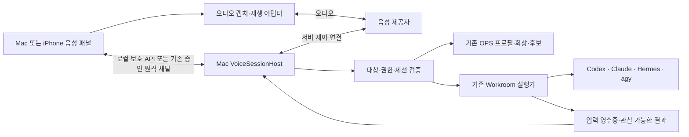

# AgentsToZ 앱 내 음성 — Mac OPS · 워크룸 · iPhone

작성: 2026-09-24 · 소스 기준: `8514e01` / v494 · 상태: **최초 설계 기준 보존 · 구현 결과는 EXECUTION.md 참조**

목표는 Mac의 **AgentsToZ OPS 음성 버튼 → 각 워크룸 음성 버튼 → iPhone 원격 음성 버튼** 순서로, 사용자가 말하고 답을 들으며 기존 작업을 이어가는 기능을 만드는 것이다. 음성 엔진은 대화를 담당하고, 프로젝트 작업은 기존 Workroom 실행기가 담당한다. 버튼을 누른 대상과 실제 실행·기억의 대상을 일치시킨다.

이 문서는 구현 완료 보고가 아니다. 코드 읽기로 확인한 현재 상태, 제안하는 동작, 실기기에서 확인할 항목을 구분한다. 실행 순서와 완료 기준은 [IMPLEMENTATION.md](IMPLEMENTATION.md)를 따른다.

> 2026-09-24 구현에서 Mac/HTTPS iPhone UI·WebRTC·호스트 도구를 추가했다. 아래 표는 구현 전 조사 기록이며, 현재 구현 범위와 아직 검증하지 못한 항목은 [EXECUTION.md](EXECUTION.md)가 정본이다. 자동 CLI 턴 완료 판정과 iPhone LAN 네이티브 미디어는 이번 구현에 포함하지 않았다.

## 1. 구현 전 확인한 상태

| 영역 | 현재 코드의 범위 | 이번에 필요한 것 |
|---|---|---|
| 외부 Voice | `src/projectCodexVoice.ts`, `src/projectCodexVoiceLaunch.ts`, `src/App.tsx`가 ChatGPT/Codex Voice 열기·프로젝트 배정 및 실행 경로 확인을 처리 | AgentsToZ 자체 마이크 캡처·전사·재생·대화 세션 |
| OPS | `src/ControlProfilePanel.tsx`, `src/controlProfileStore.ts`, `src/agentstozUseControl.ts`에 프로필·기억·등록 실행 대상 연결이 있음 | 같은 OPS 프로필에 결속된 음성 진입점 |
| 워크룸 | `src/AiTerminalPanel.tsx`와 `src/aiTerminalProtocol.ts`에 4개 AI의 시작·읽기·입력·종료가 있음 | 선택한 기존 세션에 음성 입력·응답 낭독 연결 |
| 실행 결과 | `api-server.ts`의 `send-workroom-instruction`은 PTY에 지시와 Enter를 전달하고 접수 결과를 반환 | 입력 접수와 AI 턴 완료·실제 작업 성공을 구별하는 어댑터 |
| Mac | `src-tauri/Info.plist`에 외부 앱 제어 설명만 있으며 마이크 설명이 없음. CSP도 현재 음성 연결용으로 구성되지 않음 | 마이크 권한, 실제 Tauri origin의 캡처 가능성, 재생·WebRTC 및 서명 설정 확인 |
| iPhone 웹 | `vercel.json`, `src/remoteControlMobilePage.ts`가 `microphone=()`을 보냄 | 승인된 HTTPS 음성 표면에 한정한 정책·권한 변경 |
| iPhone 앱 | `mobile/ios/App/Info.plist`에 마이크 설명이 없고 `LANWorkroomView.swift`는 HTTPS 메인 프레임의 카메라 요청만 허용 | iOS 마이크 권한·오디오 중단 처리·LAN용 네이티브 경로 |

저장소에서 오디오 입력용 `getUserMedia`, `MediaRecorder`, `RTCPeerConnection` 구현을 찾지 못했다. 기존 QR 스캐너의 `getUserMedia`는 카메라 용도다. 따라서 외부 Voice 연결 코드와 과거 문서의 “voice Workroom 완료”는 **외부 음성에서 전달된 텍스트를 처리하는 실행 기반**의 근거이며, 앱 내 음성 완료의 근거가 아니다.

기존 기억의 OPS/DEV 분리, 성공한 실행으로 대상 결속, 불확실한 작업의 자동 재실행 금지 원칙을 재사용한다. 기억 Pull은 `WORKSPACE_LEASE_BUSY`로 실패해 현재 로컬 기억과 소스만 확인했다. 잠금을 해제하거나 기억을 수정하지 않았다.

## 2. 사용자 경험

### Mac AgentsToZ OPS

- 앱 상단에 `AgentsToZ OPS · 음성` 버튼을 두고 OPS 프로필 패널에도 같은 진입점을 둔다. 두 버튼은 동일한 세션 컨트롤러를 사용한다.
- 첫 사용에는 음성 제공자 연결, 오디오 전송 여부, 발언 기록 설정을 표시한다. 사용자가 시작한 뒤 OS 마이크 권한을 요청한다. 설정 화면을 열기만 해서는 녹음·AI 호출하지 않는다.
- 패널 상단에 `대화 대상: AgentsToZ OPS`, 음성 엔진, 마이크 상태를 표시한다. 프로젝트 작업을 시작하면 `작업 대상: 프로젝트명 · main/워크트리 · AI`를 추가한다.
- “등록 프로젝트 보여줘”, “A 프로젝트 Claude 워크룸에서 오류 확인해”처럼 요청한다. 등록 ID와 OPS 프로필을 검증한 후 기존 조회·실행 경로를 사용한다.
- 동명 프로젝트나 불명확한 대상은 후보를 보여주고 한 번 묻는다. 이름을 언급한 것만으로 프로젝트나 기억 소속을 바꾸지 않는다.
- 작업 접수 시 “A의 Claude 워크룸에 전달했어요”, 완료 근거가 있을 때 “Claude의 결과를 확인했어요”로 안내한다. 결과 요약과 `워크룸 열기`를 함께 제공한다.
- `app-data` OPS도 프로필 조회·운영 대화는 가능하게 설계한다. OPS 자체 Workroom 실행에는 기존처럼 등록된 운영 폴더가 필요하다. 음성 때문에 대체 OPS 폴더나 기억을 만들지 않는다.

### Mac 각 워크룸

- 각 세션의 입력 도구 영역에 마이크 버튼을 둔다. 접근성 이름은 `프로젝트명 · AI · 음성 시작`으로 세션을 구분한다.
- 기본 동작은 **말해서 입력**이다. 한 번 눌러 녹음하고 다시 누르거나 `입력 끝내기`를 누르면 전사 초안을 보여준다. 수정한 뒤 `이 워크룸에 보내기`로 기존 세션에 전달한다.
- 같은 패널의 **실시간 대화**를 선택하면 발화 단위로 지시를 전달하고 기존 AI의 응답을 음성으로 듣는다. 전사 초안을 매번 승인하는 모드와 자동 발화 전송 모드는 명확히 구분하고 모드 변경은 사용자가 한다.
- 새 워크룸 입력란에서는 음성 초안까지만 만든다. 기존 프로젝트·AI 선택과 시작 버튼을 통해 세션을 만든 뒤 그 영수증의 세션 ID로 결속한다.
- “이 함수 고쳐줘”는 선택한 워크룸에 들어간다. 음성 엔진이 임의로 다른 AI·모델·세션을 만들거나 파일을 직접 수정하지 않는다.
- 워크룸의 AI, 프로젝트, main/워크트리, 현재 실행 권한을 계속 표시한다. 음성 시작이 권한 우회 설정을 켜거나 변경하지 않는다.
- 다른 프로젝트로 보내 달라는 요청은 전송 전에 정확한 대상 선택을 보여준다. 기존 워크룸 음성의 대상을 조용히 바꾸지 않는다.

### 공통 음성 패널

```text
AgentsToZ OPS                         또는   A 프로젝트 · Claude · worktree-x
음성 엔진: 연결한 제공자                     작업 AI: 기존 Claude 세션

● 듣는 중  00:28        [마이크 끄기] [음성 종료]
나: “로그인 오류를 확인해 줘”
상태: Claude 워크룸에 전달됨 · 작업 결과 대기
답변: …                                      [워크룸 열기]

[말해서 입력 / 실시간 대화] [답변 소리 켜기/끄기]
```

색상만으로 녹음 여부를 나타내지 않는다. 텍스트 상태·아이콘·접근성 상태를 함께 제공한다. 키보드로 시작·중지할 수 있고 마이크 권한 거부 시 기존 텍스트 입력을 유지한다. iPhone 버튼은 최소 44pt 터치 영역, Mac은 키보드 초점과 명확한 접근성 이름을 검증한다.

`마이크 끄기`는 입력 캡처를 멈춘다. `답변 소리 끄기`는 재생만 멈춘다. `음성 종료`는 음성 연결을 종료한다. **워크룸 작업 중지·터미널 종료·기억 저장은 각각 기존 별도 동작**이다.

패널을 접어도 음성이 켜져 있으면 앱 상단에 대상·마이크 상태·종료 버튼을 유지한다. 음성 UI가 완전히 사라지거나 앱이 종료되면 캡처를 종료한다. 다른 앱으로 잠시 이동한 것과 화면 잠금·절전을 구분한다.

## 3. 공통 구조와 음성 제공자



**설계의 우선 후보는 OpenAI Realtime API + 클라이언트 WebRTC + Mac sideband 제어 연결**이다. 제공자 선택에 대한 사용자 응답은 아직 없으므로 확정 계약으로 취급하지 않는다. 모델 ID·음성·단가는 구현 시 계정 접근성과 공식 문서로 확인한다. 기존 CLI 로그인 정보를 음성 API 자격 증명으로 재사용하지 않는다.

OpenAI 공식 문서는 브라우저/모바일 음성에 WebRTC를 제안하고, 동일 Realtime 세션에 서버 sideband를 붙여 도구를 처리할 수 있다고 설명한다. 이를 바탕으로 **오디오는 제공자로, 도구 실행은 Mac 호스트로** 나누는 구조를 제안한다. [Realtime 개요](https://developers.openai.com/api/docs/guides/realtime), [WebRTC](https://developers.openai.com/api/docs/guides/voice-webrtc?api=realtime), [서버 제어](https://developers.openai.com/api/docs/guides/voice-server-controls?api=realtime).

연결은 Mac 호스트가 SDP와 고정 서버 설정을 받아 제공자의 세션을 생성하는 unified 경로를 우선한다. API 키는 OS 자격 증명 저장소와 호스트 내부에만 두고 브라우저·폰·로그·Supabase 동기화·프로젝트 기억에 내보내지 않는다. 클라이언트가 임의의 제공자 call ID를 보내 다른 세션에 붙도록 하지 않는다.

| 선택 | 장점 | 구현 전 확인 |
|---|---|---|
| Realtime speech-to-speech, 우선 후보 | 자연스러운 발화 전환·끼어들기·음성 도구 연결 | 한국어·고유명사 인식, 제공자 접근·사용량, Tauri/WKWebView, 취소 이벤트 |
| 전사 → 기존 작업 AI → TTS | 텍스트 초안과 기존 워크룸에 맞추기 쉬움 | 각 단계 지연, 음성 재생·끼어들기 직접 구현 |
| 로컬 전사·TTS + 기존 작업 AI | 오디오 외부 전송 범위를 줄일 수 있음 | Mac별 성능·모델 배포·한국어 품질. 작업 AI까지 오프라인이라는 뜻은 아님 |

`VoiceProviderAdapter`가 연결·전사·취소·재생 중단·usage를 표준 내부 이벤트로 변환한다. 공급자 원시 이벤트를 앱 전체에 퍼뜨리지 않는다. 공식 문서에는 GPT-Live도 별도로 존재하며 API·이벤트 수명이 다르므로 Realtime 이벤트와 섞지 않는다. 후보 비교 이후 공급자가 바뀌어도 아래 대상·권한·영수증 계약은 유지한다.

## 4. 대상과 실행 권한

호스트가 다음 바인딩을 만들고 보관한다. 이 자료형은 **서버 내부 제안**이며 원격 DTO가 아니다.

```typescript
type VoiceBinding =
  | { kind: 'ops'; profileId: string; profileRevision: string }
  | { kind: 'workroom'; projectId: string; targetId: string;
      sessionId: string; agent: 'codex' | 'claude' | 'hermes' | 'agy';
      targetFingerprint: string };

type VoiceSession = {
  id: string;
  ownerConnectionId: string;
  epoch: number;
  binding: VoiceBinding;
  mode: 'dictation' | 'conversation';
  state: 'preparing' | 'active' | 'paused' | 'closing' | 'ended' | 'failed';
};
```

- 호스트는 등록 inventory, OPS 실제 binding, 실행 세션 소속, worktree 실체를 시작과 매 도구 실행 직전에 재검증한다. UI의 이름·role·폴더 문자열을 권한으로 사용하지 않는다.
- 원격 요청은 해당 연결에 발급된 opaque 대상 핸들만 사용한다. 로컬 projectId·경로·profile token·memoryId를 새 음성 DTO로 내보내지 않는다. 폰이 보낸 host ID·epoch·session ID도 소유권 검증 대상이다.
- OPS binding 전환, 프로젝트 삭제·경로 변경, 워크룸 종료, 권한 폐기는 해당 음성의 새 전송을 멈춘다. 새 대상 검증 뒤 사용자 시작으로 재연결한다.
- 세션 epoch가 지난 전사·도구 호출·응답은 무시한다. A 워크룸에서 시작한 녹음이 선택 변경 후 B 워크룸에 전달되면 안 된다.
- 음성 모델에는 허용한 조회·워크룸 전송·기억 후보 도구만 제공한다. 셸 실행·임의 파일 경로·OPS 후보 승인·설정 변경 권한은 음성 모델에 주지 않는다.
- 로컬에서 OPS 도구를 연결할 때 기존 `agentstoz_use_*`와 같은 서비스·검증 코드를 재사용한다. MCP를 외부에 공개하거나 모든 MCP 도구를 음성 제공자에 등록하지 않는다.
- OPS 조회는 필요한 범위의 운영 기억, 워크룸 조회는 해당 프로젝트의 필요한 기억과 선택된 세션 문맥만 제공한다. 터미널 원문을 다른 음성 제공자에 보낼 수 있다는 사실을 시작 설정에 표시하고, 자격 증명·로그인 프롬프트는 제공하지 않는다.
- 기존 CLI 승인·로그인·trust 화면은 사람이 처리한다. 말로 한 “승인”이나 모델의 tool call을 OPS 기억 승인 또는 CLI 권한 우회 증거로 사용하지 않는다.

## 5. 발화에서 실행·응답까지

### 말해서 입력

1. 사용자 시작 → 대상 고정 → 권한·제공자 준비 → 마이크 캡처.
2. 중간 전사는 화면에만 표시한다. 종료 시 최종 전사 초안을 만든다.
3. 사용자가 초안을 수정·전송한다. 빈 음성·전사 실패는 전송하지 않는다.
4. 호스트가 최종 텍스트·대상·세션·입력 revision을 검증하고 한 번 전달한다.
5. `전달됨`을 표시한다. 완료를 관찰할 수 있을 때만 별도의 완료 상태로 전환한다.

### 실시간 대화

1. 사용자 시작으로 연속 캡처를 켜고 말하기·듣기·실제 스피커 재생 상태를 표시한다.
2. 제공자 발화 종료와 최종 전사/의도 이벤트를 하나의 `utteranceId`로 결합한다. ASR 중간 문자열 또는 침묵 타이머만으로 작업을 실행하지 않는다.
3. 모델의 실행 요청을 호스트가 확인한다. 대상 모호성·기존 승인이 필요한 동작만 질문/기존 승인 UI로 보낸다. 일반 지시마다 불필요한 확인창을 추가하지 않는다.
4. 워크룸이 로그인·trust·선택 메뉴인지 먼저 확인한다. 안전하게 입력 가능한 상태가 확인되면 기존 지시 전송 서비스를 사용한다.
5. AI 응답은 해당 워크룸의 결과를 바탕으로 전달한다. “Claude 결과 요약”처럼 출처를 표시한다. 음성 모델이 독자적으로 추측한 답을 작업 AI의 결과로 말하지 않는다.
6. 사용자가 끼어들면 재생 큐와 아직 전송 전인 해당 발화 요청을 취소한다. 이미 접수된 워크룸 작업은 계속된다. “작업도 중지”는 별도 대상이 확인된 중단 요청으로 처리한다.

### 기존 PTY에 필요한 보완

현재 Workroom API의 `state: running`은 프로세스 생존을 뜻한다. `input` 성공은 입력 수락이며, quiet timeout·ANSI 화면·프로세스 종료만으로 AI 턴 완료나 작업 성공을 확정할 수 없다.

- `WorkroomVoiceAdapter`는 `inputReady`, `canObserveTurnCompletion`, `canInterruptTurn`을 에이전트별로 보고한다. 가능하지 않은 기능은 숨기거나 이유를 표시한다.
- 구조화된 런타임 이벤트를 쓸 경우 그 이벤트가 **현재 PTY의 동일 provider session/turn**에 속하는지 증명해야 한다. 별도의 `AgentRuntimeConversation`을 새로 만들어 기존 워크룸을 대체하지 않는다.
- 완료 신호가 없는 어댑터도 말해서 입력은 지원한다. 응답 읽기는 “현재 화면 출력”으로 한정하고 자동 완료 낭독은 제공하지 않는다. 각 AI의 실시간 왕복은 별도 완료 항목으로 남긴다.
- 입력 직전 키보드 입력·붙여넣기·저장·종료와의 짧은 입력 lease/revision을 확인한다. 작성 중인 CLI 입력이 있거나 상태가 불확실하면 음성 초안을 보존하고 전달을 보류한다. 기존 글 뒤에 자동으로 음성+Enter를 붙이지 않는다.
- 지시 길이는 현재 `send-workroom-instruction`의 UTF-8 4,000 bytes 제한을 따른다. 조용히 잘라 보내거나 여러 Enter로 분할하지 않는다.

### 중복과 미확정 결과

`voiceSessionId + epoch + utteranceId + actionId`에서 request ID를 고정한다. 실제 지시 전송 전에 대상·최종 텍스트 hash와 요청 상태를 기록하고, 같은 ID의 다른 payload는 거부한다.

접수 이후 응답만 유실되면 같은 영수증을 조회한다. PTY 쓰기와 기록 사이의 장애는 완전한 exactly-once를 보장할 수 없으므로 `결과 확인 필요`로 남긴다. 자동으로 새 request ID를 만들어 재전송하지 않는다. 재시작 후에도 미확정 발화는 자동 실행하지 않는다.

## 6. 오디오 수명과 동시성

연결 상태와 작업 상태를 분리한다. 연결은 `preparing → active → paused/closing → ended`이고, 작업은 `draft → dispatching → accepted → running → completed/failed/unknown`이다. 완료 관찰이 불가능하면 accepted 이후 unknown으로 남길 수 있다. 듣기/말하기/재생 중은 별도 미디어 상태라 끼어들기 중 서로 겹칠 수 있다.

| 상황 | 음성 동작 | 기존 작업 |
|---|---|---|
| 두 번째 버튼 클릭 | 기존 음성 대상 표시, 사용자 전환 시 기존 캡처 종료 후 새 대상 시작 | 기존 작업 유지 |
| 다른 탭에서 같은 음성 보기 | 같은 세션 상태 공유, 두 번째 캡처를 만들지 않음 | 유지 |
| 마이크 끄기 | track 중지·입력 버퍼 폐기. 다시 켜기는 사용자 동작 | 유지 |
| 워크룸 선택 변경 | 캡처·전송 일시 중지, 새 대상 시작 명시 | 원래 작업 유지 |
| 절전·화면 잠금·iPhone 백그라운드·통화 중단 | 캡처·재생 중지, 자동 재개 없음 | 호스트의 이미 접수된 작업 유지 |
| 네트워크/sideband 끊김 | 새 실행 차단, 캡처·재생 종료, 재연결 버튼 | 접수 영수증 조회로 복구 |
| 음성 종료 | 즉시 캡처/재생 중지, 공급자 연결과 사용량 정리 | 명시적 중지 요청 전까지 유지 |
| 원격 권한 회수 | 호스트 실행 차단·제공자 세션 해제, 클라이언트 미디어 종료 | 기존 승인 작업 정책을 따름 |

초기 한도는 **설계 기본값**이며 제공자 보장이나 측정 결과가 아니다.

- 단말당 캡처 1개, 동일 OPS/Workroom 실행 대상당 음성 소유자 1개. Mac과 폰의 동시 전송을 host lease로 직렬화한다. 수동 전환 후 이전 epoch를 폐기한다.
- 녹음 입력 1회 최대 120초, 실시간 세션 최대 15분 후 명시적 연장. 무발화 60초에는 마이크를 일시 중지한다. 작업 결과 대기는 유지하고 유휴 제공자 연결의 종료 정책은 어댑터로 분리한다.
- 초안 오디오의 앱 보유 버퍼는 120초 또는 8MiB 중 먼저 도달하는 한도로 제한한다. 실시간 전송 대기는 최대 2초이며 밀리면 끊고 사용자에게 알린다. 장시간 원음을 큐에 쌓지 않는다.
- 대상당 미전송 발화 1개·전송 중 동작 1개로 시작한다. 작업 중 추가 요청은 수정 가능한 초안으로 남기고 CLI 상태가 확인되기 전 자동 입력하지 않는다.
- UI 전사는 최근 100개/64KiB, 음성용 기억 문맥은 합계 16KiB를 기본 상한으로 한다. 크기 제한은 전체 기억 삭제가 아니라 이번 음성 세션에 보낼 문맥 제한이다.
- 모델의 반복 status tool 호출 대신 기존 작업 이벤트를 공유한다. fallback 조회는 활성 대상에만 최대 초당 2회, 완료·끊김에서 해제한다.
- 종료 시 track, 오디오 노드, playback buffer, peer connection, event subscription, 타이머, lease를 모두 해제한다. 늦게 끝난 권한 요청으로 얻은 track도 폐기한다.
- 완료된 음성 연결/중복 방지 메타데이터는 기본 30일·5,000건 한도로 관리한다. 미확정 실행 영수증을 예산 때문에 삭제하지 않는다. 상한에 도달하면 새 실행을 제한하고 기존 영수증 정리를 안내한다. 보관 창 밖의 과거 요청은 새 실행으로 취급하지 않고 만료된 요청으로 거부한다.
- 시작 전 시간·제공자 사용량 설정을 표시하고 호스트가 한도를 집행한다. usage 미확정은 0으로 표시하지 않는다. 단가·예상 비용은 제공자 확정 뒤 별도로 산출한다.

## 7. 기록과 기억

여기서 **녹음은 음성 입력을 위한 캡처**다. 오디오 파일 보관·재생 이력은 초기 범위에 포함하지 않는다. 원음은 메모리 버퍼에서 처리하고 종료·취소 시 폐기한다. 제공자 측 데이터 보관은 별도 계약이므로 로컬 미저장을 제공자 무보관으로 표현하지 않는다.

- 확정 발언은 기존 What I Said 기록 동의가 켜져 있을 때만 한 번 저장한다. `utteranceId`와 원본 provenance로 CLI transcript 수집기의 중복 기록을 막는다. 기존 수집·보관 정책과 결합하는 회귀가 필요하다.
- 동의가 없으면 전사 텍스트는 임시 UI/실행 입력으로만 쓰고, 운영 감사 영수증에는 ID·상태·hash만 남긴다. 기존 워크룸/provider 자체 기록 정책은 별도로 안내한다.
- OPS 운영 결정은 기존 OPS 후보 경로로, 프로젝트 구현 결과는 해당 프로젝트의 기존 장기기억 경로로 보낸다. 음성 종료만으로 기억을 자동 저장하지 않는다.
- 공유 OPS의 “기억해”는 후보 생성이다. 인증된 사람의 기존 데스크톱 또는 SAS 승인 원격 검토가 저장을 확정한다. 로컬 전용 `app-data`의 기존 즉시 저장 정책은 유지한다.
- 여러 프로젝트를 지속 조율하는 요청만 기존 mission을 사용한다. 단순 음성 질문마다 mission을 만들지 않는다. mission에는 원문을 복사하지 않고 기존 기록·실행 영수증을 참조한다.

## 8. iPhone 원격 확장

폰은 **마이크·스피커·음성 패널**, 연결된 Mac은 **대상 검증·키·도구·작업 실행**을 담당한다. Mac이 꺼져 있으면 시작할 수 없으며 실행 중처럼 보이지 않게 한다.

### 제어와 오디오 경로

- 기존 LAN 또는 Google 로그인 → E2EE → Mac SAS 원격 채널에서 음성 시작/종료·SDP·상태를 처리한다. 별도 공개 localhost API나 범용 MCP 터널을 만들지 않는다.
- 제안 capability `voice-v1`과 기기/대상별 `voice.use` grant를 추가한다. 이것만으로 Workroom 입력·출력, OPS 조회·기억 승인 권한을 주지 않는다. 각 동작에 기존 권한의 교집합을 매번 적용한다.
- 직접 WebRTC의 오디오는 폰과 음성 제공자 사이로 흐르고, 기존 relay는 제어 메시지만 중계한다. “폰↔Mac 제어의 E2EE”와 “제공자가 처리하는 음성”을 구분해 안내한다.
- 기존 JSON 한도를 무제한으로 늘리지 않는다. SDP 크기·건수·시간을 한정한 별도 versioned 음성 메시지를 설계하고 실제 제공자 SDP 크기로 확인한다. 원음은 기존 terminal/workspace envelope에 넣지 않는다.
- host가 직접 얻은 제공자 call ID를 승인 연결·대상·session epoch에 매핑한다. 프런트 요청에 API 키나 provider tool 자격 증명을 넣지 않는다. 만료·회수 시 세션 해제 API 또는 검증된 종료 경로로 제공자 연결도 끊는다.
- 이전 버전의 Mac/폰은 `voice-v1` 미지원 상태를 표시한다. 조용히 일반 terminal 입력으로 우회하지 않는다.

### HTTPS와 LAN은 별도 구현 경로

웹 마이크는 secure context와 권한이 필요하다. 따라서 **LAN의 사설 HTTP URL에서 웹 마이크가 동작할 것이라고 가정하지 않는다**. [W3C Media Capture and Streams](https://www.w3.org/TR/mediacapture-streams/).

1. **HTTPS 개인 포털 / HTTPS WKWebView:** 공유 React 음성 패널과 WebRTC를 재사용한다. 승인된 해당 origin/메인 프레임에만 microphone 정책과 WK 권한 처리를 추가한다. 공개 가이드·다른 origin은 그대로 둔다.
2. **iPhone 앱의 LAN:** 네이티브 캡처/재생·WebRTC 어댑터를 별도로 구현하는 방향이다. WebView 요청 문자열만으로 캡처를 허용하지 않고 네이티브가 검증한 페어링 host, 현재 연결 epoch, host가 확인한 음성 대상에 결속한다. 기존 native LANClient의 인증·키 재사용 가능성을 먼저 확인한다. 검증된 연결을 native가 확인할 수 없으면 이 브리지는 출하하지 않는다.
3. **Safari의 LAN HTTP:** 초기 미지원으로 표시하고 iPhone 앱 또는 HTTPS 연결로 안내한다. 보안 설정을 완화해 HTTP 마이크를 강제로 켜지 않는다.

네이티브 WebRTC 라이브러리·배포 크기·서명·현재 최소 iOS 버전 적합성은 D0 검증에서 결정한다. 전사 전용 네이티브 입력으로 실시간 대화 완료를 대신하지 않는다. `NSMicrophoneUsageDescription`, WK media permission, 통화·Bluetooth·잠금·네트워크 전환을 실제 iPhone에서 검증한다. [Apple 마이크 설명 키](https://developer.apple.com/documentation/bundleresources/information-property-list/nsmicrophoneusagedescription), [WK media permission](https://developer.apple.com/documentation/webkit/wkuidelegate/webview(_:requestmediacapturepermissionfor:initiatedbyframe:type:decisionhandler:)).

## 9. 구현 경계

제안 신규 모듈은 `voiceSessionProtocol.ts`, `voiceSessionHost.ts`, `voiceTargetBinding.ts`, `voiceProviderAdapter.ts`, `voiceWorkroomAdapter.ts`, `VoiceSessionPanel.tsx`, `useVoiceSession.ts`다. 역할은 각각 strict 요청 검증, 수명/영수증, 대상 검증, 공급자 연결, 기존 PTY 연결, 공통 UI, 상태 구독이다. 거대한 `App.tsx`에는 진입점과 한 개의 공통 컨트롤러만 연결한다.

로컬 관리 경로는 **제안** `/api/agent-runtime/voice` 아래 `capabilities`, `prepare`, `connect`, `state`, `pause`, `resume`, `stop`, `draft.submit`으로 제한한다. `prepare`는 대상·권한만 확인하고, 명시적 사용자 시작 뒤 `connect`가 제공자 연결을 만든다. `pause`는 새 발화 전송을 막고 `resume`은 사용자의 재개와 대상 재검증을 요구한다. Tauri `agent_runtime_request`의 정확한 허용 경로와 기존 capability 검증을 함께 확장한다. 개발용 브라우저도 기존 로컬 origin·요청 검증을 따른다.

오디오·API 키를 generic terminal 요청에 추가하지 않는다. 공급자 설정은 별도의 로컬 자격 증명 관리 경계로 제한하고 음성 tool call에 노출하지 않는다. 기존 MCP 도구명, Control/OPS 프로필 정체성, PortInfo, 기억 ID, QR의 기본 프로젝트 DTO는 유지한다.

## 10. 구현 전 확정할 항목

| 항목 | 현재 제안 | 결정 근거 |
|---|---|---|
| 음성 제공자 | OpenAI Realtime 우선 후보 | 사용자 선호와 한국어/지연/사용량 비교 |
| 정확한 모델·음성·비용 | 미정 | 실제 계정 접근 및 공식 스펙, 유료 호출은 구현 검증 때 |
| Mac 미디어 어댑터 | Tauri WebView WebRTC 우선 | 서명된 앱의 실제 origin/권한/재생 검증, 실패 시 native 검토 |
| 워크룸 완료 관찰 | 에이전트별 증거가 있는 기능만 활성화 | 같은 PTY 세션과 턴의 결속 시험 |
| iPhone LAN 미디어 | 네이티브 어댑터 | 인증된 native↔host 결속과 실기기 WebRTC PoC |

이 항목들이 미정이어도 Mac OPS → 워크룸 → iPhone 순서, 고정 대상, 기존 실행 권한, 작업/음성 수명 분리, 기억 소속과 미확정 재실행 금지 설계는 진행할 수 있다.
