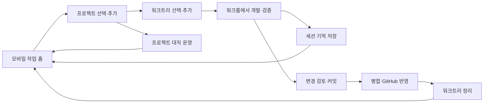

# 모바일 작업 홈 통합 설계

2026-09-11 · 수정 설계안 v3 (본인의 모바일 작업 연속성 기준) · 기준 소스 `7fbd2a0` / 설치 v434

이 문서는 설계 검토 당시 작성한 기준이며, 이후 사용자의 ‘진행해’ 승인으로 구현을 시작했다. 실제 구현·검증 범위와 남은 항목은 [실행 기록](./EXECUTION.md)에서 구분한다. 이 문서가 기존 9월 10일 계획의 **화면 기준과 모바일 우선순위**를 보완한다. 기존 연결·권한·실행 결과 계약과 검증 기록은 계속 사용한다.

## 1. 해결하려는 문제

사용자가 Mac·Windows PC 옆에 없어도 휴대폰에서 프로젝트 현황을 파악하고, QR로 등록한 단말에서 **프로젝트 생성 → 작업 공간 준비 → AI 작업 → 검증 → 기억 저장 → Git 반영 → 작업 공간 정리 → 대직 운영**을 이어갈 수 있어야 한다.

**주 사용자는 MacBook에서 작업하다 자리를 떠난 본인이다.** 웹앱과 네이티브앱은 본인이 쓰는 프로젝트·세션·기록을 모바일에서도 다루는 작업 화면이다. 설계와 검증은 ‘Mac에서 하던 일을 휴대폰에서 이어 하고, 돌아와 같은 결과와 세션을 확인한다’를 기준으로 한다. 새 작업도 휴대폰에서 시작하고 완료할 수 있어야 한다.

외부 사용자·외부 앱에 자료를 제공하는 API/feed는 별도의 연동 기능이다. 모바일 사용자가 그 API를 발급·등록하거나 외부 공유를 켜야 자기 작업을 이어갈 수 있는 구조로 만들지 않는다. 모바일 구현에는 기존 내부 API와 QR 원격 실행 경로를 재사용·확장하되, 외부 제공 API나 고객 gateway 사업의 완성을 선행 조건으로 두지 않는다.

Vercel 웹과 iPhone 앱은 같은 작업 경험을 제공한다. 프로젝트 파일과 AI·Git·카카오톡 작업은 선택한 호스트에서 실행한다. 휴대폰 탭 이동·화면 잠금·일시적인 연결 끊김은 호스트 작업 종료나 재등록 사유가 되지 않는다.

우선 완료할 경로는 **등록한 Mac이 실행 중인 상태에서 본인의 휴대폰으로 접속해 작업을 이어가는 것**이다. ‘자리를 떠남’을 ‘Mac 종료’로 해석하지 않는다. 등록 호스트의 실행·연결 준비는 기존 연결 설정에서 확인하고, 매번 자리를 떠날 때 QR이나 기능별 설정을 반복하지 않는다. 호스트가 꺼진 경우에는 기존에 조회 가능한 동기화 자료와 마지막 확인 상태를 제공한다. 호스트 없이 기억·내가 한 말 전체를 읽는 서버 확장은 별도 후속 과제이며 본인 원격 작업의 선행 조건이 아니다. 접수되지 않은 명령을 실행됐다고 표시하거나, 호스트가 돌아오면 변경 명령을 임의로 재전송하지 않는다.

핵심 완료 기준은 ‘버튼이 있다’가 아니라 **휴대폰에서 시작한 작업의 대상·진행·결과·복구까지 알 수 있다**는 것이다.

## 2. 현재 구현을 활용할 범위

아래 ‘있음’은 현재 소스의 구현을 뜻한다. 운영 Vercel·Windows·실제 iPhone에서 모두 검증됐다는 뜻은 아니다.

| 영역 | 현재 확인한 구현 | 개선 설계 |
|---|---|---|
| 화면 | 새 원격 화면과 기존 포털이 별도 진입점. 테마 토큰은 공유하지만 포털 메뉴는 `<a>`로 이동 | 새 원격 화면을 공통 홈으로 삼고 내부 탭 전환으로 통합 |
| 프로젝트 | 원격 목록·검색·페이지 조회·생성, 생성 결과의 정확한 대상 선택 | 전체 계정 목록과 선택 호스트의 실시간 상태 연결. 기존 폴더 등록·GitHub 복제는 별도 지원 여부 확인 후 확장 |
| 워크룸 | 기존 PTY, AI 선택, 입력·출력, 세션 유지와 연결별 작업 권한 | 모바일 주 작업 경로로 배치. 진행 작업·검증·결과에서 프로젝트 상세로 왕복 |
| Git | 원격 commit/pull/push/merge 경로 있음 | 변경 검토, 방향·대상 표시, 단계별 결과를 갖춘 모바일 흐름으로 구성 |
| 워크트리 | 원격 추가 있음. 로컬 삭제 API 있음. 원격 삭제 action 없음 | 정확한 등록 워크트리에 한정한 원격 정리 경로 추가 |
| 기억 | 자동 저장·로컬 수동 저장·백업·복구 기반 있음 | 모바일의 ‘세션 기억하기’는 현재 입력 초안 작성이므로, 실제 저장 요청과 완료 결과를 제공하는 기능으로 확장 |
| 내가 한 말 | Mac의 별도 보호 API·사용자 발언 목록·검색·출처 필터·수집·정제 후 동기화 있음. 모바일 열람은 별도 구현 필요 | 기록 탭과 프로젝트 상세에 통합. 선택 발언을 워크룸 초안으로 가져오되 자동 전송하지 않음 |
| 대직 | Mac에서 N:N 연결·승인 자료·별칭·ON/OFF·진단 있음 | 모바일용 상태·승인된 연결의 ON/OFF·진단부터 연결하고 이후 설정·공유 승인 확장 |
| 재접속 | pairing과 socket 분리, 30일 권한, 동일 origin 복원, 결과 미확정 요청 보호 | 단말 전환·로그인 갱신·네트워크 변경을 포함하는 공통 상태 경험 완성 |
| iPhone | SwiftUI 진입, 동일 WKWebView의 프로젝트/워크룸, 인증·복원 기반 있음 | 공통 작업 홈을 같은 WK 컨테이너에 제공. 카메라·시스템 인증·저장소는 네이티브 어댑터 유지 |

기존 장기기억의 ‘비검색 대직’은 초기 결정이다. 이후 사용자가 승인한 PDF·RAG 요구와 v429–v432 구현이 현행 기준이다. 이전 문서를 근거로 검색을 제거하지 않는다.

## 3. 화면 기준과 탐색 구조

**첨부 왼쪽의 새 원격 화면이 디자인 기준**이다. 기존 포털 기능을 이 안에 배치한다. 따뜻한 중립색 배경·구리색 강조·카드 형태를 유지하되, 큰 안내문과 중복 이동 버튼을 줄인다.

### 공통 프레임

```text
AgentsToZ                         [화면 설정] [계정·설정]
[내 기기 전체 / 회사 Mac ▾]         연결됨 · 확인 시각
────────────────────────────────────────────────────
선택한 탭의 본문
  홈: 이어할 작업 / 확인 필요 / 프로젝트 / 대직 현황
  프로젝트: 검색·생성 → 프로젝트·워크트리 상세
  워크룸: 실행 중 세션 → 입력·출력·검증 결과
  북마크: 기존 계정 북마크 기능
  기록: 내가 한 말 / 장기기억 — 각각 검색·상태·복구
────────────────────────────────────────────────────
  홈       프로젝트       워크룸       북마크       기록
```

- 휴대폰은 하단 **홈 / 프로젝트 / 워크룸 / 북마크 / 기록** 5개 탭을 사용한다. 기록 화면에서만 ‘내가 한 말 / 장기기억’ 전환을 제공한다. 마지막 선택을 복원하고, 각 기능의 직접 링크는 정확한 하위 화면으로 연다. 넓은 화면은 같은 순서의 사이드 내비게이션을 사용한다.
- 호스트 선택은 항상 같은 위치에 둔다. 설정에서 새 기기 QR 등록·연결 목록·권한·테마를 관리한다.
- 대직은 프로젝트 상세의 작업 영역과 홈의 ‘대직 중 / 확인 필요’ 카드로 진입한다. 별도 최상위 탭을 늘리지 않는다.
- 프로젝트 안에는 개요, 워크트리, Git, 기억, 대직을 본문 섹션으로 둔다. 모바일에서 전역 탭과 가로 탭을 두 줄로 쌓지 않는다.
- 브라우저 뒤로 가기는 프로젝트 상세→목록처럼 앱 내부 경로를 되짚는다. 탭별 검색어·스크롤·선택한 프로젝트를 복원한다.
- 탭 이동은 페이지 재탐색이나 로그인 재시작을 일으키지 않는다. 워크룸 연결 소유자는 탭 컴포넌트 밖에 둔다.
- 키보드가 열린 워크룸에서는 입력창과 세션 제어가 우선이다. 하단 탭이 입력창을 덮지 않게 하고 상세 내비게이션은 접는다.

### 홈에서 우선 보여줄 것

1. **이어서 작업:** Mac에서 하던 최근 프로젝트와 진행 중 세션, 선택 호스트. 해당 세션의 실제 식별자를 확인해 휴대폰에서 이어가고, 돌아온 Mac에도 같은 작업 결과가 남는다.
2. **확인 필요:** 실패·결과 미확정·기억 백업 대기·Git 충돌·대직 중지. 같은 문제를 중복 카드로 늘리지 않는다.
3. **빠른 작업:** 프로젝트 추가, 워크트리 추가, 세션 기억하기. 대상이 없으면 대상 선택부터 이어진다.
4. **최근 프로젝트와 대직:** 활동·Git·기억·대직 상태를 요약하고 상세로 연결한다.

기기가 등록되지 않아도 홈·권한이 있는 계정 자료는 열린다. QR 등록은 하나의 안내 카드로 제공한다. 일시 오프라인에 ‘새 QR이 필요합니다’를 표시하지 않는다. 만료·해지 등 재등록이 필요한 경우에만 그 안내를 사용한다.

### 테마와 상단 정리

- 본문의 ‘어두운 화면 / 밝은 화면’ 큰 버튼을 없애고 헤더 우측에 **화면 설정** 아이콘을 둔다. 터치 영역은 44px 이상이며 접근성 이름을 제공한다.
- 선택 패널에는 **기기 설정 따름 / 밝게 / 어둡게**와 현재 선택 표시를 둔다. 버튼 문구가 현재 상태인지 다음 동작인지 추측하게 하지 않는다.
- 신규 사용자는 기기 설정을 따른다. 기존에 직접 고른 밝은/어두운 설정은 보존한다.
- Vercel 같은 앱 내 모든 탭에 동일하게 적용한다. 네이티브도 같은 세 가지 선택을 제공하되 OS 설정을 명시적 선택으로 덮어쓰지 않는다.
- ‘EXTERNAL INTERNET · E2E’ 등 기술 문구는 연결 상세로 옮긴다. 상단에는 사용자에게 필요한 호스트명·연결 상태만 보여준다.
- 긴 보안 설명은 최초 연결·권한 변경 때 보여주고 평상시에는 상세에서 확인한다. 오류·작업 결과보다 안내문이 먼저 화면을 점유하지 않게 한다.

## 4. 프로젝트에서 작업 완료까지



이 흐름은 필수 순서를 강요하지 않는다. 기억 저장과 Git 반영을 각각 실행할 수 있고, 종료 화면에서 남은 작업을 모아 완료할 수도 있다.

### 프로젝트 추가·관리

- ‘프로젝트 추가’는 실행 호스트·허용 작업 폴더·프로젝트 이름을 먼저 정한다. 호스트 선택이 이미 돼 있으면 재입력하지 않는다.
- 신규 생성, GitHub에서 가져오기, 기존 폴더 등록을 사용자의 목적에 따라 구분한다. 현재 실제 지원되는 경로부터 노출하고, 폴더 등록은 호스트가 제공하는 제한된 후보로 선택한다.
- 생성 직후 **정확히 생성된 프로젝트 상세**를 연다. 생성 응답이 늦어져도 다시 눌러 동일 이름 폴더가 여러 개 생기지 않도록 기존 receipt/request ID를 재사용한다.
- ‘Mac에서 Codex 앱 열기’는 보조 메뉴로 내린다. 휴대폰의 주 동작은 **이 프로젝트에서 작업**이며 선택 호스트의 워크룸으로 들어간다. 호스트의 Finder·브라우저만 열리는 동작은 그 위치를 명확히 표시한다.
- 프로젝트 이름·메모·분류 같은 계정 메타데이터 편집과 호스트 파일 생성·변경은 결과를 구분한다. 계정 목록과 호스트 등록의 동일성은 검증된 매핑으로 연결하고 이름이 같다는 이유로 합치지 않는다.

### 워크트리 추가·정리

- 프로젝트 아래 주 작업 공간과 연결 워크트리를 계층으로 표시한다. 브랜치, 실행 중 작업, 미커밋 변경, 미반영 커밋을 한곳에서 확인한다.
- 추가는 기준 브랜치와 새 브랜치명을 보여주고 완료 후 새 워크트리 상세로 이동한다. 기존 원격 추가 동작과 등록 검증을 사용한다.
- 정리 검토는 실행 중 작업·변경 파일·미반영 커밋·병합 상태를 확인한다. 주 작업 공간은 제거 대상에서 제외한다.
- 일반 정리는 깨끗하고 보존 상태가 확인된 워크트리를 대상으로 한다. 변경이 남으면 커밋·병합·보존 단계로 바로 연결한다. 잠금을 풀거나 재귀 삭제하는 자동 우회는 하지 않는다.
- 확인 화면에 **폴더 제거 / 브랜치 유지 또는 별도 삭제 / 등록 목록 정리**를 구분해 표시하고 서버가 실제 결과를 확인한 뒤 목록을 갱신한다.

### Git과 검증

- 프로젝트 상세의 Git 영역에서 변경 파일 요약, 브랜치, upstream, 앞섬·뒤처짐, 마지막 원격 확인 시각을 본다.
- **Git 동기화**는 먼저 관계를 확인하고 필요한 Pull·Push를 제안한다. 양쪽이 갈라졌으면 충돌 검토로 연결한다. 단순 버튼 이름 때문에 양방향 강제 덮어쓰기를 실행하지 않는다.
- 커밋 전 파일·변경 검토는 별도 승인된 읽기 범위에서 제공한다. 원문 diff를 일반 프로젝트 목록 DTO에 추가하지 않는다.
- 병합은 출발 워크트리·대상 브랜치·충돌 점검·검증 결과·GitHub 반영 여부를 한 화면에서 검토한다. 기존 로컬 기본 브랜치 병합과 GitHub PR 병합을 같은 성공으로 부르지 않는다.
- ‘병합 후 GitHub 반영’은 검토 화면에서 한 번 선택할 수 있게 하되, 결과에는 병합과 Push를 각각 표시한다. Push만 실패하면 병합을 다시 하지 않고 Push 단계부터 확인한다.
- 테스트는 현재 워크룸 실행 경로를 사용하고 선택 프로젝트의 결과를 연결한다. 범용 무제한 원격 셸 API를 새로 만들지 않는다.
- 개발 화면 확인은 휴대폰에서 열 수 있는 등록된 배포·미리보기 링크를 우선 제공한다. 호스트의 localhost를 여는 기능과 휴대폰 미리보기를 구분한다. 별도 개발 서버 중계는 인증·수명·노출 범위를 정한 후속 기능으로 둔다.

### 세션 기억과 자동 저장

- 프로젝트와 워크룸에 **지금 세션 기억하기**를 제공한다. 현재의 프롬프트 초안 버튼은 ‘저장 요청문 작성’으로 정확히 표현하고, 결과를 확인하는 정식 저장 동작으로 대체한다.
- 자동 저장 사용 여부, 마지막 로컬 저장, 백업 상태, 아직 저장하지 않은 완료 작업을 함께 표시한다. 자동 저장이 켜졌다는 이유로 수동 저장을 숨기지 않는다.
- 수동·자동 저장은 기존 dispatcher·coverage·중복 방지·provider 정책을 공유한다. 같은 작업을 두 번 AI에 보내지 않는다.
- 결과는 **저장 대기 → 저장 중 → 로컬 저장 완료 → 백업 완료/재시도 필요**로 표시한다. 로컬 성공·백업 실패를 전체 실패로 보이지 않게 한다.
- Git 동기화와 기억 동기화는 버튼·상태를 분리한다. 작업 종료 화면에서 둘을 모아 안내하되 결과는 각각 남긴다.
- 충돌·잠금·미확정 저장은 해당 작업의 복구 화면으로 연결한다. 원본·현재 소유자·복구 가능 근거를 서버가 확인한 검토 결과에만 복구 동작을 결속한다. 휴대폰에서 임의 잠금 파일을 삭제하는 기능은 제공하지 않는다.
- 원격에서 복구 근거를 입증할 수 없는 OS 권한·로그인 문제는 필요한 호스트 조치를 구체적으로 표시한다. 같은 오류 문구와 재시도 버튼만 반복하지 않는다.

### 내가 한 말: 찾기에서 작업 재개까지

‘내가 한 말’은 수집된 사용자 발언이며, ‘장기기억’은 프로젝트의 결정·교훈을 정리한 자료다. 같은 기록 탭에서 접근하되 데이터·권한·저장 결과를 합치지 않는다. AI의 전체 응답과 대화 원문을 모두 보관하는 기능으로 표현하지 않는다. 현재 목록 DTO는 사용자 발언 중심이다.

- **기록 → 내가 한 말:** 검색, 프로젝트(장기기억 범위), AI 종류, 입력 출처를 제공한다. 기본은 권한이 있는 모든 프로젝트이며 프로젝트 상세에서 들어오면 그 프로젝트로 제한한다. 기록의 수집 단말과 작업을 실행할 호스트는 별개로 표시한다.
- 카드에는 발언 일부, 발언 시각, 프로젝트, AI, 수집 단말을 표시한다. 상세에서 전체 허용 본문·출처·저장 위치를 본다. `human / agentstoz / unknown`은 출처 분류이며 실제 사람이 타이핑했다는 인증으로 표현하지 않는다.
- 현재 목록의 적재 순서와 발언 시각을 구분한다. ‘최근 적재순’을 기본으로 명시하고, 과거 발언이 뒤늦게 수집돼 위에 나올 수 있음을 설명한다. 날짜·단말 필터는 서버 전체 검색이 지원된 경우에만 추가하며 현재 로드한 50건만 필터해 전체 결과처럼 보이지 않게 한다.
- **이 말로 작업하기:** 선택 발언 → 실행 호스트·프로젝트 확인 → 기존 워크룸 또는 새 작업 선택 → 편집 가능한 요청 초안. 사용자가 전송하기 전 AI 호출·기존 세션 입력 덮어쓰기를 하지 않는다. 원래 세션을 정확히 확인할 수 없으면 ‘새 작업’으로 안내한다.
- 여러 발언을 모을 때는 개수·길이 상한을 적용하고 선택 항목과 실제 전송 본문을 보여준다. 본문은 명시적으로 가져온 시점에만 첨부하며 전체 원장을 자동 주입하지 않는다. 기록 조회 자체는 AI를 호출하지 않는다.
- **기억에 반영하기:** 선택 발언을 근거로 검토 가능한 기억 후보를 만들고 기존 저장 경로에 연결한다. 읽기 권한만으로 AI 전송·장기기억 쓰기 권한을 얻지 않는다. 1차 출시의 ‘작업하기’ 초안과 실제 기억 저장 완료를 혼동하지 않는다.
- ‘발언 수집 시각 / 원격 동기화 시각 / 장기기억 저장 시각’을 별도로 표시한다. 최신 한 프로젝트의 수집 시각으로 전체 프로젝트가 최신이라고 표시하지 않는다. 원본 미발견·부분 수집·검색 미완료·로컬 대체 조회를 빈 결과와 구분한다.
- 휴대폰에서 입력한 워크룸 발언도 기존 수집 동의와 대상 검증에 따라 수집한다. 새 모바일 직접 기록 저장기를 추가해 호스트 transcript 수집과 중복 저장하지 않는다. 기존 기록을 요청으로 재사용한 새 발언은 별개의 발언이며 그 출처를 보존한다.

### 내가 한 말: 제공 경로와 운영 범위

| 상황 | 제공할 경험 | 구현·검증 조건 |
|---|---|---|
| 본인의 등록 호스트 온라인 — 우선 경로 | Mac에서 보는 본인의 기록 조회·검색, 수집 상태, 선택 프로젝트 수집·동기화, 워크룸으로 이어가기 | 기존 QR 연결과 호스트의 기록 조회 기능을 연결. 로컬 보관 자료와 정제된 동기화 자료의 출처를 표시하고 기존 수집·보존 정책을 유지 |
| 호스트 오프라인·모바일 인터넷 연결 — 보조 경로 | 기존 계정 조회로 제공 가능한 동기화 자료와 마지막 상태 | 아직 모바일 조회가 연결되지 않은 자료는 지원 범위를 표시. 추가 서버 조회는 별도 확장으로 검증하며 본인 호스트 연결 개발을 막지 않음 |
| 휴대폰도 오프라인 | 연결 상태와 재접속 안내 | 초기 버전은 민감 본문의 영구 오프라인 저장 미지원. 연결 중 화면에 남은 자료를 최신 조회로 표시하지 않음 |
| 권한 없음·만료·회수 | 내용 없는 접근 안내와 권한 검토 경로 | 목록·상세·검색·건수 모두 동일 검사. 회수 시 열린 본문과 선택 초안의 아직 전송하지 않은 참조도 정리 |

- 본인 모바일 연결은 기존 QR 등록 화면에서 작업과 기록 이용 범위를 함께 검토한다. 기존 동의가 포함하지 않은 범위는 한 번 보완하고, 유효한 범위에서는 탭 이동·검색·재접속마다 동의를 반복하지 않는다. 기록 수집 동의와 외부 앱 공유 동의는 별도로 유지한다.
- 승인 범위는 선택 프로젝트/기억·단말·만료·정책 revision에 결속한다. 기억 합병으로 기존 허용 프로젝트 밖의 발언까지 자동 공개하지 않는다. 자료를 읽을 때 수집·보존·삭제 상태와 본인 모바일 연결 범위를 검사한다. 외부 공유 제외 설정을 본인의 로컬 기록 열람 금지로 재해석하지 않는다.
- 외부 앱 feed 인증 키를 발급하거나 공유 기능을 켜는 단계를 모바일 사용 흐름에 넣지 않는다. 기존 내부 기록 기능을 호출하는 호스트 어댑터가 본인 연결을 검증하고 필요한 자료를 반환한다. Keychain/DPAPI 키, service-role, 로컬 관리 capability는 호스트에 남긴다. Mac의 로컬 자료와 정제 후 동기화된 자료가 다를 수 있음을 출처로 설명한다.
- 조회 결과는 `no-store`; 서비스워커·localStorage·분석 로그·오류 보고에 본문/검색어를 남기지 않는다. 탭 전환은 연결을 유지하되 본문 메모리는 제한한다. 로그아웃·단말 전환·권한 회수 시 본문을 지우고, 모바일 background 복귀 시 유효 권한을 재확인한다.
- 1차는 조회·검색·선택 발언으로 작업 초안 만들기와 수집 상태를 제공한다. 이어서 별도 권한으로 승인된 프로젝트의 ‘지금 수집·동기화’를 제공한다. 수집 설정 켜기, 과거 기록 소급 수집, AI 분석 동의, 제외 범위 변경, 삭제는 단순 열람 권한에서 실행하지 않는다.
- 정책 변경·삭제의 모바일 관리 흐름은 후속 검토 화면으로 구현한다. 삭제는 기존 원격 우선·로컬 후속 계약을 유지하고, 오프라인 단말 사본이 남으면 완전 삭제 성공으로 표시하지 않는다. 실패한 수집·동기화도 완료 단계부터 반복하지 않는다.
- 대직 공유와 연결하지 않는다. 내가 한 말을 조회하거나 기억 후보로 선택해도 카톡방의 승인 자료가 늘어나지 않는다. 대직에는 기존 별도 공유 검토가 필요하다.

### 모바일 대직 운영

- 프로젝트 상세에 연결된 카톡방별 별칭·상태·최근 확인·최근 응답·공유 자료 개수·AI/한도를 표시한다. 프로젝트↔채팅방 N:N 구조와 연결별 권한을 그대로 사용한다.
- 1차는 **이미 승인된 연결의 켜기·끄기·상태·진단**을 제공한다. 켜기 전 호스트·채팅방·현재 공유 자료 revision과 연결 가능 여부를 확인한다. 꺼짐은 실제 중지 확인 후 표시한다.
- 2차는 방 연결·별칭·승인 자료 변경·RAG 생성과 검토를 모바일로 확장한다. 생성했다고 공유가 적용되지 않으며, 방별 검토·동의와 FAQ 무효화 계약을 유지한다.
- 대직은 호스트의 카카오톡에서 실행된다. 휴대폰 카카오톡 프로필과 연결하거나 휴대폰에서 대신 전송하는 기능으로 표현하지 않는다.
- macOS 접근성·카카오톡 로그인·창 읽기 준비는 최초 등록 때 점검한다. 모바일에서는 승인한 방의 창 다시 열기와 진단을 요청할 수 있도록 좁은 동작을 추가한다.
- 현재 카카오톡 대직과 PDF 추출의 macOS 제약을 숨기지 않는다. Windows에는 실제 어댑터가 검증되기 전 ON 버튼을 활성화하지 않는다.
- 켜기 전 대화 미처리·불명확 전송 자동 재시도 금지는 유지한다. 모바일 ON 성공과 실제 새 질문 응답 성공을 별도로 검증한다.

## 5. 연결·권한·실행 결과의 공통 설계

### 계정과 호스트 연결

- 본인이 등록한 모바일에서 일상 작업을 이어가는 흐름을 우선한다. 기존 승인·로그인·연결 상태를 복원하고, 새 권한이 필요한 경우에만 등록 설정에서 보완한다. 외부 API 키 관리·다른 사용자 초대·고객별 권한 관리는 일상 작업 화면의 선행 단계로 두지 않는다.
- 계정 로그인이 제공하는 프로젝트·북마크·기억 자료와 QR이 제공하는 호스트 실행 권한은 같은 앱에서 사용하되 서로 대체하지 않는다.
- 같은 Wi-Fi 연결은 기존대로 Vercel 가입 없이 사용 가능하다. 계정 자료 탭을 열었을 때 필요한 로그인을 안내하며, 계정 인증 실패가 호스트 작업 연결을 지우지 않는다.
- 최초 등록은 기기 이름·만료·허용 프로젝트/작업 폴더를 보여준다. 일반 관리, 워크룸 실행, 기억 저장·복구, Git 변경·정리, 대직 운영의 지원 범위를 검토할 수 있게 한다.
- 기존 권한은 같은 범위에서 복원한다. 새 기억·대직·삭제 기능이 추가돼도 예전 QR 동의를 넓은 권한으로 자동 변경하지 않는다. 다음 외출 전 등록 준비 화면에서 필요한 기능을 한 번에 점검할 수 있게 한다.
- 호스트 목록에서는 ‘등록됨 / 연결 중 / 연결됨 / 오프라인 / 만료·해지 / 조치 필요’를 구분한다. 일시 오프라인에 등록 정보나 입력 초안을 임의로 지우지 않는다.
- LAN 주소 변경 자동 탐색은 현재 미구현이다. 검증된 호스트 신원을 확인하는 복구 단계가 필요하며, 동일 IP·이름만으로 다른 단말을 인수하지 않는다.

### 실행 결과

- 공통 작업 기록에는 호스트·프로젝트·워크트리·사용자 요청 ID·실행 단계·검증된 결과·다음 동작을 둔다. 새 범용 작업 엔진 대신 기존 실행기의 결과를 공통 화면 모델로 정리한다.
- 요청 접수와 완료를 구분한다. 재접속 시 동일 요청의 상태를 조회하고, 전송 여부가 불확실한 변경 명령은 다시 만들지 않는다.
- 호스트를 바꾼 뒤 도착한 이전 응답은 원래 호스트의 작업 기록에만 반영한다. 탭을 닫아도 실제 작업과 자동 기억 관찰은 유지한다.
- 일반 작업은 불필요한 확인창 없이 실행한다. 자료 공유 변경·삭제·병합은 대상과 영향을 보여주는 검토 화면을 마지막 단계에 둔다.
- 모바일로는 검증된 대상 ID와 정해진 동작만 전달한다. 로컬 관리 capability, 경로·환경값·자격 증명을 그대로 넘기지 않는다. 새 원격 기능은 기능별 권한·DTO·결과 검사로 확장한다.

## 6. 구현 구조와 이전 방식

- `WorkspaceShell`(가칭): 새 화면을 기준으로 공통 헤더·단말 선택·하단 탭·테마를 제공한다.
- `WorkspaceConnectionOwner`(가칭): 기존 relay/LAN controller를 감싸 호스트별 연결과 워크룸 수명을 소유한다. 개별 탭이 소켓·QR token을 다시 만들지 않는다.
- 기존 포털의 프로젝트·북마크·장기기억 기능을 독립 화면으로 추출해 Shell 안에 탑재한다. 원격 프로젝트와 계정 프로젝트의 식별 매핑을 먼저 검증한다.
- Vercel과 호스트 제공 LAN 화면은 같은 화면 규칙·행동 모델을 사용한다. LAN 화면도 장기적으로 공통 UI 산출물을 사용하도록 연결하되 기존 경량 전송·정적 경로 계약을 검증한다.
- 기존 `/`, `/?tab=ports|bookmarks|memories`, `/remote/`, QR 진입 링크를 초기 화면 상태로 해석하는 호환 진입점을 둔다. 각 진입점이 같은 Shell을 열고 이후 탭 이동은 내부 상태 전환으로 처리한다.
- `/remote/`를 허용하는 기존 WK 탐색 계약과 일회용 QR fragment 소비를 보존한다. 내부 탭 변경 때문에 토큰을 URL에 다시 싣거나 새로운 pairing을 만들지 않는다.
- 현재 iframe 금지와 CSP는 유지한다. 통합을 iframe이나 인증 저장소 복사로 해결하지 않는다. 원격 화면에서 직접 QR을 스캔하려면 Vercel camera 정책·네이티브 bridge·사용자 실행 시점의 카메라 접근을 함께 검토한다.
- 호스트의 capability 응답으로 UI 기능을 구성한다. 신형 웹이 구형 호스트에 미지원 명령을 보내지 않으며 지원하지 않는 기능은 이유·필요 버전을 표시한다.
- 배포는 호스트 기능 준비 → 웹 호환 배포 → 네이티브 갱신 순서다. 기존 QR·계정 북마크·진행 세션을 유지하는 이전 테스트와 이전 버전 복귀 경로를 준비한다.

## 7. 개발 순서와 단계별 완료 기준

| 단계 | 범위 | 다음 단계로 넘어갈 기준 |
|---|---|---|
| 0. 계약 확정 | 현행 기능/표면 표, 화면 구조, 상태·권한·결과 계약, 지원 버전 | 디자인 기준이 새 화면으로 일치하고 누락 기능과 검증 장소가 명확함 |
| 1. 공통 홈·테마 | Shell, 탭 전환, 기존 포털 기능 통합, 기록 하위 화면, 테마, QR 진입, 홈 상태 | 탭 20회 전환해도 문서 재탐색·재로그인·추가 pairing·터미널 종료 없음 |
| 2. 개발 주 흐름 | 생성→정확한 프로젝트/워크트리→워크룸→변경·검증, 내가 한 말 조회·검색→요청 초안 | 모바일에서 생성 대상 혼동·중복 생성 없이 작업과 결과까지 이어짐 |
| 3. 작업 마무리 | 실제 세션 저장·백업·복구, 내가 한 말 수집·동기화 결과, Git 검토·병합·동기화, 워크트리 정리 | 한 단계 실패 후 완료 단계를 반복하지 않고 마무리 가능 |
| 4. 대직 운영 | 승인 연결 ON/OFF·진단, 이후 자료/방 설정 | 두 프로젝트·두 방 N:N 제어 및 실제 신규 질문 응답 확인 |
| 5. 네이티브·플랫폼 검증 | 공통 홈 WK 통합, 시뮬레이터·실기기·Windows 어댑터 확인 | 해당 표면의 기기 검증을 통과한 기능만 출시 완료로 표시 |

네이티브 어댑터와 fixture 코드는 1–4단계 중 함께 준비한다. 5단계는 다른 단말이 필요한 UI·시스템 검증 단계이지, 네이티브 개발을 마지막까지 보류한다는 뜻이 아니다.

## 8. 이 단말에서 할 수 있는 검증과 인계

설계 당시에는 Command Line Tools만 확인되어 아래와 같이 인계 범위를 나눴다. **2026-09-11 재확인에서는 이 Mac에 Xcode 26.6과 iOS 26.5 simulator가 사용 가능하다.** 현재 실행 결과와 남은 실기기 인계는 [NATIVE-EXECUTION.md](NATIVE-EXECUTION.md)를 따른다. 다른 단말의 이전 시뮬레이터 성공 기록을 이번 변경의 검증으로 사용하지 않는다.

| 이 단말에서 개발 후 수행 | 다른 Xcode 단말에서 수행 |
|---|---|
| React/TypeScript/Bun/Rust 구현·계약 테스트 | SwiftUI·UIKit·WKWebView를 포함한 iOS 빌드 |
| Chromium/WebKit 모바일 크기, 밝게/어둡게/기기 설정, 키보드·safe-area UI 테스트 | 시뮬레이터 화면 전환·rotation·키보드·접근성·앱 lifecycle |
| 테스트 호스트·격리 Git 저장소의 생성/정리/병합·중복/연결 끊김 테스트 | 실제 카메라 QR·Google 인증 복귀·LAN 권한·실기기 한글 입력 |
| Swift Foundation 코어 테스트와 native adapter 계약·fixture 작성 | 5G↔Wi-Fi, 잠금·장시간 background·cold launch 후 작업 복원 |
| 승인 범위 내 설치 Mac 읽기·실행 검증과 웹 배포 전 점검 | Windows 호스트의 경로·Git·실행기·권한 동작과 플랫폼 차이 |

다른 단말에는 **동일 commit SHA, fixture 버전, 실행 명령, 기대 결과, 미검증 목록, 화면 캡처 위치**를 포함한 인계 문서를 제공한다. 사용자 설정·운영 credential·실제 대화 원문은 fixture로 복사하지 않는다.

### 최종 사용자 시나리오

1. Mac에서 작업하던 중 자리를 떠나 등록한 휴대폰을 열면 최근 프로젝트와 같은 진행 세션이 보인다. 그대로 이어 하거나 새 프로젝트와 워크트리를 만든다.
2. 워크룸에서 작업을 시작한 뒤 북마크·기억을 확인하고 돌아와 같은 세션을 이어간다.
3. 화면 잠금·앱 재시작·일시 단절 후 QR을 다시 찍지 않고 허용된 세션을 복원한다.
4. 변경을 검토·검증하고 기억 저장과 백업 결과를 각각 확인한다.
5. 브랜치를 병합·GitHub에 반영하고 완료된 워크트리를 정리한다.
6. 프로젝트 대직을 켜고 실제 새 질문 응답을 확인한 뒤 휴대폰에서 끈다.
7. 호스트가 오프라인일 때도 권한과 서버 경로가 준비된 계정 자료는 이용하고, 실행 불가 이유와 마지막 상태를 구분한다.
8. 내가 한 말에서 예전 요구를 찾아 다른 등록 호스트의 정확한 프로젝트로 가져오고, 편집·전송 후 기존 워크룸을 유지한다.
9. 두 프로젝트 중 하나만 허용된 단말에서 다른 프로젝트의 본문·검색 결과·건수가 노출되지 않는다. 제외·권한 회수 후 열린 본문도 다시 사용할 수 없다.
10. 수집 지연·정제된 본문·장기기억 저장 결과를 구분하고, 기록 열람만으로 AI 호출이나 대직 자료 공유가 발생하지 않는다.
11. 기록 탭을 오가거나 앱을 다시 열어도 중복 수집·재전송이 없으며, 원격 동기화 실패는 로컬 보관 성공을 지우지 않는다.
12. 휴대폰에서 작업을 끝내고 Mac으로 돌아왔을 때 같은 프로젝트·워크트리·세션·Git·기억 결과를 확인한다. 외부 API 키 발급·공유 설정 없이 이 왕복 흐름을 완료한다.

## 9. 이번 설계에서 후속으로 추적할 것

- 서버 전원·잠금·OS 로그인·접근성 권한을 모바일 UI만으로 해결할 수 있는 것으로 약속하지 않는다. 최초 준비 점검과 조치 가능한 오류를 우선 제공한다.
- 호스트 주소 변경 자동 탐색, 휴대폰 개발 서버 미리보기 중계, 앱이 닫혔을 때의 푸시 알림은 별도 수명·인증 설계를 거쳐 추가한다.
- Windows 카카오톡 대직은 기존 macOS 구현의 버튼 복제로 완료할 수 없다. 범용 관리 기능과 플랫폼 전용 기능을 capability로 구분한다.
- macOS 네이티브 격리 broker의 별도 출하 조건과 관리형 파일 쓰기 제한은 유지한다. 기존 워크룸 경로의 편의 개선과 혼동하지 않는다.

## 10. 수정 설계 검토 결과

- 목적 교정: 외부 사용자용 API/feed와 본인의 웹·네이티브 원격 작업을 분리했다. 이번 개발의 중심은 QR로 등록한 본인 호스트와 모바일 사이의 작업 연속성이다.
- 누락 수정: ‘내가 한 말’을 기록 탭·프로젝트 상세·워크룸 진입·홈의 수집 문제 안내에 반영했다. 최상위 탭을 6개로 늘리지 않는다.
- 의미 분리: 발언 원장, AI 전체 대화, 장기기억, 대직 공유 자료는 다른 데이터다. 같은 화면에서 연결해도 저장·분석·공유 동의를 합치지 않는다.
- 구현 순서 교정: 기존 QR 연결과 내부 호스트 기능을 먼저 모바일에 연결한다. 호스트가 없는 상태의 추가 서버 조회와 외부 제공 gateway는 별도 과제로 두며, 이를 본인 모바일 작업의 선행 개발로 삼았던 v2의 해석을 철회한다.
- 범위 유지: 신규 홈·테마, 프로젝트·워크트리, Git, 세션 저장, 대직이라는 원래 목표는 유지한다. 발언 조회와 작업 초안 연결은 개발 주 흐름에 포함하고, 고위험 정책 변경·소급 수집·삭제는 독립 검토 흐름으로 둔다.
- 완료 증거: TypeScript/API 회귀와 모바일 브라우저 테스트에 범위 누출·적재순·부분 조회·회수·중복 수집·초안 덮어쓰기 방지를 추가한다. iOS background 가림·복귀와 실제 인증은 다른 Xcode 단말에서 확인한다.
- 이번 변경은 설계 문서만이며 제품 구현·빌드·설치·배포는 수행하지 않았다.

## 근거

- 화면 분리·테마·포털 링크: `src/remote-control-portal-main.tsx:2155`, `src/portal-main.tsx:1326`, `src/appearanceTokens.css`, `vercel.json`.
- 현행 원격 action: `src/remoteControlCore.ts:43`, `src/remoteControlProcessGateway.ts`, `src/remoteControlGitSafety.ts`.
- 프로젝트 실행과 작업 권한: `src/projectLaunchPolicy.ts`, `src/projectLaunchReceipt.ts`, `src/remoteTerminalGrant.ts`, `src/remoteTerminalGrantStore.ts`.
- 현재 모바일 기억 초안: `src/AiTerminalPanel.tsx:162`, `src/remoteControlMobilePage.ts:269`. 기존 저장·복구: `src/memorySaveAutomaticHost.ts`, `src/terminalMemoryQueue.ts`, `api-server.ts`.
- 대직: `src/csDuty.ts`, `src/csDutyHost.ts`, `src/CsDutyPanel.tsx`, `docs/cs-duty.md`.
- iPhone 연결 소유·인증·검증 한계: `mobile/ios/README.md`, `mobile/ios/App/RemoteHomeView.swift`, `mobile/ios/App/LANWorkroomView.swift`.
- 이전 구현·검증 기록: `docs/plans/remote-workspace-2026-09-10/execution-evidence.md`. 해당 기록의 source/운영/실기기 구분을 유지한다.

- 내가 한 말 현행 DTO·목록·정책: `src/WhatISaidPanel.tsx`, `src/whatISaidSharedPolicy.ts`, `src/whatISaidRemotePolicy.ts`, `api-server.ts`의 `/api/what-i-said/list`.
- 관련 별도 인증·연동 설계: `docs/design/byos-auth-device-registration.md` 10절. 이 문서의 고객 gateway scope를 본인 QR 작업 경로의 선행 조건으로 가져오지 않는다. 모바일 기능·자원 관리 근거: `docs/onboarding-qr-device-migration-plan.md`, `docs/resource-management.md`.
