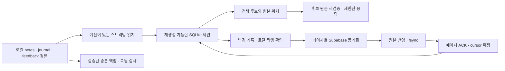

# 장기기억 누적 규모 개선 계획

작성일: 2026-09-23 · 상태: 첫 구현 묶음 진행, 전체 계획·운영 배포 미완료

구현 이후의 사실과 남은 범위는 [실행 기록](EXECUTION.md)을 우선 참고한다. 아래 출발점은 구현 전 관측이다.

근거: [실측 및 소스 점검](../../design/project-memory-long-horizon-audit-2026-09-23.md)

## 1. 목표와 범위

목표는 **기록을 보존하면서, 평상시 저장·검색·동기화 비용을 전체 이력 대신 변경량에 가깝게 만드는 것**이다. 장애가 발생하면 어디까지 저장됐는지 증명하고 이어갈 수 있어야 한다.

목표 규모는 사용자 추가 지정 전까지 다음과 같이 둔다. 아래 수치는 설계·시험 목표이며 현재 제품의 보장이 아니다.

| 항목 | 계획 기준 |
|---|---|
| 한 프로젝트 | journal 100만 건, feedback 100만 건을 각각 검증 |
| 본문 규모 | journal 평균 본문 UTF-8 1 KiB, 별도로 짧은 본문·8 KiB 본문·단일 대형 기록 혼합. base64/JSON·색인·백업의 추가 용량도 측정 |
| 한 호스트 | 등록 프로젝트 100개, 같은 시간에 실제 변경되는 프로젝트 10개 |
| 기기 | 먼저 Mac 2대, 이후 Windows와 Ubuntu를 같은 복구 시나리오로 검증 |
| 누적 형태 | 여러 해 분산, 한 달 집중, 오래된 날짜의 뒤늦은 추가, 일괄 가져오기 |
| 우선순위 | 원본·복구 증거 보존 → 실패의 정확한 표시 → 메모리/응답 예산 → 처리 속도 |

첫 출하 범위는 기존 원본 형식을 유지하는 증분 읽기·색인·동기화와 노트 저장 개선이다. 물리적인 journal/feedback 분할은 후속 선택 단계다. 원격 DB의 권한 모델을 여러 사용자용 서비스로 재설계하는 작업은 이 계획과 별도로 다룬다.

## 2. 출발점

- 선행 개선은 로컬 작업 트리에 있으며 아직 설치 앱이나 운영 DB에 배포하지 않았다. 피드백 캐시 상한·배치 저장·실패 전파, 일지 추가 최적화, 검색 인덱스 보강이 포함된다.
- 최종 소스 검사에서 typecheck, Bun 4,388개, Rust 60개가 통과했다. 유지보수 실행 `20260923T112149Z-ea8fca64`는 `sourceUnchanged: true`였다. 이는 당시 소스의 검증이며 이후 구현의 검증을 대신하지 않는다.
- 앞선 합성 측정은 일지 25,000건 append 1,878→32 ms, 100,000건 append 106 ms였다. 100,000건 생성·전체 읽기·색인·검색을 포함한 프로세스 최대 RSS는 약 1.225 GB였다.
- 로컬 API Pull은 `full-fallback`으로 동작한다. 설정된 Supabase 연결에서 `portmgr_project_memory_ledger_delta`, `portmgr_project_memory_ledger_cursor_status` 호출은 모두 `404 / PGRST202`였다. 함수 미배포, 노출 schema/cache, 연결 대상 차이를 구분하는 확인이 먼저다.
- `memoryDocumentChanges()`는 전체 notes를 변경 후보로 만든다. `prepareMemoryDocumentTransaction()`은 변경 없는 파일을 걸러내기 전에 입력 128개를 제한한다. 제목 색인은 프롬프트에 계속 누적된다.

## 3. 유지할 불변 조건

1. 프로젝트 로컬 파일이 정본이다. SQLite 색인을 지워도 원본에서 복원할 수 있다.
2. 유효한 기록·미해결 저장 작업·중복 실행 방지 기록을 자원 예산 때문에 삭제하지 않는다. 처리 예산이 부족하면 대기·미완료·복구 필요 상태를 반환한다.
3. 원본 append와 필요한 fsync가 끝나기 전에는 완료 영수증·ACK·remote cursor를 전진시키지 않는다.
4. 로컬 저장 성공과 원격 백업 성공은 별개다. 한쪽의 실패가 다른 쪽의 실제 결과를 덮지 않는다.
5. journal의 기존 entry identity, feedback origin identity, curated entry ID를 유지한다. 색인용 전체 SHA-256과 기존 중복 판정 ID를 구분한다.
6. 역사적 일지와 현재 curated 지식의 권위를 구분한다. 검색 속도 개선이 예전 결론을 현재 결정으로 승격시키지 않는다.
7. canonical root·memoryId·소스 generation·workspace lease를 확인한다. root 이동, identity 병합, 파일 교체, 동시 쓰기에서 이전 색인을 그대로 신뢰하지 않는다.
8. 복구가 필요한 상태에서 무작정 AI를 재호출하지 않는다. 이미 적용된 입력·비용·동의 범위를 기존 저장 원장으로 확인한다.
9. 신뢰할 수 없는 새 형식이나 불완전한 검색 결과를 완료로 표시하지 않는다.

## 4. 목표 구조

### 원본 읽기와 색인

- 초기에는 현재 월별 `.md`와 단일 feedback JSONL을 그대로 읽는다. 파일 내부의 검증된 기록 경계에 논리적인 구간을 만들어 큰 파일도 일정한 메모리로 처리한다.
- 색인은 root/memory identity, schema version, source generation, 파일 identity, 구간 경계/해시, 기록별 원본 위치·길이·해시·검색 토큰을 가진다. 정본의 평문 전체를 별도 영구 사본으로 만들지 않는다.
- 색인 table의 최소 책임은 `sources`, `segments`, `entries`, `index_jobs`다. 이름과 SQL은 구현 계약 검토에서 확정한다. 기존 sync ACK와 저장 실행 원장은 각각의 책임을 유지하며, 검증된 source generation으로 연결한다.
- 새 색인 generation은 임시 상태로 생성하고 검증이 끝난 뒤 게시한다. 실패 시 기존에 검증된 generation 또는 명시적인 미완료 상태를 유지한다. 원본이 바뀌었으면 이전 generation을 최신인 것처럼 반환하지 않는다.
- 한 호스트의 색인 worker는 우선 1개, 대기 요청은 16개 이내로 제한한다. 같은 root의 재색인 요청은 합치고 공정하게 순환한다. worker가 원본을 직접 수정하거나 저장 성공을 선언하지 않는다.
- 구간별 checkpoint를 남기므로 재시작 후 처리한 전체 이력을 반복하지 않는다. 긴 작업 내내 저장용 workspace lease를 독점하지 않고, 원본 세대 확인과 결과 게시를 짧은 경계에서 수행한다.

### 증분 검증의 신뢰 경계

크기·mtime·파일 watcher는 변경 징후이며 내용 무결성의 증명이 아니다. 이 전제를 명시하지 않은 “변경분만 검사”는 채택하지 않는다.

- 호스트가 lease 안에서 수행한 append는 검증된 이전 경계와 새 바이트의 해시·길이를 함께 기록해 증분 반영한다.
- 외부 편집, 파일 교체, truncate, watcher 유실, cache 복구, identity 변경은 해당 소스를 재검증 대상으로 만든다. 같은 길이의 수정과 수정 시간 복원도 시험한다.
- 검색에 사용할 후보는 원본의 실제 위치와 해시를 다시 확인한다. 잘못된 후보를 버리는 것만으로 누락된 정답까지 검증됐다고 주장하지 않는다.
- 파일 발견/색인 적용/내용 검증 상태를 구분한다. 미확인 변경이 남으면 `complete: false` 또는 재구축 상태를 표시한다. 주기적인 내용 재검증은 예산과 진행률을 가진 background 작업으로 실행한다.
- 모든 과거 바이트를 매번 읽지 않고 임의의 외부 수정을 즉시 완전하게 감지할 수 있다고 주장하지 않는다. `complete`가 어느 검증된 generation을 뜻하는지 API 계약과 테스트에 명시한다.

## 5. 단계별 실행 계획

### 단계 0 — 선행 개선 확정과 비교 가능한 측정

**산출물**: 선행 변경의 독립된 변경 묶음, 규모 fixture 생성기, 읽기/할당량 계측, 전후 기준 보고서.

- 기존 작업 트리의 수정 범위를 고정하고 검증 결과와 연결한다. 구현 착수 시 별도 브랜치/워크트리에서 후속 변경을 분리한다.
- `benchmark-project-memory-scale.ts`의 현재 200,000건 제한과 메모리에 전체 fixture를 만드는 방식을 개선한다. 100만 건 fixture는 별도 프로세스에서 스트리밍으로 생성한 뒤 측정 프로세스를 시작한다.
- 반복 검색, 1건 append, 1,000건 catch-up, 최초 색인, 캐시 제거 후 재구축, 전체 내보내기, 복원을 따로 측정한다.
- 파일 읽은 bytes, 파싱한 행, SQL 조회 행, 파일 fsync, index bytes, worker/sidecar RSS, event-loop 지연, 요청 p50/p95, 재개까지 시간을 수집한다. 비밀·대화 본문은 계측에 포함하지 않는다.

**완료 기준**: 같은 하드웨어·Bun 버전·fixture·절차로 이전/새 구현을 비교할 수 있다. fixture 생성이 섞인 과거 1.225 GB와 작업 worker만의 RSS를 직접 비교하지 않는다.

### 단계 1 — 실제 환경의 증분 동기화와 상태 진단

**대상**: `schemaSql.ts`, 두 ledger migration, API의 sync 결과 및 장기기억 상태 표시.

1. 실제 연결 대상, 노출 schema, 두 RPC의 signature/권한, 설치 sidecar의 지원 버전을 읽기 전용으로 확인한다.
2. 운영 상태와 최신 정본 DDL을 비교한다. 20260828010000/020000 migration을 무조건 다시 실행하지 않고, 이후 변경을 보존하는 필요한 forward migration을 작성한다.
3. 격리한 Postgres에서 backfill, 두 연결의 동시 commit, alias/merge 후 늦은 업로드, DB 복원 후 cursor 검증을 실행한다. SQL 문자열 일치나 단일 연결 테스트만으로 동시성 검증을 대신하지 않는다.
4. 큰 backfill은 건수·시간 예산과 재개 위치를 가진다. 준비 완료 전에는 cursor 신뢰를 허용하지 않는다. 상태 조회가 migration이나 대량 backfill을 시작해서는 안 된다.
5. `delta / full-fallback / migration-required / recovering` 상태와 실제 원인을 구분한다. 인증/네트워크 실패를 오래된 schema로 오인하지 않는다.
6. 운영 반영은 소스 구현·검증과 별도 출하 작업으로 실행한다. 대상·변경 SQL·백업/복원·되돌리기 절차를 확정한 후 적용하고 설치본에서 확인한다.

**완료 기준**: 설치본에서 두 기기 간 새 기록만 이동하며, 변경 없는 두 번째 sync는 본문 전체를 내려받지 않는다. 과거 날짜의 새 기록이 누락되지 않고, cursor anchor 소실과 원격 복원 시 안전하게 재동기화한다.

### 단계 2 — 스트리밍 reader와 재생성 가능한 영속 색인

**대상**: `project-memory-server.ts`의 journal parser, `projectMemoryFeedback.ts`, `projectMemoryJournalRecall.ts`, 신규 reader/index/worker 모듈.

- 첫 변경은 동작이 같은 스트리밍 parser다. v2 프레임, v1 두 가지 배치, 중간 손상·미완료 tail, 한글/UTF-8 경계, dedup 순서를 기존 결과와 대조한다.
- DB에 기록 identity와 원본 구간을 넣어 전체 배열/Set을 매 요청마다 만들지 않는다. 로컬 읽기와 ACK 포함 여부 검증은 keyset 페이지·indexed join으로 처리한다.
- 큰 파일을 읽는 위치와 parser 상태를 저장한다. 기록 중간에서 끊은 상태를 완료 위치로 저장하지 않는다. oversized 기록은 원본을 보존하고 명시적인 미완료/복구 경로를 남긴다.
- 색인 쓰기 원자성, 버전 불일치, 손상 DB, disk full, 프로세스 종료, source 변경, root/identity 변경을 주입 시험한다. 새 schema를 모르는 실행 파일은 새 cache를 쓰지 않는다.
- 먼저 기존 reader와 새 reader를 작은 fixture에서 비교한 후 새 경로로 전환한다. 대규모 운영 이력에 두 경로를 매번 동시에 실행하지 않는다.

**완료 기준**: 100만 건 최초 읽기와 재구축이 작업별 메모리 예산 안에서 실행되고 중단 후 재개된다. 원본 추가가 없는 요청에서는 원본 전체를 파싱하지 않는다. 임의 원본 교체를 정상 증분 append로 취급하지 않는다.

### 단계 3 — 검색·동기화의 전체 이력 의존 제거

**대상**: recall, `prepareProjectMemoryLedgerState`, journal Push/Pull, feedback sync, `projectMemoryLedgerState.ts`.

**검색**

- SQLite에서 제한된 후보만 고르고, 원문은 기록 위치로 읽어 재검증한다. `readProjectMemoryJournal()` 전체 배열을 요구하는 API를 온라인 검색 경로에서 제거한다.
- 두 글자 한국어 검색은 별도 bigram posting과 기존 trigram 조합을 우선 검증한다. 디스크 증가량과 흔한 단어의 후보 폭증을 측정한다. 예산을 넘는 후보 검색은 제한 결과와 불완전 상태를 반환한다.
- 전체 검색 fallback을 UI 요청 안에서 조용히 실행하지 않는다. 색인이 없거나 손상됐으면 재구축 진행률과 재시도 가능한 상태를 반환한다.
- 검색 품질 fixture로 정확한 제목, 한국어/영어 별칭, 희귀 키워드, 흔한 짧은 키워드, 수정·철회된 지식, legacy unverified 기록을 고정한다. 기존 authority/caution 표시는 유지한다.

**동기화**

- 페이지별로 원본 반영 → fsync → ACK/cursor 확정한다. 전체 catch-up의 ACK Set을 메모리에 모은 뒤 마지막에 저장하는 경로를 제거한다.
- 한 실행의 시작 identity와 원격 상한 sequence를 고정해, 지속적으로 유입되는 데이터를 끝없이 쫓지 않는다. 필요한 경우 별도 버전의 bounded delta RPC를 추가하고 기존 RPC와 공존시킨다.
- 행 수뿐 아니라 응답 bytes와 실행 시간에도 한도를 둔다. 미완료 sync의 cursor와 남은 작업을 저장하고 다음 작업 단위에서 재개한다.
- “페이지를 정상 처리함”, “현재 목표 sequence까지 동기화 완료함”, “전체 백업 완료함”을 구분한다. 로컬 저장 영수증을 중간 sync 상태 때문에 되돌리지 않는다.
- 로컬 퇴행 검증은 source generation과 색인의 전체성 증명을 사용한다. 검증을 생략하거나 ACK 개수만 같다는 이유로 안전하다고 판단하지 않는다.

**완료 기준**: 일지 100만 건에서 1건 추가·재검색·다음 sync의 본문 읽기량이 정상 append의 새 구간에 비례한다. 미래 payload, 페이지 중 fsync 실패, 동일 페이지 재전송, 두 기기와 병합/복원에서 누락·중복·잘못된 완료가 없다.

### 단계 4 — curated 노트의 저장 한계와 제목 색인 성장 해소

**대상**: `projectMemoryDocument.ts`, `memoryDocumentTransaction.ts`, `prepareProjectMemoryUpdate`, `memorySaveContract.ts`, `memorySaveHostCommit.ts`, 생성 스킬/어댑터.

- 작은 첫 변경으로 실제 달라진 파일만 transaction 후보에 넣는다. 검증 없이 입력 128개 제한을 키우지 않는다. 준비 단계의 탐색과 실제 쓰기 각각에 별도 예산을 둔다.
- 자동으로 순서 기반 파일명을 다시 매겨 모든 note가 변경되는 상황을 줄인다. 기존 파일명은 유지하고 새 노트에는 안정적인 식별자를 부여하는 호환 방식을 먼저 정한다.
- 최상위 CORE에는 제한된 주제 안내를 두고 상세 제목은 주제별 색인/조회로 옮긴다. AI에는 관련 섹션과 제한된 routing context만 보낸다. 문맥에서 빠진 원본은 계속 보존·조회 가능해야 한다.
- 초기 제안은 routing context 8 KiB 이내, target section 12,000-byte 목표, V2 실제 프롬프트 48,000-byte 상한 유지다. 초과 시 잘라 저장하거나 사실을 버리지 않고 보완 작업이 필요함을 표시한다.
- 전체 문서 `beforeHash/afterHash`에 의존하는 CAS·영수증·복구·백업 계약을 함께 검토한다. 노트별 CAS와 문서 manifest generation을 추가한다면 별도 버전으로 전환한다. 한 함수만 바꿔 기존 충돌 검사를 약화하지 않는다.
- Claude/Codex/Hermes의 기억 읽기 안내가 새 주제 색인을 따라갈 수 있어야 한다. 단일 파일/현재 notes 형식도 계속 읽는다. 어댑터 버전과 읽기 호환 검사를 함께 갱신한다.

**완료 기준**: notes 129/1,000개에서 한 note 변경, 메모리 섹션 이동, 중단·재개, 동시 외부 수정, Push/Pull이 성공한다. entry ID와 살아 있는 사실이 보존되고 routing context가 notes 전체 크기와 함께 증가하지 않는다.

### 단계 5 — 영속 저장량, 아카이브와 복원

**대상**: private GitHub archive, curated 원격 리비전 정책, 저장 원장/receipt·ACK 상태 계측, disk admission.

- 정본·색인·revision·outbox·미해결 작업별 byte/row와 증가량을 구분해 표시한다. polling마다 전체 디렉터리를 재계산하지 않고 기존 기록 및 예산이 있는 갱신 작업을 사용한다.
- 완료된 백업은 검증된 immutable pack/manifest로 관리해 바뀐 구간만 검사한다. GitHub 저장소 identity·권한·visibility·refspec 검사는 매 Push 유지한다.
- 새 디렉터리에 복원해 파일/기록/identity/hash와 검색 결과를 대조한다. 원격 목록에 존재하는 것만으로 복원 가능하다고 판단하지 않는다.
- 원격 revision 500개 정책을 별도의 재개 가능한 정리 작업으로 만든다. 현재 head, 복구/미전송 백업이 참조하는 revision을 보호한다. 정리 후보를 확정하고 실제 삭제하는 순간에도 동시 Push를 검사한다. 원격 정리를 로컬 저장 성공의 조건으로 만들지 않는다.
- 자동 raw-input 만료 같은 기존 동의 정책과 curated/journal 보관 정책을 혼동하지 않는다. 미확정 작업·실행 fence의 제거는 이 계획에 포함하지 않는다. 압축/이관도 중복 실행 방지와 복원 증거를 유지해야 한다.
- 원본의 물리적 분할은 별도 결정 사항이다. 필요하면 바이트/건수 단위 segment를 도입하되, 구형 offline 단말의 쓰기·재접속까지 검증하기 전에는 전환하지 않는다. marker 파일 하나로 구형 writer가 멈춘다고 가정하지 않는다.

**완료 기준**: 백업/복원이 예산 안에서 중단·재개되고, 미해결 데이터가 보존된다. 정리 작업 실패가 기록 소실이나 저장 성공 은폐를 일으키지 않는다. 새 backup 형식을 읽지 못하는 버전으로의 복귀 범위를 명시한다.

### 단계 6 — 설치본 검증과 단계적 출하

- 순서: 합성 fixture → 단일 호스트의 합성 프로젝트 → 실제 설치 Mac의 한 프로젝트 → 두 기기 → OS별 검증 → 확대.
- schema는 먼저 호환 확장하고 reader·worker를 배포한 뒤 writer 전환을 고려한다. 개발 소스의 통과와 설치본 동작 증거를 별도 보관한다.
- 기존 자원 정책 안에서 실제 24시간 연속 시험과 7일 제한 운용을 계획한다. fake clock 시험은 실제 경과 시간 시험의 대체가 아니다.
- 비정상 RSS 증가, health 지연, false complete, 누락/중복, 복구 불능이면 확대하지 않는다. 성능 목표 미달과 데이터 무결성 실패는 따로 판정한다.
- 되돌릴 때 background index/새 reader를 끄고 원본과 미해결 작업을 보존한다. 작은 자료만 검증된 legacy 경로로 되돌리고, 큰 자료는 무제한 fallback 대신 명시적인 일시 제한 상태를 제공한다. schema downgrade나 원장 삭제로 되돌리지 않는다.

**완료 기준**: 대상 설치본과 OS별로 저장·검색·sync·재시작·복원 영수증이 있다. 확인하지 않은 OS/기기 범위를 성공으로 표시하지 않는다.

## 6. 초기 자원·성능 목표

단계 0에서 기준 하드웨어를 기록하고 다음 값을 조정한다. 변경한 목표와 이유는 결과 보고서에 남긴다.

| 측정 | 제안 목표/상한 |
|---|---|
| 색인 최신, 변경 없는 반복 검색 | 원본 본문 전체 읽기 0회. 후보 원문만 제한적으로 읽음 |
| 100만 건, 색인 최신 검색 | 일반 질의 p95 1초 이하. 예산 초과 질의는 2초 안에 불완전/재시도 상태 반환 |
| background 작업 중 health | p95 200 ms 이하, 측정 중 서버 응답 정지 없음 |
| worker 작업 단위 | 초기 4 MiB 또는 1,000기록 단위로 구분하고 시간·취소 확인. 단일 큰 기록 예외는 별도 상한/미완료 계약으로 처리 |
| 작업 동시성 | host당 색인 worker 1개, root별 요청 통합, 대기 최대16개. 실제 저장 dispatcher의 우선순위와 독립적인 자원 예산 |
| 메모리 | fixture 생성 제외한 색인 worker 최대 RSS 256 MiB 목표. sidecar+worker 증가량은 같은 유휴 기준 대비 384 MiB 목표 |
| 프롬프트 | 실제 V2 프롬프트 48,000 bytes 유지. 주제 routing context 초기8 KiB 목표 |
| 정상 증분 sync | 추가 없는 다음 sync는 전체 journal/feedback 본문 전송0. 페이지별 원본/ACK/cursor 확정 |
| 최초 구축/전체 복원 | O(전체 bytes) 허용. 메모리·작업 단위는 제한, 취소·진행률·재개 지원 |
| 디스크 | 원본은 누적을 허용. 색인/임시 작업은 예산·여유 공간 사전 검사. 전체 색인 크기와 원본 대비 비율을 측정 후 admission 기준 확정 |

빠른 응답을 위해 검색의 정확성 표시를 숨기지 않는다. `complete`는 후보 제한, 색인 coverage, 원본 freshness를 포함하는 계약으로 정하고, UI가 최신 동기화/백업 성공과 혼동하지 않게 한다.

## 7. 변경 묶음과 의존 순서

| 묶음 | 내용 | 선행 조건 |
|---|---|---|
| A | 선행 개선 고정, 스트리밍 fixture와 계측 | 없음 |
| B | 운영 연결 진단·capability 표시·필요 migration 및 격리 DB 회귀 | A |
| C | 호환 스트리밍 parser와 checkpoint | A |
| D | 영속 source/segment/entry 색인·worker·복구 | C |
| E | 증분 recall·한국어 검색·신선도/불완전 상태 | D |
| F | 페이지별 sync와 ACK/cursor 확정·중단 재개 | B, D |
| G | 노트 변경 후보 제한 해소 | A |
| H | 주제 색인·노트별 저장/CAS·어댑터 호환 | G, D의 identity/검증 계약 |
| I | 증분 archive·revision 정리·복원 시험 | F, H의 최종 계약 |
| J | 설치본·두 기기·OS별 장시간 시험과 출하 | 해당 출하 범위의 묶음 완료 |

첫 구현 묶음은 **A → B/C → D → E/F**를 중심으로 진행한다. G는 전체 note 저장 한계를 먼저 줄이는 독립 변경으로 끼울 수 있다. 한 번에 DB·원본 파일 형식·CAS 계약을 모두 바꾸는 변경 묶음은 만들지 않는다.

## 8. 필수 회귀와 종료 기준

| 시험군 | 최소 시나리오 |
|---|---|
| 누적 규모 | 1만/10만/100만 건, 100개 프로젝트, 긴 본문·같은 달 집중 |
| 파일 무결성 | tail 중단, 중간 손상, 같은 크기 수정, mtime 복원, truncate, rename 교체, symlink·root 이동 |
| 색인 | 삭제/손상, 구버전/future schema, 게시 직전 종료, 구축 중 원본 변경, 두 프로세스 경쟁 |
| sync | 1,000개 페이지 경계, 두 기기·늦은 과거 기록, alias 병합, 순서 역전, 미래 payload, cursor anchor 소실, DB 복원 |
| 저장 실패 | 파일/디렉터리 fsync 실패, disk full, SQLite commit 실패, 프로세스 종료 후 중복 실행 방지 |
| curated | 129/1,000 notes, 안정 ID, 주제 이동, 동시 외부 편집, 프롬프트 상한, 생성 어댑터의 읽기 |
| 검색 품질 | 한국어 두 글자·별칭·정확 제목·희귀/흔한 단어·오래된 근거·정정된 결정, 부분 결과 표시 |
| 운용 | 단일 호스트 자원 예산, 공정한 작업 순환, 네트워크 단절/재개, 실제24시간 및 제한된7일 운용 |
| 백업/복원 | 깨끗한 위치로 전체 복원, 신규/기존 archive 혼합, 원격 변조·누락, revision 정리 중 동시 Push |

각 묶음은 해당 실패를 재현하는 회귀와 typecheck를 통과해야 한다. 병합/출하 전에 프로젝트 유지보수 runner의 `verify`를 최종 소스가 바뀌지 않은 상태로 실행한다. 저위험 문서 변경에 전체 테스트를 불필요하게 반복하지 않는다.

프로젝트당 100만 건에서 자원 목표·데이터 무결성·복원 시험을 통과하고, 설치본에서 delta 운용이 확인되어야 첫 목표가 완료된다. 장기 디스크 정책과 새 물리적 파일 형식은 별도 완료 상태로 관리한다. 이 계획 문서를 만든 사실을 구현 완료로 표시하지 않는다.

## 9. 에포트와 미확정 선택

현재 에이전트는 Codex(OpenAI, GPT-6 계열)이며 정확한 세부 모델·현재 에포트 설정은 확인되지 않았다. 계획과 D/F/H의 신뢰·동시성·복구 계약에는 높은 추론 에포트를 권장한다. 대표 fixture와 API 계약이 안정된 뒤 반복 어댑터 연결·문서·정형 회귀에는 에포트를 낮출 수 있다. 설정은 자동 변경하지 않는다.

구현 초기에 확정할 항목은 기준 하드웨어, 한국어 bigram의 디스크 비용, 외부 파일 수정의 freshness 계약, source generation/CAS 버전, 운영 DB migration 범위다. 현재 원본 형식을 유지하는 reader/index 작업은 이 중 일부가 미확정이어도 먼저 준비할 수 있다. 데이터 삭제·새 archive opt-in·원본 형식 전환을 암묵적인 기본값으로 넣지 않는다.
