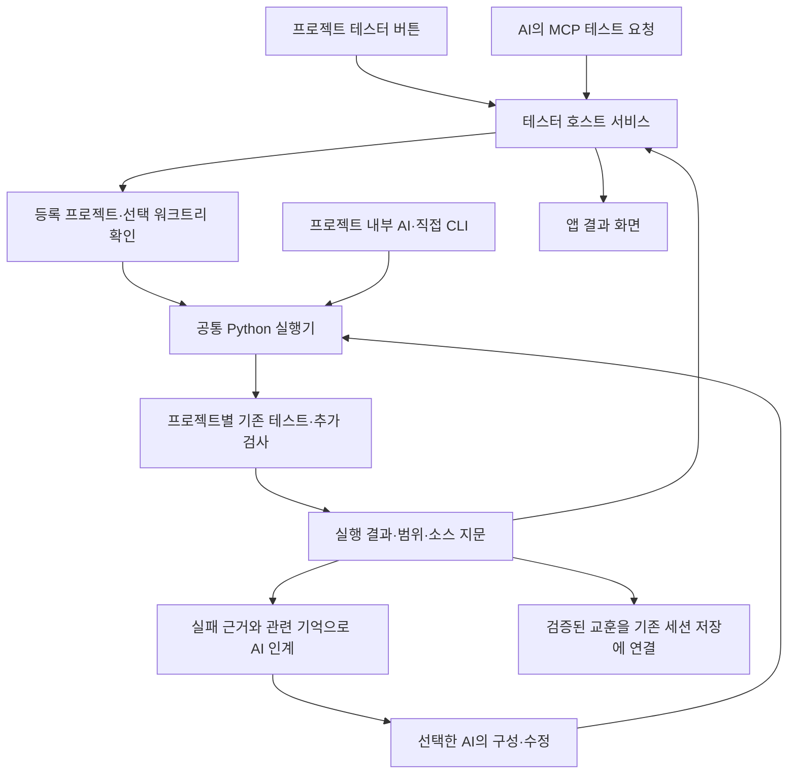

# 프로젝트 테스터 에이전트 구현 설계

2026-09-14 · 설계 기준 소스 `e6c0b7c` · **목표 설계**

첫 구현의 실제 범위·계약·남은 검증은 [EXECUTION.md](EXECUTION.md)를 따른다. 아래 미래 목표 전체가 구현됐다는 뜻은 아니다.

사용자가 원하는 경험은 프로젝트에서 **테스터 설정하기 → 테스트 실행 → 필요할 때 AI로 개선**이다.
프로젝트 안에서 일하는 AI도 같은 테스터를 사용한다. 테스트 구성과 검증된 해결책은 프로젝트에 축적되고, 다른 Mac이나 다른 AI로 바뀌어도 이어진다.

상세 실행 계약은 [CONTRACTS.md](CONTRACTS.md), 구현 순서와 수용 검사는 [ACCEPTANCE.md](ACCEPTANCE.md)에 둔다.

## 1. 결정

1. 사용자에게는 **테스터 에이전트**, 내부 공통 실행기는 기존 **maintainer** 이름을 유지한다. 같은 기능을 위한 두 Python 실행기를 만들지 않는다.
2. 테스터는 공통 Python 실행기, 프로젝트 소유 테스트, AI 사용 지침, 기존 DEV 기억의 연결이다. 새로운 LLM 제공자나 별도 기억 DB를 필수로 추가하지 않는다.
3. 앱 버튼, MCP, 프로젝트 CLI가 같은 설정과 결과 형식을 사용한다. 앱과 MCP는 같은 호스트 서비스로 실행하며, 앱 없이 실행한 CLI 결과도 출처를 구분해 읽는다.
4. 기본 버튼은 AI 호출 없이 테스트한다. 테스트가 없거나 실패하면 관련 근거를 선택한 AI에 전달하고, 수정 후 Python으로 재검증한다.
5. 처음에는 한 프로젝트의 완전한 흐름을 만든다. 전체 프로젝트 자동 설치·상시 LLM 실행·정기 스케줄은 기본값에 넣지 않는다.

## 2. 현재 코드와 추가할 부분

| 현재 확인한 구현 | 재사용·확장 방향 |
|---|---|
| `scripts/agentstoz-maintainer.py` v1.0.0 | `plan/run/status/baseline/init`, 프로세스 정리·잠금·보고서·기억 발췌 재사용. 기계 판독 상태·실행 연결 계약 추가 |
| `.agentstoz/maintainer.json` schema 1 | 기존 프로젝트별 argv·프로필·시간 제한·의존 순서를 유지 |
| `init`의 4개 파일 생성 | 기본 설치에 재사용하되, 부분 설치 복구·기존 설치 채택·업데이트를 별도 계약으로 추가 |
| `ProjectMemoryPanel.tsx`, `repositoryWorkflow.ts` | installed/current 버전 표시와 관리 블록 보존 패턴 참고. 새 패널을 분리해 `App.tsx`에는 연결만 추가 |
| `agentstozUseControl.ts`, `agentstoz-use-mcp-server.ts` | 실제 사용 가능한 tester 작업만 capability와 MCP 목록에 노출 |
| `onboardingAssistantHandoff.ts` | 복사 시점 상태, 실행 완료와 구분하는 인계 방식 재사용. 프로젝트 테스트용 내용을 별도 생성 |
| `build-sidecar.ts`, `src-tauri/tauri.conf.json` | 현재 템플릿 복사는 Hermes 항목만 포함. 테스터 자산을 추가해야 소스 checkout 없는 설치 앱에서 설치 가능 |
| `workspaceLease.ts`, runtime guard | 설치/업데이트의 쓰기 잠금, 실행 프로세스 소유권·종료 확인 재사용. 중첩 실행은 별도 검증 필요 |
| `mobileWorkspaceProtocol.ts` | 현재 tester 작업과 권한 없음. 명시적인 프로토콜 확장 후 모바일에 노출 |

현재 Python 자체 회귀와 앱 관련 검사를 통과한 사실은 **새 버튼·MCP·자동 지침 연결의 구현 증거가 아니다**.

## 3. 화면과 사용자 흐름

### 프로젝트의 작은 상태 줄

프로젝트 상세의 장기기억 영역과 나란히 `테스터` 영역을 둔다. 카드·목록·워크트리 화면은 같은 상태와 패널을 사용한다.

| 상태 | 주 버튼 | 보조 정보·다음 행동 |
|---|---|---|
| 아직 없음 | **테스터 설정하기** | “이 프로젝트의 테스트를 실행하고 결과를 AI와 연결합니다.” |
| Python/실행 도구 부족 | **실행 환경 준비** | 부족한 항목 하나와 기존 온보딩/AI 인계 연결 |
| 기본 도구만 있고 검사가 없음 | **AI로 테스트 구성** | “테스트 실행 명령이 아직 없습니다.” |
| 사용 가능, 아직 실행 안 함 | **테스트 실행** | 기본은 빠른 검사. 전체 검사 등은 펼쳐 선택 |
| 검사 중 | **결과 보기** | 현재 검사·경과 시간·취소. 중복 시작 버튼 없음 |
| 통과 | **다시 테스트** | “빠른 검사 통과 · 5분 전”. 실제 검사 범위 표시 |
| 실패 | **AI로 개선** | 실패 검사와 짧은 원인. 같은 검사 재실행도 제공 |
| 실행 조건 부족/중단 | **해결 방법 보기** | 설치·로그인·기기 연결·재실행 중 실제 필요한 행동 |
| 이후 코드 변경 | **변경 후 테스트** | 이전 통과를 보존하되 현재 코드의 성공으로 표시하지 않음 |

버전 업데이트는 별도의 작은 배지로 표시한다. 업데이트 알림이 검사 버튼을 항상 대체하거나 기존 호환 테스터 사용을 막지 않는다.
상태 색상만으로 의미를 전달하지 않고 문구를 함께 제공한다. 좁은 화면과 iPhone에서는 주 버튼을 44pt 이상의 터치 영역으로 제공한다.

### 처음 설정하기

1. **상태 확인:** 등록 프로젝트의 기존 테스트, Python 3.9+, 관련 AI 연결, 장기기억 유무를 읽기 전용으로 확인한다. 탐색 중 `package.json` 스크립트를 실행하지 않는다.
2. **한 화면에서 준비:** 발견한 검사, 기본 검사, 생성할 파일을 보여준다. 이미 사용할 수 있는 도구는 선택을 요구하지 않는다. Python이 없으면 환경 준비로 안내하고 거짓으로 설치 완료하지 않는다.
3. **테스터 만들기:** 버튼을 누르면 기본 파일과 관리 지침을 설치한다. 이는 표시한 파일의 생성/연결 요청이며 매 파일마다 다시 묻지 않는다. GitHub 생성이나 자동 Push는 결합하지 않는다.
4. **첫 검사:** 실제 검사가 있으면 “설치 후 빠른 검사” 기본 선택에 따라 실행한다. 검사가 없으면 파일 생성까지만 완료하고 `AI로 테스트 구성`을 보여준다.
5. **AI 작업 후 다시 확인:** AI의 완료 문구를 신뢰해 상태를 바꾸지 않고 파일 상태와 실제 검사 결과를 다시 읽는다.

장기기억과 AI가 없어도 기존 테스트를 실행할 수 있다. 기억이 없을 때만 `장기기억 연결`을 보조 행동으로 제공하며 설정을 막지 않는다.
새 프로젝트 생성 완료 화면과 기존 프로젝트 등록 화면에서도 같은 설정 진입점을 보여준다. 자동으로 모든 폴더에 파일을 쓰지 않는다.

### 평소 사용

`테스트 실행`은 기본 `quick` 프로필을 선택한다. 프로젝트가 다른 기본 프로필을 지정했다면 그 이름을 사용한다.
`전체 검사`, `화면 검사`, `실기기 검사`는 해당 프로젝트에 실제 정의돼 있을 때만 선택 목록에 나온다.
사용자는 Python 코드·JSON·MCP 이름을 알 필요가 없다. 명령·파일·상세 로그는 세부정보에서 확인한다.

결과 화면은 검사한 프로젝트/브랜치/실행 Mac, 검사 범위, 시각, 통과·실패·생략, 이후 코드 변경 여부를 보여준다.
`명령 실행 성공`, `실제 테스트 통과`, `실서비스·배포본 확인`을 구분한다. 단순 exit 0 또는 `covers` 선언만으로 핵심 기능 전체 통과를 만들지 않는다.

## 4. 공통 구조

AI 분석과 수정은 현재 사용자의 요청 범위에서 진행한다. 단순 `테스트해`는 검사와 보고를 요청하며, 실패 발견만으로 무제한 수정 루프를 시작하지 않는다.
`테스트하고 고쳐줘` 또는 `AI로 개선`이면 수정과 재검증까지 같은 인계로 수행한다. 동일 실패가 두 번 반복되면 가설·새 근거를 먼저 정리하고 무작정 반복하지 않는다.

## 5. 프로젝트에 남는 것과 기기에 남는 것

| 위치 | 소유와 용도 |
|---|---|
| `scripts/agentstoz-maintainer.py` | 공통 실행기 배포본. 기존 경로 유지, 검증된 버전으로 업데이트 |
| `.agentstoz/maintainer.json` | 프로젝트가 소유하는 검사 명령·프로필. 앱 업데이트가 초기 설정으로 덮어쓰지 않음 |
| `.agentstoz/MAINTAINER.md` | 프로젝트 AI가 읽는 공통 사용 안내. 기존 생성 경로 유지 |
| `.agentstoz/tester-agent.json` | 새 정적 메타데이터: 설치 템플릿/지침 버전, 관리 파일 기준 해시, 표시 이름·기본 프로필·기능별 검사 매핑 |
| 기존 `tests/`, 테스트 설정 | 실제 프로젝트 검사. Python·JS·Rust·Swift 등 기존 언어/도구를 유지 |
| 프로젝트별 AI skill/관리 블록 | 공통 안내와 명령으로 연결하는 얇은 어댑터 |
| `.agentstoz/maintainer/` | 로컬 보고서·잠금·비교 기준. Git 제외 유지 |
| OS 사용자 전용 앱 데이터 | 설치 트랜잭션, 실행 영수증, 인터프리터/기기 입력, 로컬 권한·작업 목록 |
| 기존 canonical DEV 기억 | 테스트 방법·미검증 범위·검증된 해결책. 별도 tester 기억 원본을 만들지 않음 |

앞의 소스·설정·지침은 **해당 프로젝트 Git**에 포함한다. Git 없이도 로컬 사용은 가능하며 앱에는 `다른 Mac에 전달하려면 Git에 저장`을 안내한다.
사용자 계정, 기기 ID, 인증 정보, 절대 경로를 공유 템플릿에 저장하지 않는다. 다른 Mac에서는 동일 검사 구성을 읽고 그 Mac의 실행 환경만 다시 확인한다.
여러 사용자가 같은 public repo를 복제해도 보고서·실행 권한·장기기억을 자동 합치지 않는다.

## 6. AI가 자동으로 발견하는 방법

설치기는 `agentstoz-test`라는 공통 작업 이름으로 프로젝트 어댑터를 연결한다. 기존 `/test` 명령을 덮어쓰지 않는다.

| AI 표면 | 설치·연결 방침 |
|---|---|
| Codex | 프로젝트 `AGENTS.md` 관리 블록 + `.agents/skills/agentstoz-test/SKILL.md`. `$agentstoz-test`와 자연어 테스트 요청 연결 |
| Claude Code | 기존 프로젝트 지침 + 지원하는 프로젝트 skill/command 어댑터. 공통 안내를 참조하고 별도 테스트 로직을 복제하지 않음 |
| Hermes | 실제 활성 home/profile과 지원 skill 경로를 확인한 후 연결. 기본 프로필만 설정하고 다른 프로필도 됐다고 표시하지 않음 |
| Antigravity/agy | 실제 지원 workspace rule/skill/MCP에 연결. IDE와 CLI는 각각 실행 확인 |
| 도구 없는 AI | `AI 인계문 복사`로 안내와 검토 제공. 직접 실행 가능으로 표시하지 않음 |

공통 지침에는 다음을 포함한다.

- 테스트 요청이나 코드 변경 후 검증 시 manifest를 읽고 기존 검사부터 실행한다. 테스트가 없으면 미검증으로 보고하고 요청 범위 안에서 구성한다.
- MCP 연결 시 등록 프로젝트/워크트리 ID로 시작·상태·결과를 조회한다. 브리지 없이 로컬 실행 권한이 있으면 프로젝트 Python CLI를 사용한다. 같은 요청을 양쪽에서 중복 실행하지 않는다.
- 현재 작업 폴더와 **검사 실행 root**를 일치시킨다. 기억 회상만 primary worktree의 canonical root를 사용한다.
- 실패를 숨기기 위해 검사를 삭제하거나 기대값을 임의로 낮추지 않는다. 수정과 함께 재현 회귀 검사를 추가하고 실제 결과로 완료를 판단한다.
- 기억은 검사 지침의 발견성과 반복 문제 해결에 사용한다. 과거 통과 결과가 현재 실행을 대체하지 않는다.

관리 지침 존재, skill 인식, MCP 연결, 실제 테스트 실행 성공을 각각 기록한다. 자연어를 모든 AI에서 강제로 가로채는 전역 훅은 설치하지 않는다.
처음 연결한 AI 하나에서 실제 사용을 확인하면 시작할 수 있다. 네 가지 AI 설치를 사용자에게 필수로 요구하지 않는다.

## 7. 장기기억과 Control

테스터 안내 파일과 AI 관리 블록이 사용법의 정본이다. 기존 기억이 있는 프로젝트에는 설치 시 관련 위치·사용 결정을 기존 저장 경로로 연결한다.
기억 연결이 실패해도 설치 파일과 검사 결과는 유지하며, 기억 저장은 별도 재시도한다. 기억 ID를 새로 만들거나 linked worktree에 기억 사본을 생성하지 않는다.

실행 로그를 매번 기억에 넣지 않는다. `증상 → 재현 검사 → 원인 → 수정 → 통과한 검사와 남은 한계`가 확인된 경우에만 기존 remember-session 흐름에 교훈으로 제안한다.
현재 자동 기억 설정이 있으면 그 dispatcher/동의 범위를 사용한다. 테스터가 자동 저장이나 별도 AI 호출을 몰래 켜지 않는다.
로컬 저장 완료와 Supabase/GitHub 백업 완료는 기존 UI처럼 구분한다.

Control은 여러 프로젝트의 최근 검사 요약·실행 Mac·다음 조치와 프로젝트 기억 참조를 갖는다. DEV 원문과 원본 로그를 중앙에 복사하지 않는다.
첫 릴리스의 Control 현황은 연결된 Mac이 실제로 제공하는 결과만 집계한다. 오프라인 Mac의 이전 결과에는 조회 시각을 표시하고 최신 통과로 취급하지 않는다.

## 8. 확장과 업데이트

- 공통 Python 실행기·지침 템플릿과 프로젝트별 검사 설정은 서로 다른 버전으로 관리한다.
- runner schema 1 호환을 유지한다. UI 메타데이터는 별도 versioned 파일에 추가하며 기존 CLI 사용을 깨지 않는다.
- 기존 파일 해시가 마지막 관리 버전과 같으면 공통 파일만 갱신한다. 사용자가 수정했으면 차이를 보여주고 보존한다. 프로젝트 `checks/profiles`를 새 기본값으로 초기화하지 않는다.
- 설치/업데이트는 전체 목적지 검사 → 임시 준비 → 현재 기준 재검증 → 관리 파일 적용 → 사후 검증 → 완료 영수증 순서다. 중단 시 자신의 트랜잭션만 복구한다.
- Git Pull로 이미 설치된 프로젝트를 발견하면 **재설치 대신 채택·환경 확인**한다. 새 Mac에서 Python 경로와 서명 기기 입력을 다시 결속한다.
- 초기 검사 어댑터는 기존 명시적 Bun/npm 스크립트와 Python unittest를 우선한다. 추가로 pnpm/yarn/uv/pytest/Cargo/Xcode는 실제 설정·도구가 확인된 어댑터부터 지원한다.
- 확장 지점은 탐색기, 결과 해석기, 환경 준비 안내, AI 어댑터다. 첫 버전에서 원격 플러그인 다운로드나 새로운 범용 DAG 엔진을 만들지 않는다.

## 9. 배포와 구현 범위

첫 출하 단위는 **Mac 앱 설정·실행·결과 + 프로젝트 지침 + AI 인계 + MCP + 프로젝트 Git 이동**의 완전한 한 바퀴다.
모바일 실행 버튼과 Control 다중 프로젝트 현황은 같은 계약 위의 다음 단계이며 완료 전에는 준비됐다고 표시하지 않는다.

앱 번들에 runner와 템플릿을 포함해 개발 저장소 경로 없이 설치한다. Python 런타임은 별도 준비 상태다.
새 Mac에 Python이 있다고 가정하지 않는다. 없으면 설치 안내/AI 핸드오프를 제공하고, 번들 Python 도입은 별도의 서명·크기·업데이트 검증 후 결정한다.
Mac TestFlight 채널은 기존 앱 온보딩 계획의 적합성 실증을 따른다. 실제 배포본에서 외부 Python·선택 폴더·하위 테스트 실행을 시험하고 소스 실행 결과로 대신하지 않는다.
iPhone은 연결된 Mac에 검사를 요청하고 결과를 표시한다. iPhone 내부에 Python 실행 환경을 넣는 설계가 아니다.

## 10. 완료 기준

새 사용자가 코드 편집 없이 설정 버튼으로 기존 검사를 실행하고, 검사가 없는 프로젝트에서는 AI 인계로 실제 테스트를 구성할 수 있어야 한다.
프로젝트 안의 지원 AI에서 `테스트해` 요청을 했을 때 같은 검사 설정과 실행 결과를 사용해야 한다.
그 프로젝트를 다른 Mac에 clone한 뒤 맞춤 검사가 보존되고, 공통 테스터 업데이트 후에도 동일 검사를 실행할 수 있어야 한다.
위 흐름을 설치 앱·실제 AI·등록 프로젝트로 확인한 시점에 테스터 에이전트 기능 완료를 보고한다.
