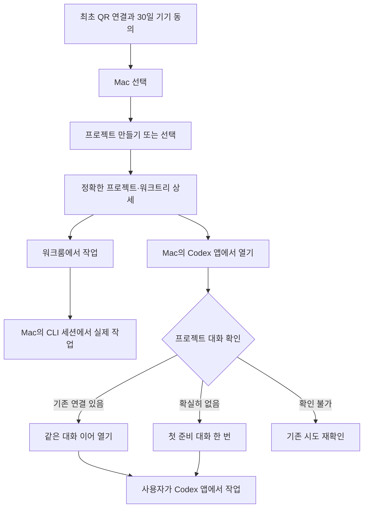

# 원격 프로젝트와 워크룸 통합 개선 계획

작성: 2026-09-10 · 계획 단계 · TypeScript / React / Bun / Rust / macOS

protocol: LOOP-PROTOCOL [a-f] loaded (round budget 1)

성공 기준: 새 프로젝트 생성부터 정확한 프로젝트의 워크룸 작업 또는 Mac Codex 앱 첫 연결까지 하나의 흐름으로 설계한다. **QR 한 번과 최초 동의 후 30일간 평소 사용에서 재연결·탭 이동·앱 재시작을 편하게 수행**하고 **Vercel 포털·원격제어·워크룸의 스타일을 통일**한다. 실행·권한·재접속·실패 결과를 검증 가능한 테스트와 연결한다. 이번 작업에서는 소스 변경, 앱 재시작, 잠금 삭제, 실제 AI 제출, 배포를 수행하지 않는다.

## 권장 방향

프로젝트를 고른 다음 **워크룸에서 작업**하거나 **Mac의 Codex 앱에서 열기** 중 하나를 선택하게 한다. Vercel 웹은 연결된 Mac을 조작하는 화면이며, 프로젝트 파일과 CLI는 선택한 Mac에서 실행된다. Mac 앱·웹·iPhone 앱이 같은 실행 대상·준비 상태·결과 규칙을 사용한다. iPhone 포함은 “네이티브 앱”의 범위를 넓게 해석한 계획 가정이다.

워크룸은 프로젝트 폴더에서 실제 파일 작업을 하는 기존 CLI 실행 경로다. Codex 앱 첫 열기는 그 프로젝트에 연결된 최초 대화만 준비하고, 실제 작업은 사용자가 Mac Codex 앱에서 이어서 하는 흐름이다. 워크룸 세션을 Codex 앱 대화로 변환하거나 자동 이전한다고 설명하지 않는다.

현재 비활성 관리형 작업 체크박스를 켜는 방식으로 해결하지 않는다. 이미 있는 워크룸·Codex 앱 경로를 완성하고, 관리형 파일 쓰기 격리는 별도의 출하 조건을 충족할 때 활성화한다. 코드 근거: `src/agentRuntimeProtocol.ts:5`, `src/aiTerminalProtocol.ts:6`, `src/codexFirstConversation.ts:3`. 설치본과 현재 장애의 상세 관측은 [읽기 전용 조사 근거](audit-evidence.md)에 분리했다.

## 빠른 시작

1. [도메인과 수용 기준](domain-analysis.md)을 정본으로 대상·세션·결과 명칭을 확인한다.
2. [아키텍처](architecture.md)의 기존 모듈 재사용 경계와 결과 계약을 구현 기준으로 삼는다.
3. [TDD 전략](tdd-strategy.md)의 실패 테스트를 작성하고 [구현 체크리스트](implementation-checklist.md)를 순서대로 진행한다.
4. Mac 설치본·Vercel 웹·iPhone 앱의 실제 두 가지 작업 흐름을 완료한 뒤 출하를 판단한다. 단위 테스트 통과와 설치본 동작을 구분한다.

## 아키텍처 선택: 권장안과 대안

**권장안 — 공통 실행 선택 화면과 기존 실행 경로 재사용.** 프로젝트·워크트리의 정확한 대상과 호스트 준비 상태를 확인한 뒤 기존 `AiTerminalService` 또는 `CodexFirstConversationLaunchCoordinator`로 연결한다. 새 프로젝트 결과는 생성된 정확한 대상의 영수증으로 반환하고 그 상세 화면으로 이동한다. 새로운 범용 에이전트 실행 엔진이나 별도 원격 명령 API는 만들지 않는다.

Codex 앱 버튼은 결과에 따라 다음처럼 동작한다.

| 확인된 상태 | 주 버튼 | 결과 기준 |
|---|---|---|
| 정확한 프로젝트 소속의 기존 대화 있음 | Mac의 Codex 앱에서 이어 열기 | 그 대화로 열기를 요청하고 확인 가능한 범위까지 표시 |
| 정확한 조회로 기존 대화 없음이 확인됨 | Mac의 Codex 앱에서 처음 열기 | 기존 고정 준비 메시지를 한 번 제출하고 프로젝트 소속·영구 대화를 검증 |
| 조회 실패·전달 결과 불확실 | 상태 다시 확인 | 새 대화 제출 없이 기존 시도를 확인 |

처음 열기 설명: “프로젝트 연결용 첫 대화만 준비합니다. 실제 작업은 Mac의 Codex 앱에서 이어서 진행하세요.” 기존 고정 메시지는 파일 읽기·수정·명령·도구 실행을 요청하지 않는다(`src/codexFirstConversation.ts:3`). 프로젝트에 들어가는 것만으로 AI를 실행하지 않으며 사용자가 버튼을 눌렀을 때 준비한다.

**대안 — 앱만 열기.** 기존 `/api/open-code-app`의 `mode: new` 딥링크로 앱의 프로젝트 작성 화면만 열 수 있다. AI를 호출하지 않는 보조 기능으로 제공할 수 있지만, 프로젝트의 영구 대화 연결 완료로 표시할 수 없다(`api-server.ts:18179`). 두 동작을 대등한 주 버튼으로 늘리지 않고 추가 메뉴에 둔다.

## 현재 확인한 사실과 미확정 사항

| 구분 | 확인 내용 | 근거와 해석 |
|---|---|---|
| 관리형 작업 제한 | 파일 쓰기 관리형 작업은 false, 지속형 대화는 읽기 전용 허용 | `src/agentRuntimeProtocol.ts:9`, `src/agentRuntimeProtocol.ts:13`; Vercel 인증 오류로 분류하지 않는다 |
| 기존 워크룸 | 프로젝트 대상 확인 후 내부 PTY를 시작하는 코드가 있음 | `src/App.tsx:9868`, `src/aiTerminalService.ts:133`; 설치 GUI 성공을 증명한 것은 아님 |
| 실행 화면 혼재 | 외부 터미널, 내부 AI 터미널, 지속 대화, 공급자 앱 버튼이 별도로 나열됨 | `src/App.tsx:12124`, `src/App.tsx:12173`, `src/App.tsx:12185`, `src/App.tsx:12208` |
| 설치 상태 | 설치 앱·소스 버전 433, 로컬 health schemaVersion 14/ok 응답 | 주 작업의 읽기 전용 실측; 구버전·미기동을 장애 원인으로 단정하지 않는다 |
| 런타임 잠금 장애 | sidecar 로그에 supervisor 잠금 실패가 반복되고 현재 잠금의 소유 프로세스는 종료 상태 | 주 작업 읽기 전용 실측 + `src/agentRuntimeSupervisor.ts:12`, `api-server.ts:7805`; 로그 자체에는 발생 시각이 없어 현 턴의 실패 시각과 연결하지 않는다 |
| 장애 범위 | 관리형 서비스 초기화 실패와 워크룸 서비스는 별도 | `api-server.ts:7703`, `api-server.ts:7727`; unavailable 서비스도 targets를 제공(`api-server.ts:7656`, `src/agentRuntimeHttp.ts:489`)하므로 targets 호출만으로 워크룸 실패를 확정하지 않는다 |
| 첫 Codex 대화 | 동시 클릭 병합, 영구 대화 ID 보존, 재시작 후 대상 검증이 있음 | `src/codexFirstConversationLaunch.ts:74`, `src/codexFirstConversationLaunch.ts:104`, `src/codexFirstConversationLaunch.ts:121` |
| 생성 후 이동 | 생성 브리지에서 상세 결과를 버리고 0페이지 목록으로 반환 | `api-server.ts:11880`, `src/remoteControlCore.ts:1113`, `src/remoteControlCore.ts:1118`; 웹은 새 카드를 찾아 누르라고 안내(`src/remote-control-portal-main.tsx:1866`) |
| LAN 문서 불일치 | 일반 소켓 종료는 페어링 세션을 남기며 재접속 때 터미널 권한은 다시 검증 | `src/remoteControlLanServer.ts:523`, `src/remoteControlLanServer.ts:591`; `docs/runtime-execution.md:31`의 새 QR 요구 설명은 수정 대상 |
| 네이티브 broker | 상태·등록·전용 계정 확인 코드가 있으나 진단 결과가 실행 권한을 부여하지 않음 | `src/macOSRuntimeNativeClient.ts:48`, `src/MacOSRuntimeBrokerSetup.tsx:96`; 현재 설치본의 실행 격리 완료로 해석하지 않는다 |

**아직 재현하지 않은 것:** 사용자가 누른 정확한 네이티브 실행 버튼의 실패 경로, 설치 Codex 앱의 권한·로그인·포커스 상태, 실제 휴대폰에서 생성→실행 전체 흐름. 구현 시작 시 이 세 항목을 선택된 버튼과 대상에 묶어 재현하고, 오류를 장기 표시하는 진단 카드로 수집한다. 단순 toast나 “실행 실패”로 끝내지 않는다.

## 사용자 흐름

### Mac 앱

프로젝트 목록 → 프로젝트 상세 → 주 행동 두 개를 제공한다.

- **워크룸에서 작업:** 정확한 프로젝트/워크트리·AI를 확인하고 기존 실행 세션이 있으면 이어간다. 새 세션은 사용자가 선택한다. 준비 실패 시 같은 화면에서 설치·로그인·접근 상태를 확인하고 재시도한다.
- **Mac의 Codex 앱에서 열기:** 기존 정확한 대화를 이어 열거나, 처음이면 고정 준비 대화 한 번으로 해당 프로젝트에 연결한다. 연결이 확인된 뒤 사용자가 Codex 앱에서 계속 작업한다.

“Mac에서 폴더 열기”는 Finder를 여는 보조 버튼으로 둔다. 프로젝트 폴더와 워크룸은 같은 작업 대상의 파일 위치와 실행 화면이다. 외부 터미널·새 창·다른 AI 앱은 추가 실행 메뉴에 모으고, 기존 기능을 주 흐름의 경쟁 버튼으로 중복 표시하지 않는다.

### Vercel 웹

연결된 Mac 선택 → 연결/준비 상태 → **프로젝트 / 워크룸** 탭을 사용한다. 프로젝트를 만들 때 선택 Mac과 작업 루트 이름을 보여 주고, 완료 후 정확히 생성된 프로젝트 상세로 이동해 위 두 행동을 제공한다. 폴더 경로나 실제 등록 ID를 원격 DTO로 노출하지 않는다.

Mac이 오프라인이거나 응답하지 않으면 실행 요청을 쌓지 않고 상태를 표시한다. 절전은 연결이 끊긴 원인의 하나로 안내할 수 있지만 관측 없이 확정하지 않는다. 이미 보낸 요청이 불확실하면 새 요청을 만들기 전에 같은 요청의 결과를 확인한다. 다른 Mac으로 전환한 뒤 도착한 이전 Mac 응답은 현재 화면을 바꾸지 않는다.

### iPhone 네이티브 범위

“네이티브 앱”에는 iPhone도 포함한다는 가정으로 개선 범위에 넣는다. 최종 목표는 iPhone 앱 안에서 같은 Mac의 **프로젝트 / 워크룸** 두 탭을 새 QR 없이 오가는 것이다. Mac·Vercel을 먼저 검증하는 것은 출하 순서이며 iPhone 기능을 완료한 것으로 세지 않는다.

현재 SwiftUI 목록과 WKWebView 워크룸의 연결 소유권을 먼저 한 곳으로 모은다. 구체적인 최소 구현은 [아키텍처](architecture.md)의 연결 소유·인증 어댑터 설계를 따른다. 토큰을 URL/query/임의 스크립트로 전달하지 않으며, 같은 세션의 화면 전환과 새로운 단말 승인을 구분한다. 인터넷도 최종적으로 네이티브 앱 안에서 작업하게 하고 로그인 복귀·E2EE 세션 복원·앱 백그라운드 복귀를 실제 iPhone에서 검증한다. 기존 Safari 연결은 중간 호환 경로이며 네이티브 통합 완료 조건을 대체하지 않는다.

최초 Mac 승인에 **이 기기에서 워크룸 작업 허용**을 별도 opt-in으로 제공한다. 유효한 동일 단말이 다시 연결될 때마다 Mac으로 돌아가 재허용하지 않아도 되도록, 허용 대상을 포함한 단말 권한과 현재 소켓의 실행 권한을 분리한다. 기존의 세션 한정 허용을 자동으로 영구 전환하지 않는다.

### QR 한 번으로 30일 사용

최초 QR 연결과 필요한 별도 동의를 마친 같은 기기는 30일 동안 화면 잠금, 앱 백그라운드, 탭 이동, 웹 새로고침, 앱·sidecar·Mac 재시작에도 다시 QR을 찍거나 승인받지 않고 연결을 복원한다. 호스트 주소가 바뀌면 저장한 호스트 신원에 대한 검증을 거쳐 주소만 갱신한다. 같은 이름이나 IP 응답만으로 다른 Mac을 신뢰하지 않는다. 실제 잠금 해제·네트워크 접속·OAuth 로그인 갱신과 QR 재페어링은 구분한다.

Google/Supabase access token의 수명은 QR 연결과 별도다. 기존 인증 클라이언트의 갱신을 재사용하고, 네트워크/조회 실패로 인증 정보를 지우거나 QR을 다시 요구하지 않는다. 필요한 경우 같은 계정으로 다시 로그인한 뒤 기존 controller·암호화 연결을 복원한다. 다른 계정이나 실제 권한 철회는 허용하지 않는다.

| 구분 | 기간의 기준 | 다시 해야 하는 것 |
|---|---|---|
| 미사용 QR | 발급 후 30일, 한 번만 사용 | 미사용 만료 또는 회전 시 새 QR |
| 승인된 원격 연결 | 성공 pairing/SAS 승인 시점부터 절대 30일 | 실제 만료·해제·의도적 로컬 인증 저장 삭제·새 단말에서 새 연결 |
| 워크룸 기기 권한 | 별도 최초 opt-in, 위 승인 연결의 남은 기간 이하 | 동의 만료·해제·범위 밖 요청만 새 동의; 연결로 유효기간이 자동 연장되지 않음 |
| 실행 중인 CLI | 실제 Mac 프로세스 수명 | 화면 복귀는 기존 세션 재선택, sidecar 종료 후에는 상태를 확인하고 재개 여부 선택 |

권한 범위는 Mac에서 처음 허용할 때 **선택한 프로젝트** 또는 **선택한 작업 루트에서 이 기기가 만든 프로젝트 포함** 중 고르게 한다. 원격에서 프로젝트를 만들고 곧바로 작업하려는 목적에는 후자를 권장한다. 생성 요청의 소유 기기와 작업 루트의 안정된 신원·생성 결과·현재 등록 대상이 일치할 때만 포함한다. 다른 기기나 다른 루트에서 생긴 프로젝트로 자동 확대하지 않는다.

## 구현 우선순위와 완료 기준

| 단계 | 변경 결과 | 이 단계의 완료 기준 |
|---|---|---|
| P0 실행 원인과 준비 상태 | 표면별 준비 상태, 지속 오류·재시도 UI, supervisor 복구 필요 분리 | 관리형 복구 필요 상태에서도 허용된 프로젝트/워크룸/Codex 앱 기능의 독립성을 fixture로 확인. 실제 실패 경로를 재현해 수정 대상을 확정. 재현 불가면 해당 실행 장애는 미해결로 남기며 P6 완료로 세지 않음 |
| P1 생성 결과와 재시도 | 생성 요청 ID·정확한 대상·단계별 결과 반환, 생성 후 상세 이동 | 중복 클릭·응답 손실·재접속에도 프로젝트 한 개. 생성된 프로젝트가 첫 목록 페이지에 없어도 바로 선택 |
| P2 공통 화면과 디자인 기반 | 주 행동 두 개, 공통 토큰·컴포넌트·테마 설정 | main/worktree 동일명 오선택 없음. 내부 실행 세션을 확정하고 해당 워크룸으로 이동. 포털/원격/워크룸이 같은 테마·폰트·상태 규칙 사용 |
| P3 Codex 앱 첫 연결 | 기존 첫 대화 coordinator·fence를 Mac/원격 공통으로 사용 | 첫 연결 한 번, 정확한 기존 대화 재열기, 잘못된 포커스에 제출 안 함, 결과 불확실 시 자동 재제출 안 함 |
| P4 원격 동의와 Vercel 흐름 | 30일 기기 동의, 생성 결과·워크룸 이동, 웹 스타일 통일 | 같은 기기에서 29일 경과·잠금/복귀·재시작 후 재QR/재승인 없이 사용하고 30일 만료는 적용. 허용 루트에서 생성→워크룸 또는 Codex 첫 열기를 실제 확인. 포털/원격/워크룸 모든 화면의 light/dark 스타일과 행동 일치 |
| P5 iPhone 네이티브 흐름 | 프로젝트/워크룸 2탭, 하나의 연결 소유권, 인터넷 로그인 복귀 | 탭 이동에 새 QR 없음. LAN·인터넷 모두 앱 안에서 생성→두 실행 선택을 수행하고 잠금/복귀·권한 해제를 실기기로 확인 |
| P6 설치·문서·출하 검증 | 지원 버전 협상, 최신 LAN 문서, 실제 설치본 검증 기록 | 사용자가 누른 실제 실행 경로에서 정확한 target·CLI 입력/출력 또는 Codex 프로젝트 연결을 설치본으로 확인. 필수 검증과 Mac/웹/iPhone 시나리오 통과. 재현 불가 장애·미검증 표면은 완료 표시하지 않음 |

워크룸 화면 재접속은 살아 있는 PTY를 이어 보여 주는 것이다. sidecar·앱 프로세스 종료 뒤 같은 PTY가 살아난다고 약속하지 않는다. 종료/유실 상태를 표시하고 가능한 경우 CLI 자체의 대화 재개를 사용자가 선택하게 한다(`docs/runtime-execution.md:10`, `src/aiTerminalService.ts:108`).

## 필수 계약

- 실행 직전에 host·connection·등록 대상·실제 main/worktree를 다시 검증한다. 브랜치 표시명이나 마지막 선택만으로 실행하지 않는다.
- “요청 전달”, “프로젝트/대화 생성 확인”, “앱에서 열림 확인”, “결과 확인 필요”를 구분한다. OS open 성공을 실제 포커스·정확한 대화 열림으로 승격하지 않는다.
- 프로젝트 생성의 기존 Git·장기기억 기본 준비는 유지한다. 폴더+등록 완료를 기준점으로 삼고, 초기 커밋·장기기억·백업·방문 기록은 단계별 결과를 기록한다. 부가 기능 실패로 생성된 프로젝트를 이동하거나 숨기지 않는다. 미완료 초기 커밋은 worktree 생성의 기존 Git 조건에서 설명한다. 관련 경계: `api-server.ts:2307`, `api-server.ts:2318`, `api-server.ts:2341`.
- 터미널 원문 전송·입력 동의는 QR 기본 제어·관리형 작업·지속 대화와 별도다. 신규 단말 opt-in은 안정된 pairing/controller identity + host + 허용 대상 + 만료 + 해지 revision에 결속한다. 현재 연결 epoch는 모든 요청과 대기 뒤 다시 검증한다. 유효한 동일 단말 복귀는 허용을 복원하지만 새 pairing/다른 Mac/만료/해지에는 새 동의가 필요하다. 기존 세션 한정 허용은 명시적 전환 없이 재사용하지 않는다. 기존 경계: `src/aiTerminalRemoteGateway.ts:7`, `src/aiTerminalService.ts:118`.
- supervisor 잠금은 소유 프로세스 종료만으로 삭제하지 않는다. OS boot/session epoch 교체와 원래 잠금의 정확한 결속처럼 이전 실행 세대가 존재할 수 없다는 검증 가능한 증거를 설계한다. legacy 잠금에 그 증거가 없으면 수동 확인 또는 복구 필요 상태를 유지한다. 자동 unlink나 단순 재시작을 복구 절차로 삼지 않는다(`src/agentRuntimeSupervisor.ts:12`).
- 현재 세션 수·출력 버퍼·입력 대기열·relay 본문 제한을 유지한다. 새로운 결과 기록은 상한과 보존 규칙을 정의하며, 미완료 작업과 불확실 제출을 삭제해 예산을 맞추지 않는다(`src/aiTerminalService.ts:97`, `src/aiTerminalProtocol.ts:65`).
- 웹/호스트 버전 불일치는 capability에 따라 지원 기능만 표시한다. 미지원 호스트에 새 필드를 추측해서 전송하지 않는다.

## 디자인 시스템 영향도

Vercel 스타일 혼재의 근거가 확인됐다. 포털은 `src/index.css:10`의 warm/copper 계열과 Manrope를 쓰지만 원격 화면은 `src/remote-control-portal.css:1`의 어두운 navy/mint·Inter를 강제한다. 워크룸은 `src/AiTerminalPanel.css:1`의 warm fallback을 사용해 같은 원격 페이지 안에서도 두 체계가 섞인다. 포털의 `src/portal-main.tsx:1674` 하드코딩 테마도 정리 대상이다.

기존 index.css의 토큰·폰트 정의를 작은 공통 스타일시트로 추출하고 포털·원격·Mac이 함께 사용한다. `src/appAppearance.ts`의 테마 설정을 재사용하며 전체 index.css를 중복 import해 reset이 충돌하게 만들지 않는다. 헤더·내비게이션·카드·버튼·입력·대화상자·상태·빈 화면·오류를 공통 컴포넌트와 크기 규칙으로 맞춘다. 색뿐 아니라 아이콘·텍스트로 상태를 전달한다. xterm/ANSI는 가독성을 위한 기존 어두운 터미널 표면을 유지하는 명시적 예외다.

모바일은 주 행동을 세로 배치하고 44px 이상 터치 영역을 준다. 데스크톱은 같은 순서로 나란히 배치한다. 320–430px 모바일, 1024/1440px 데스크톱, 125% 확대, light/dark에서 로그인·승인·프로젝트·원격·워크룸을 모두 검증한다. computed style과 실제 클릭·키보드·대비를 함께 확인하며 문자열 스냅샷만으로 통일을 판정하지 않는다. 오류와 화면 전환에서도 입력한 프로젝트명·작업 요청을 보존한다.

준비된 같은 Mac의 프로젝트를 바꿀 때 전체 화면 재로딩이나 추가 로그인을 요구하지 않는다. 한글 입력·Enter·포커스·사용자의 터미널 스크롤 선택을 보존하며, 모바일 키보드가 전송 버튼을 가리지 않게 한다. 로컬 진행 표시 100ms 이내를 목표로 두고 실제 입출력 지연은 건강한 연결에서 측정한다. 기존 전송 간격·버퍼 상한을 임의로 높여 속도를 맞추지 않는다.

## 검증 기록과 한계

계획 품질 검사: 전문 역할 **4/4(100%)**, 필수 문서 **5/5**, TDD와 구현 체크리스트의 테스트명 **28/28 완전 일치**, 추가/누락/중복 **0개**, 도메인과 아키텍처의 저장소 인터페이스 **2/2 일치**. 문서 완성 기준을 충족했으며 구현·설치본 동작 완료를 뜻하지 않는다. 고위험 가설 4개를 반박 검토해 생성 결과 누락과 OS 열기/실제 화면 확인 차이는 확인했고, supervisor 때문에 targets가 반드시 실패한다는 가설과 일반 lastVisit IO 실패가 폴더 이동으로 전파된다는 가설은 기각했다.

계획 작성 중 주 작업에서 기존 fixture 5개 파일을 실행했다: `agent-runtime-readiness.test.ts`, `codex-first-conversation-launch.test.ts`, `codex-first-conversation-pending-store.test.ts`, `codex-desktop-submission-fence.test.ts`, `remote-control-external-launch-route.test.ts`. 결과는 **23 pass / 0 fail / 94 expects**. 이것은 준비 상태·첫 대화 중복 방지·복구·경로 매핑 부품 검증이다. 설치 GUI나 실제 휴대폰의 종단간 성공 증거가 아니다.

Swift 코어 기준선도 `swift test --package-path mobile/ios/AgentsToZCore`에서 XCTest **1개(내부 9개 회귀 그룹) / 0 fail**을 확인했다. 이것은 macOS에서의 Swift 계약 검증이며 실제 iPhone UI·카메라·로그인·LAN 동작 증거가 아니다. 전체 기록은 [조사 근거](audit-evidence.md)를 따른다.

구현 이후 `bun run verify`를 필수로 실행하고, 영향 범위에 맞는 `bun run test:resources`, `bun run test:ios`, 웹/모바일 smoke, 설치 Mac·iPhone 실측을 추가한다. 현재 계획 문서 작성만으로 전체 소스 verify를 수행했다고 표시하지 않는다.

## 별도 출하 조건과 후속 범위

관리형 파일 쓰기의 자동 시작·상태·취소는 broker 등록만으로 출하하지 않는다. Developer ID 설치본, 전용 실행 주체, 실제 하위 프로세스 격리·종료 증거와 별도 수용 기준이 필요하다. 현재 source가 진단 결과에 `executionAuthorized: false`를 유지하므로 본 계획의 편의 개선 완료와 분리해 추적한다(`src/macOSRuntimeNativeClient.ts:52`). 재검토 조건은 설치본에서 격리 canary와 준비 계약을 모두 통과하는 것이다.

웹에서 임의 Mac 파일 탐색, 원격 shell/path/env 입력, 기존 워크룸 세션의 Codex 앱 자동 이전, 자동 Git Push·배포, 무인 권한 확대는 이번 목적에 포함하지 않는다.
