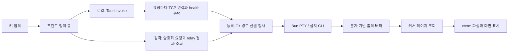

# AI 워크룸 속도·안정성 개선 계획

작성: 2026-09-23 KST · 기준 소스: `e764bddaaf7ab95a39a2400c3b58b8a88bf31cb6` / v492

상태: **조사·기초 측정·계획 작성 완료. 제품 개선 구현과 설치·배포는 아직 수행하지 않음.**

워크룸이 같은 CLI를 Mac Terminal·Orca에서 실행할 때와 동등한 입력·출력 반응을 내고, 화면 복귀와 연결 복원에서는 더 편리하고 안정적으로 작동하도록 한다. Codex 앱과의 비교는 공통 사용자 작업을 별도로 측정한다. 같은 모델이라도 제공자 응답 시간과 앱 기능이 달라질 수 있으므로 터미널 속도와 AI 추론 속도를 합쳐 개선율을 계산하지 않는다.

추가 요구사항: **워크룸 실행 옵션 버튼과 기본 ON인 ‘권한 우회(Bypass)’ 선택**을 제공한다. [실행 옵션 명세](LAUNCH-OPTIONS.md)를 첫 기능 전달 단위 P0-UI로 추가한다. 기본 ON/OFF UI와 네 CLI 인자 연결을 구현했다. 모바일·접수 VOC 수정과 확인 범위는 [실행 기록](EXECUTION.md)을 따른다.

추천 순서는 **실행 옵션 연결·측정 → 입력·출력 경로 개선 → 로컬 스트리밍 → 원격 스트리밍 → 세션 호스트 분리 → 장시간 검증**이다. Bun PTY는 이미 사용하고 있다. 이번 기초 실험에서 일반 PTY 왕복은 빠르게 동작했으므로, 먼저 전송 대기와 주변 작업을 개선한다.

## 1. 이번 조사에서 확인한 범위

| 항목 | 결과 |
|---|---|
| GitHub pull | `git pull --ff-only origin main`: 이미 최신. HEAD 변경 없음 |
| 기존 작업 보존 | 기존 미추적 `../runtime-and-decades-memory-2026-09-23/` 보존 |
| 이전 지연 개선 작업 | `codex/workroom-interaction-latency`는 v488 `89a4c99`, 현재 main의 조상. 미병합 커밋·미커밋 변경 없음. 다시 merge할 작업 없음 |
| 프로젝트 기억 | canonical root의 Supabase Pull 성공, 기존 워크룸 교훈 검토 |
| 실행 환경 | macOS 26.7 arm64, Bun 1.4.2 |
| 설치/소스 구분 | 설치 앱 Info.plist는 v488.0.0, 소스는 v492. 이번 소스 시험을 설치 앱 성능으로 취급하지 않음 |
| Context7 | xterm.js, Bun, Tauri 공식 문서 조회. 주요 내용은 공식 웹 문서와 대조 |
| 기본 검증 | quick run `20260923T132506Z-c865fbb6` 통과: maintainer-self 8.205초, essential-contracts 119 pass / 0 fail, 29.102초. 소스 불변 확인 |
| 집중 검증 | 실제 임시 PTY·스케줄러·원격 권한·출력·자원 수명 등 6파일, **47 pass / 0 fail**, 21.29초 |
| 신규 기초 측정 | 임시 shell PTY 왕복, 등록 경로 검사, 출력 페이지/조회 간격 실험. [수치](baseline.json), [재현 코드](probe.ts) |
| 미측정 | 설치 Mac UI, 실제 Codex/Claude/Hermes/agy 모델 응답, Codex 앱/Orca/Terminal 화면 비교, LAN/인터넷 지연, 실기기 iPhone, 72시간 내구성 |

기존 [런타임·장기기억 계획](../runtime-and-decades-memory-2026-09-23/PLAN.md)은 별개 문서다. 그 문서의 과거 측정이나 장기 무손실 판정을 이번 워크룸 검증 결과로 가져오지 않는다.

## 2. 현재 구조와 병목 근거



아래의 ‘코드 확인’은 실제 구현에서 관찰한 구조다. ‘실측’과 구분하며 각 항목을 곧바로 사용자 장애의 단일 원인으로 단정하지 않는다.

| 우선순위 | 확인한 사실과 영향 | 근거 |
|---|---|---|
| P0 | 입력 후 wake/로컬 1.5초 반응 구간은 이미 있다. 이후 빈 조회에서 로컬 최대 2초, 원격 최대 5초로 backoff한다. 늦게 생성되는 출력은 다음 조회까지 대기할 수 있다 | `src/aiTerminalScheduling.ts:18`, `src/AiTerminalPanel.tsx:129` |
| P0 | 원격 requester는 시작 간격 최소 140ms, 일반 요청은 직전 응답까지 기다린다. 입력·목록·출력이 통신 슬롯을 공유한다 | `src/aiTerminalScheduling.ts:12`, `:64` |
| P0 | 인터넷은 추가로 호스트 활성 조회 1초, 일반 결과 조회 1초. 지정된 제어 키/첫 read만 초기 250ms 조회 특례가 있다 | `src/remoteControlInternetAgent.ts:89`, `src/remoteControlRelayController.ts:1166`, `:1620` |
| P0 | 프런트 close는 큐를 우회하지만 인터넷 controller의 `#terminalAdmission`은 앞 요청의 전체 응답 완료를 기다린다. 앞 요청이 미확정일 때 close도 지연될 가능성. 종단 간 재현 필요 | `src/aiTerminalScheduling.ts:84`, `src/remoteControlRelayController.ts:1141` |
| P0 | 같은 터미널 출력 응답 상한이 로컬·원격 모두 최대 4 × 1,024 UTF-16 문자. packed chunk JSON 합계 8,500 bytes 검사도 있다. 여러 바이트 문자/제어 문자열에서는 더 작아질 수 있다 | `src/aiTerminalOutput.ts:4`, `src/aiTerminalProtocol.ts:73` |
| P1 | 설치 앱은 각 요청에서 TCP 연결 → 같은 peer health 검증 → 실제 요청을 수행한다. `spawn_blocking`은 이미 적용되어 있다. 연결 재사용/스트리밍으로 줄일 수 있는 고정 비용 후보 | `src/aiTerminalClient.ts:9`, `src-tauri/src/lib.rs:497`, `:1373` |
| P1 | 재사용 가능한 checkout proof가 있지만, 입력·resize마다 등록 목록 전체의 realpath/stat와 선택 checkout의 Git 신원을 다시 검사한다. 큰 등록 목록·느린 파일시스템에서 입력 비용 및 sidecar 메인 루프 정체 가능 | `api-server.ts:7774`, `:7815`, `src/aiTerminalService.ts:29`, `:235` |
| P1 | 본문+마지막 CR을 받은 경우 Codex 150ms / 나머지 CLI 40ms 후 Enter를 쓴다. 일반 단일 Enter에는 이 지연이 없다. 과거 실제 CLI의 paste swallowing 대응이므로 무조건 제거 금지 | `src/aiTerminalService.ts:111`, 관련 프로젝트 기억 |
| P1 | 출력 저장은 문자 수 100만 상한, callback마다 작은 chunk 생성, 앞부분 `shift()`, read는 배열 처음부터 seq 탐색. 작은 callback이 많으면 객체 수/스캔 비용이 커진다 | `src/aiTerminalService.ts:246`, `src/aiTerminalOutput.ts:8` |
| P1 | 세션 선택/visible 변경 시 xterm dispose·재생성, cursor=0으로 재조회한다. 짧은 CSS 숨김 복원 시험과 React 세션 전환은 다른 경로다. 오래된 출력·ANSI 중간 절단에서는 전체 화면 복구가 어렵다 | `src/AiTerminalPanel.tsx:102–145`, `tests/workroom-rendering.e2e.mjs:109` |
| P1 | 출력마다 세션 summary를 새 객체로 반영하고 ResizeObserver에서 fit/resize를 수행한다. 실제 React commit/프레임 비용은 아직 측정하지 않음 | `src/AiTerminalPanel.tsx:117`, `:139` |
| P1 | 실행 세션은 AiTerminalService 메모리에 있고 shutdown은 CLI를 종료한다. 화면 전환에는 살아 있지만 앱/sidecar 재시작 생존을 보장하지 않는다 | `src/aiTerminalService.ts:129`, `:282`, `docs/runtime-execution.md:31` |
| P2 | 요청 이력 100,000개, pending 256개는 의도한 보호 장치다. 장시간 세션에서는 입력 이력이 차면 새 입력을 거부한다. 종료로 공간을 회수하는 기존 시험은 있음 | `src/aiTerminalService.ts:103`, `tests/terminal-resource-lifecycle.test.ts` |

이미 있는 입력 중복 방지, 4:1 읽기 공정 배분, 종료 우선 처리, packed output, UTF-8 streaming decoder, `write` callback 후 커서 전진, EOF 대기, 자동 저장 큐를 신규 개선으로 다시 계산하지 않는다.

### 기초 측정 결과

동일한 임시 shell echo 프로그램을 실제 Bun PTY로 실행했다. 1회 warmup 후 각 30회, 실행 순서를 교대했다. 양쪽 모두 1ms 조회를 사용한다. 서비스의 대상 해석은 단순 임시 폴더로 대체했으므로 **제품 UI·등록 검증·Tauri·모델 지연은 포함하지 않는다**.

| 경로 | p50 | p95 | 해석 |
|---|---:|---:|---|
| 직접 Bun PTY | 1.147ms | 1.416ms | OS PTY 왕복의 작은 기초 사례 |
| AiTerminalService, 본문/Enter 별도 요청 | 1.387ms | 1.905ms | 서비스의 기본 입력 중계 자체는 이 조건에서 빠름 |
| AiTerminalService, Codex 본문+Enter 한 요청 | 152.354ms | 154.252ms | 호환성 대기 150ms가 관찰됨. 실제 Codex에서 제거 가능하다는 증거는 아님 |

등록 경로 검사 함수만 20회 측정했을 때, 온전한 로컬 디렉터리 1/100/1,000개에서 p50은 **0.012/1.063/11.405ms**, p95는 **0.018/1.377/12.068ms**였다. 실제 전체 target resolver·클라우드 파일·인증 비용은 제외했다. 따라서 디렉터리 1,000개를 모두 즉시 검사하는 현재 설계는 16.7ms 프레임 예산에 비해 작은 비용이 아니다.

1/10/100천 개의 1문자 callback chunk를 보존한 tail 조회는 p50 **0.011/0.037/0.244ms**였다. 선형 탐색은 확인했지만 이 수치만으로 최우선 병목이라고 주장하지 않는다. 더 큰 객체 수·할당·GC·`shift()` 비용은 P0에서 측정한다.

현재 함수로 ASCII 100만 문자를 재생하면 **245페이지**가 필요하다. 원격 최소 요청 간격만 적용해도 첫 요청 시작부터 마지막 요청 시작까지 **34.16초 이상**이다. 이는 **계산값**이며 실측 전송 시간이 아니다. RTT, 다른 요청, relay 주기, 암호화와 화면 표시는 제외했다. 로컬에는 이 140ms 제한이 없으므로 같은 수치를 적용하지 않는다.

## 3. ‘동등 이상’의 합격 기준

다음 수치는 **개발 목표**이며 현재 달성값이 아니다. P0 측정으로 기준 하드웨어·화면 주사율·측정 오차를 고정하고, 이후 임의로 완화하지 않는다. p50/p95/p99, 최대값, 실패 수를 함께 보관한다.

| 항목 | 로컬 1차 합격 목표 |
|---|---|
| 일반 키 → 실제 echo 화면 | p95 ≤ 30ms, p99 ≤ 60ms. 같은 CLI의 가장 빠른 비교 표면보다 p95 추가 지연 ≤ 화면 1프레임 |
| PTY output 수신 → 화면 표시 | p95 ≤ 32ms, p99 ≤ 80ms. 유휴 30초 뒤 첫 출력도 동일 기준 |
| start → 인터랙티브 CLI 준비 | 같은 CLI/설정의 비교 표면 대비 p95 ≤ 1.10배 + 100ms. 최초 설치·로그인 제외, cold/warm 분리 |
| 대량 출력 | 동일 바이트/ANSI fixture 처리량 ≥ 가장 빠른 비교 터미널의 95%, checksum 일치. 1MiB/s 60초 출력 중 입력 p95 ≤ 50ms와 bounded memory도 동시에 만족 |
| 화면·세션 전환 | 캐시된 세션 p95 ≤ 100ms, cold snapshot 복원 p95 ≤ 300ms. 같은 세션·커서·화면 모드 유지 |
| 중단/종료 | 로컬 Ctrl-C 전달 p95 ≤ 50ms. 명시 close는 정상 CLI p95 ≤ 1초; 강제 종료 상한과 종료 미확정 상태를 구분 |
| 장시간 안정성 | 1/4/12 세션, 72시간 soak에서 앱 원인 crash/hang 0, 입력 중복/순서 역전 0, 출력 무통지 누락 0 |
| 자원 | CLI 자원은 별도 집계. idle 1세션 앱 추가 CPU ≤ 1% of one core 목표. 출력 큐/화면 캐시 한도 명시, 종료 100회 뒤 FD·타이머·리스너가 기준선으로 복귀, 안정화 후 RSS 증가 추세 ≤ 1MiB/시간 목표 |
| 재연결 | 화면/네트워크 단절만으로 CLI를 중단하지 않음. 연결 가능한 상태로 돌아온 뒤 LAN p95 ≤ 1초, 인터넷 p95 ≤ 3초 재attach 목표 |

원격은 물리적 네트워크 지연을 포함한다. LAN은 echo p95 ≤ 80ms, 인터넷은 RTT ≤ 100ms인 통제 환경에서 p95 ≤ 250ms를 1차 목표로 한다. RTT를 넘는 앱 추가 지연도 별도 기록한다. 인터넷을 로컬 Terminal보다 항상 빠르게 만든다고 약속하지 않는다.

‘더 낫다’는 판정은 동등한 정확도·부하에서 적어도 하나의 지표를 20% 이상 개선하고, 나머지 필수 지표를 악화시키지 않았을 때 사용한다. 예: 창 재열기/네트워크 복귀 후 같은 세션으로 돌아오는 시간. 무중단 72시간 통과는 장기 신뢰성의 표본이며 영구 무장애 보장은 아니다.

### 비교 실험 설계

1. **터미널 비교**: 같은 Mac·CLI 바이너리와 버전·cwd snapshot·환경/플러그인·폰트/격자·scrollback·전원 상태로 Mac Terminal, Orca 터미널, 워크룸을 순서를 섞어 실행한다. 초기화/steady state는 각각 최소 30회, 키 입력은 1,000회 이상, 지연 분포는 3회 독립 실행한다.
2. **Codex 구분**: Codex CLI는 위 동일 바이너리 시험에 포함한다. Codex 데스크톱 앱은 일반 요청 작성·첫 답변 표시·스크롤·중단·대화 복귀의 공통 사용자 작업으로 비교한다. 앱 내부 처리량이나 독점 프로토콜을 추정하지 않는다.
3. **모델 비교**: 동일 제공자·정확한 모델/effort·계정·프롬프트·도구·승인 설정·컨텍스트 길이를 기록한다. 가능한 범위에서 교차 순서로 최소 20쌍 실행한다. TTFT, 전체 완료, tool 시간, rate-limit/네트워크 오류를 나누며 품질 저하나 권한 확대를 속도 향상으로 계산하지 않는다.
4. **결정적 fixture**: 실제 PTY의 raw echo, split UTF-8 한글/emoji, IME 조합, bracketed paste, 방향키·Esc·Ctrl-C, interactive 승인, resize, normal/alternate screen, synchronized output, cursor query 응답, 1/10MiB burst, slow consumer를 검사한다.
5. **계측**: `inputCaptured → queued → transportSent → authorized → ptyWritten → ptyOutput → clientReceived → parserApplied → painted` 시점을 결속한다. `xterm.write` callback은 **파싱 완료**이지 paint 완료가 아니다. render/프레임 관찰을 추가하며 숨은 WKWebView는 별도 상태로 분류한다. 서로 다른 프로세스/기기의 monotonic clock을 직접 빼지 않고 clock 보정 또는 동기화가 필요 없는 각 구간 시간·RTT를 사용한다.
6. **저장 형식**: source SHA/설치 버전, 하드웨어, Bun/xterm/CLI 버전, fixture digest, 크기/개수·지연·오류 코드·trace ID만 남긴다. 프롬프트·출력 원문·경로·토큰은 성능 로그에 넣지 않는다.

## 4. 단계별 구현 계획

### P0-UI — 워크룸 실행 옵션과 기본 Bypass ON (0.5–1.5 개발일)

- `새 터미널` 옆에 **실행 옵션 · Bypass ON** 버튼을 배치하고, 펼친 옵션의 **권한 우회(Bypass)**를 기본 선택한다. 사용자는 OFF로 바꿀 수 있다.
- 앱 실행 옵션에서 `internal`일 때 bypass 버튼을 숨기는 조건을 제거하고, 워크룸 내부와 같은 선택값을 사용하도록 연결한다. 현재 `terminalOptionDefaults('internal')`의 bypass 기본값은 false이므로 true로 변경한다. `bgMode`·`tmuxMode`는 기존 false를 유지한다.
- 기본 ON은 현재 사용자 요청에 따른 기능 요구사항이다. 기존 로컬 앱과 같이 선택은 현재 앱 세션에서 유지하고, 화면 전환으로 사용자의 OFF 선택을 덮어쓰지 않는다. 다음 앱 세션은 기본 ON으로 시작한다.
- start 요청에 명시적 선택값을 전달하고 CLI별 확인된 인자로 변환한다. 기본값만 바꾸거나 버튼만 추가해 끝내지 않는다. 상세 경로·구버전 호환·4종 CLI 인자·회귀 기준은 [실행 옵션 명세](LAUNCH-OPTIONS.md)를 따른다.
- 이 기능이 줄이는 승인 대기와 PTY/전송 성능 개선을 따로 집계한다. 비교 표면들도 같은 권한 설정을 사용한다.

### P0 — 비교 기준과 종단 간 병목 고정 (1–2 개발일)

- 기존 `tests/workroom-input-lifecycle.e2e.mjs`, `workroom-rendering.e2e.mjs`, `tests/fixtures/terminalRelayHarness.ts`를 확장한다. 이번 `probe.ts`는 원인 탐색용이며 제품 성능 게이트를 대신하지 않는다.
- `AiTerminalPanel`, requester, Tauri bridge, target proof, PTY와 relay 각 구간에 opt-in bounded 계측을 넣는다. raw 본문 수집 없음. 1/4/12 세션 및 1/100/1,000 등록 규모로 측정한다.
- 입력 중 autosave/프로젝트 탐색/저속 Git·클라우드 파일 접근이 겹치는 경우, sidecar event-loop lag와 Tauri 요청 시간을 확인한다.
- 인터넷 full controller에서 입력 응답을 잃게 한 뒤 close를 보내 실제 전송 순서와 대기 시간을 측정한다. requester 단위 모형만 통과해서 완료 처리하지 않는다.
- 완료 산출물: `BENCHMARK.md`, 버전 결속 JSON, 설치본/소스별 측정, 재현 절차. 현재보다 빠르다는 주장은 아직 하지 않는다.

### P1 — 입력 경로와 출력 저장 비용 감소 (3–5 개발일)

- **입력**: 키·붙여넣기·제출을 구분하는 내부 입력 adapter를 설계한다. 일반 키는 0–8ms batch, paste는 byte 예산으로 묶고 CLI별 제출 완료를 검사한다. 150/40ms 대기는 실제 4종 CLI 버전별 회귀가 통과한 경로에서만 줄인다. 지연 Enter 중 close/revoke/세션 변경을 다시 검사해 늦은 write를 막는다. 부분 write/`drain` 의미를 정확한 Bun 버전에서 검증하고, 수락되지 않은 바이트만 처리한다.
- **신원 검사**: 전체 등록 경로 검사와 동기 파일 읽기를 sidecar 입력 이벤트 루프에서 분리하는 bounded worker를 우선 검토한다. 선택 cwd/dev/inode/Git binding, 삭제 fence, 권한 revision의 실행 직전 확인은 유지한다. 임의 TTL cache나 watcher만으로 검증을 대신하지 않는다. O(N) 검사를 제거하려면 타 등록 경로의 symlink 변경·새 alias까지 검출한다는 증명이 필요하며, 증명 전에는 비동기화·범위 제한만 적용한다.
- **출력 저장**: 배열 `shift` 대신 seq로 접근 가능한 block ring/deque, byte·block 수 이중 한도, 작은 callback 병합을 도입한다. 최근 tail 조회가 전체 이력 길이에 비례하지 않게 한다. v1 API는 기존 4chunk 계약을 유지하는 adapter로 남긴다.
- **프런트**: 출력 데이터는 React state 밖의 세션별 store에 유지하고 summary가 실제 바뀔 때만 반영한다. resize는 animation frame당 한 번, 같은 크기는 무시하고 마지막 크기로 합친다. session/transport 교체 시 queued 입력 취소와 listener 수명을 명시한다.
- **종료**: 출력·status backlog가 close를 가로막지 않도록 각 계층을 시험한다. 인터넷 단일 cursor 소유 규칙 때문에 즉시 해결되지 않는 부분은 P3의 protocol 변경으로 넘기며 로컬 개선을 원격 완료로 보고하지 않는다.
- 완료 기준: 기존 권한·신원 교체·입력 누락·저장 후 종료 회귀 통과, 부하별 계측에서 병목 감소 확인, 지연 Enter 중 취소 회귀 통과.

### P2 — 인증된 로컬 스트리밍과 화면 복원 (3–5 개발일)

- 권장 경로: **Bun PTY → 인증된 지속 연결 → Rust bridge → Tauri Channel → xterm**. health proof를 생략하지 않고 같은 peer/connection epoch에 결속한다. 재접속·sidecar 교체에는 새 증명을 수행한다. capability를 브라우저 JavaScript·URL·로그에 노출하지 않는다.
- Tauri v2 Channel은 Rust→화면의 전달 수단이다. 현재 Rust→Bun의 요청별 HTTP를 그대로 두면 전체 경로가 스트리밍이 되지 않으므로, sidecar 구독/종료 endpoint와 내부 stream도 함께 구현한다. Tauri 전역 이벤트로 대량 출력을 broadcast하지 않는다.
- 브라우저 개발 표면은 검증된 loopback origin의 전용 연결을 쓴다. LAN/인터넷 remote 권한과 혼용하지 않는다. 연결 한 개를 무권한 다중 프로젝트 읽기로 확장하지 않는다.
- feature negotiation으로 `terminal-stream-v2`를 지원하는 조합만 활성화한다. v1 read는 구버전과 장애 시 fallback으로 유지한다. 전환 시 `(sessionId, streamEpoch, afterSeq)`로 이어 붙이며 명령을 새 ID로 재실행하지 않는다.
- 프레임은 8–16KiB 또는 최대 8ms coalescing을 시작값으로 실측 조정한다. reader별 parser ACK credit와 bounded pending bytes를 둔다. ACK는 처리한 seq에만 전진하고, paint 지표와 분리한다.
- 느린 독자 한 명이 CLI와 다른 독자를 멈추지 않게 한다. 일정 lag를 넘은 reader는 resync 상태로 전환하고 snapshot+delta로 복구한다. 단순히 ANSI 중간을 버린 뒤 계속 그리지 않는다. 원본 대화의 저장 계약은 별도 유지한다.
- 화면 snapshot은 parser watermark, 크기, normal/alternate buffer, cursor, 모드와 일치하는 seq를 묶는다. snapshot과 delta를 교체하는 동안 입력/resize epoch를 검증한다. `@xterm/headless`+serialize는 후보이며 unsupported mode와 비용 검증 후 채택한다.
- 세션 UI는 활성+최근 세션의 제한된 캐시로 재사용한다. 초기 예산 후보: client pending 256KiB/reader, 2개 화면·총 16MiB, 한 개 활성 GPU renderer. 측정으로 확정하고 숨김에서 실행/자동 저장을 종료하지 않는다. eviction은 검증된 snapshot 복원이 준비된 세션만 허용한다.
- WebGL은 WKWebView 실측에서 효과가 있을 때 선택 적용한다. 초기화 실패/context loss에서 기본 renderer로 복귀하고 terminal 데이터는 유지한다. 라이브러리 버전만 올려 성능 향상을 가정하지 않는다.
- 완료 기준: 로컬 입력/표시 SLO, backlog 처리, 정상/alternate 화면 checksum, 100회 세션 전환, 느린 독자와 GPU context loss에서 복원, 기존 capability 격리 시험 통과.

### P3 — LAN·인터넷 전송 지연과 정체 해소 (4–7 개발일)

- LAN은 기존 승인된 WebSocket 위에서 출력 구독을 우선 적용한다. 입력/close와 bulk output의 queue/credit를 나누되 같은 세션 순서·권한 검증은 유지한다. 큰 로컬 frame을 기존 원격 v1 envelope에 그대로 넣지 않는다.
- 인터넷은 **1초 polling 제거 가능성**을 별도 spike로 검증한다. 우선 기존 relay에 도착 알림을 더해 receiver를 깨우고, cursor/receipt를 authoritative catch-up으로 유지하는 방안을 비교한다. 이것만으로 목표에 못 미치면 ciphertext를 나르는 지속 연결을 구현한다. 원격 서버의 지원 여부·백그라운드 제한·연결/호출 비용은 조사 후 확정한다.
- 암호화·SAS 승인·30일 기기 grant·취소 revision·현재 socket epoch·요청 ID를 재사용한다. 새 stream의 direction/epoch/sequence와 AEAD nonce 유일성을 명시한다. 기존 단일 cursor를 병렬 receiver 둘이 소비하거나 sequence gap을 임의로 건너뛰지 않는다.
- `inputAccepted`, `outputChunk`, `outputAck`, `sessionExited`, `resyncRequired` 등 v2 이벤트를 versioned allowlist로 추가한다. 명령 receipt와 bulk output을 분리하고 close가 앞 입력의 응답 대기 뒤에 갇히지 않게 admission을 설계한다. 도달 가능한 host에서만 close 전달시간을 판정하고 offline은 pending/미확정으로 표시한다.
- ACK/응답 유실에서 새 request ID로 입력을 재전송하지 않는다. start/save/close의 상태 조회로 확정하고, 입력 전달을 알 수 없으면 미확정으로 유지한다. 구버전 fallback에서도 이 원칙을 지킨다.
- 기기 background, Wi-Fi↔셀룰러, host sleep/wake, 중복 packet, 순서 변경, 오래된 ciphertext, revoke 도중 backlog를 주입한다. 256/128KiB 같은 stream budget은 E2EE envelope 크기·동시 reader 상한과 함께 검증 후 확정한다.
- 완료 기준: LAN/인터넷 각 목표, 100회 재접속·100회 통제 fault에서 중복 실행 0, 권한 철회 즉시 새 전달 거부, 느린 모바일 때문에 로컬 입력이 느려지지 않음. 네트워크 장애 중 새 명령을 성공으로 표시하지 않음.

### P4 — 앱 재시작과 장시간 세션 안정성 (5–8 개발일)

- 일반 API·인벤토리·기억 저장과 PTY 수명을 분리하는 **사용자 계정 전용 session host**를 설계한다. 기존 managed runtime의 격리 권한과 혼동하지 않는다. 우선 별도 Bun process로 실측하고 Rust/native 재작성은 이 방식이 목표에 실패한 경우에만 검토한다.
- UI/sidecar 장애 시 host가 같은 CLI를 계속 소유하고, 새 UI는 검증된 session ID+host epoch로 attach한다. 프로세스 존재/PID만으로 인수하지 않고 소유권·시작 신원·등록 binding을 확인한다. 동시 host 시작과 stale ownership을 시험한다.
- 앱 ‘창 닫기’, 앱 ‘종료’, 업데이트, 명시 ‘세션 종료’의 의미를 구분한다. 명시 세션 종료는 실제 process group 종료와 저장 receipt를 확인한다. 백그라운드 실행이 새 동작이 되는 경우 설정과 현재 상태를 제품에서 명확히 제공한다.
- 머신 재부팅이나 session host 자체 crash에서 OS PTY를 그대로 복원한다고 주장하지 않는다. 해당 CLI가 지원하는 대화 resume은 사용자가 선택한 뒤 실행하며 미확정 명령은 자동 재실행하지 않는다.
- 100,000 request-history 한도를 단순 LRU로 삭제하지 않는다. bounded sequence window와 영구적인 accepted-through/rejected-through fence, session epoch를 설계하여 오래된 ID가 다시 입력되지 않게 한다. crash 중 수락/실행 불확실성은 명시한다. UI 표시 이력과 입력 중복 방지 근거를 분리한다.
- 과거 raw 터미널 출력을 무제한 디스크에 기록하지 않는다. 필요한 snapshot/metadata의 보관·암호화·총량·손상 복구를 정하고, 기존 기억 원본·미완료 저장 intent는 회수 대상에서 제외한다.
- 완료 기준: UI/sidecar 강제 종료 후 같은 살아 있는 CLI에 재attach, host crash에서 정직한 종료/미확정 상태, PID 재사용·동시 host·권한 폐기·100,000회 초과 입력·저장 중 종료에 대한 회귀, 72시간 soak.

### P5 — 설치본 비교와 단계적 적용 (2 개발일 + 72시간 soak)

- source SHA와 정확히 일치하는 공식 빌드를 사용한다. 설치 v488과 개발 소스 v492를 혼합 측정하지 않는다. `--allow-unpublished-source` 패키지를 공식 설치·배포 결과로 쓰지 않는다.
- 최소 4종 실제 CLI와 Mac UI를 확인하고, 원격 변경에는 iPhone WKWebView를 포함한다. 제공자 인증 실패는 별도 장애로 기록한다.
- opt-in canary → 제한 적용 → 기본 적용 순서로 전환한다. stream/renderer/broker를 독립 feature flag로 두고 실패 유형별 비활성화가 가능해야 한다.
- 롤백 시 서버 소유 CLI를 죽이거나 session을 재실행하지 않는다. v1 호환 read adapter로 같은 cursor를 이어 받는다. 안전한 live downgrade가 불가능한 broker 변경은 신규 세션에서만 롤백하고 기존 세션은 유지/명시 종료한다.
- 필수 결과물이 모두 있어야 ‘Codex·Orca·Terminal 수준’이라고 보고한다: 비교 수치, 시각적 정확성, 설치본 버전, fault 결과, soak 요약, 남은 미검증 범위.

전체 추정은 실행 옵션 추가를 포함해 **18.5–30.5 개발일 + 장시간 검증 대기**다. 한 명이 순차 구현하는 범위 추정이며 약속된 일정이 아니다. P0 뒤 실제 병목/relay 가능성에 따라 다시 산정한다. 실행 옵션 P0-UI를 먼저 전달할 수 있으며, 이어서 P0–P2의 로컬 성능을 개선한다. 원격·재시작 보장은 이후 명확히 별도 전달한다.

## 5. 검증·회귀 연결

| 변경 영역 | 기존 시험과 추가할 검증 |
|---|---|
| 실행 옵션 | `terminal-defaults.test.ts`, `ai-terminal.test.ts`, `ai-terminal-prompt-args.test.ts` + 기본 ON/사용자 OFF, 모든 시작 버튼, CLI별 argv, 구버전 요청, 실행 세션 표시, 원격 권한 보존 |
| 입력·실제 PTY·등록 신원 | `ai-terminal.test.ts`, `ai-terminal-prompt-args.test.ts` + 부분 write, delayed Enter 중 취소, 4종 CLI interactive/paste, dataless/FIFO/alias 변경 |
| 스케줄링·출력 | `ai-terminal-scheduling.test.ts`, `ai-terminal-output.test.ts`, `terminal-resource-lifecycle.test.ts` + byte/block 한도, 12세션, reader fairness, 100k 이상 입력 |
| UI | `workroom-input-lifecycle.e2e.mjs`, `workroom-rendering.e2e.mjs`, `workroom-usability.e2e.mjs` + 실제 transport 지연, 전환 후 snapshot, IME 실기기, renderer loss |
| 인터넷 | `remote-control-relay-controller.test.ts`, `remote-control-relay-session-vault.test.ts`, `tests/fixtures/terminalRelayHarness.ts` + full stack stalled input→close, 중복/epoch/nonce/철회/네트워크 전환 |
| 보안 연결 | `agent-runtime-capability-isolation.test.ts` 및 Rust health proof 관련 회귀 + stream peer 교체, 권한 없는 subscribe, window binding, 재연결 인증 |
| 저장·종료 | `workroom-close-evidence.test.ts`, `terminal-memory-queue.test.ts`, 관련 저장 회귀 + 새 session host 소유권/receipt 일치 |
| 최종 | Python quick → 관련 focused suite → `bun run verify` → 설치본 비교 → 72시간 soak. 웹 초기 FCP/LCP 시험은 터미널 반응 시험을 대체하지 않음 |

본 조사에서는 quick과 집중 47개만 실행했다. 전체 `verify`, browser/native UI, 모델 비교, soak는 제품 구현 후 게이트로 남아 있다. 이번 문서 작성을 제품 검증 완료로 표시하지 않는다.

## 6. 공식 자료와 설계 반영

조회일: 2026-09-23. Context7은 `/websites/xtermjs`, `/xtermjs/xterm.js`, `/websites/bun`, `/tauri-apps/tauri-docs`를 사용했다. 공식 문서는 라이브러리 계약의 근거이며 이 프로젝트의 성능 보증이 아니다.

- [xterm flow control](https://xtermjs.org/docs/guides/flowcontrol/): reader 처리량과 pending 크기를 watermark/ACK로 조절하는 근거. 현재 이미 사용하는 write callback만으로 전체 전송 backpressure가 완성되지는 않는다. Bun PTY에 node-pty의 `pause/resume`을 그대로 가정하지 않는다.
- [xterm encoding](https://xtermjs.org/docs/guides/encoding/): 문자열/UTF-8 byte 입력과 streaming 경계. chunk·한국어·emoji 시험에 반영한다.
- [xterm WebGL addon](https://github.com/xtermjs/xterm.js/blob/master/addons/addon-webgl/README.md), [serialize addon](https://github.com/xtermjs/xterm.js/blob/master/addons/addon-serialize/README.md): 선택적 renderer와 snapshot 후보. 실제 pinned xterm 6 계열 호환성과 alternate/mode 정확성을 시험한다.
- [Tauri frontend 호출과 Channel](https://v2.tauri.app/develop/calling-frontend/#channels): 고속·순서 있는 stream 전달을 위한 Channel 선택 근거. Channel 자체를 인증·권한 경계로 간주하지 않는다.
- [Bun child process / Terminal](https://bun.com/docs/runtime/child-process): PTY callback, resize, process exit와 PTY EOF 구분, write/drain 계약 검토. 현재 node_modules 타입에는 Terminal 선언이 검색되지 않아 타입와 런타임 버전 불일치도 구현 전 정리 대상이다. 최신 문서의 Windows ConPTY 지원이 이 앱의 Windows 지원을 뜻하지는 않는다.
- [Bun WebSocket backpressure](https://bun.com/docs/runtime/http/websockets#backpressure): `send=-1`은 이미 큐에 들어간 상태이고 `0`은 연결 문제로 전달되지 않은 상태다. -1을 실패로 보고 같은 메시지를 새로 보내 중복시키지 않도록 ACK/재연결 시험에 반영한다.

## 7. 재현과 인수인계

기초 측정 재현은 저장소 루트에서 실행한다. fixture는 임시 폴더·자체 shell PTY만 만들고 정리하며 모델·설치 앱·로컬 API·원격 연결을 사용하지 않는다.

```bash
bun docs/plans/workroom-performance-2026-09-23/probe.ts
bun test --cwd tests --max-concurrency=1 ai-terminal.test.ts ai-terminal-output.test.ts ai-terminal-scheduling.test.ts terminal-resource-lifecycle.test.ts ai-terminal-remote.test.ts ai-terminal-request-policy.test.ts
```

quick 원본 보고서: `.agentstoz/maintainer/runs/20260923T132506Z-c865fbb6/report.md`.
집중 시험 로그: [focused-tests.log](focused-tests.log).

P0-UI의 실행 옵션 버튼·CLI 인자 연결을 구현했다. 다음 성능 작업은 **P0의 실제 Tauri/워크룸/비교 표면 계측**이다. 구현자는 본문의 코드 확인과 기초 측정, 기존 개선, 미래 목표를 구분해 사용하고 먼저 source/installed version을 다시 고정한다.
